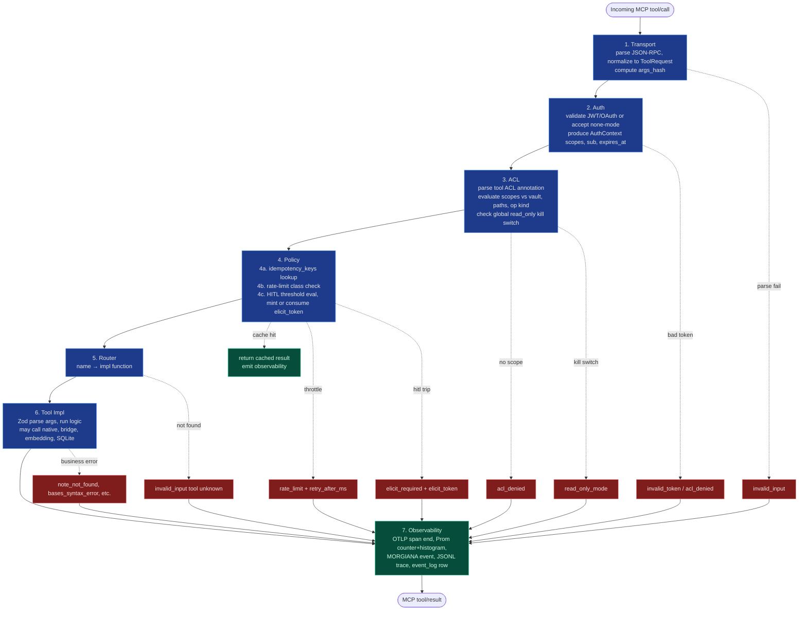

# obsidian-tc — Architecture and Topology

> **Scope note (2026-06-19):** obsidian-tc is an *access* MCP — vault read/write, search, and control. Retrieval intelligence (GraphRAG, clustering, hybrid retrieval fusion) is **out of scope**; pair obsidian-tc with an external retrieval/RAG service. The Python ML sidecar (component 14 and the § 3.3 IPC contract) and the native `kmeansAssign` / `actrDecayScore` reservations described below are **deprecated and being removed** — treat those sections as historical.

**Status:** shipped in v1.0.1 (2026-06-19). This document records the architecture and topology committed for the v1.0 line.
**Tool surface:** 103 tools across 28 domains — see [`docs/G2.1-tools.md`](docs/G2.1-tools.md).
**Linear:** THE-115

## Scope and inheritance

This sub-doc commits the topology, IPC contracts, and dispatch pipeline for V1. It inherits the 103-tool surface from G2.1 r2 and the polyglot architecture from G1.

**Resolved here:**
- G2 architecture parent's open question 3 (plugin discovery) — precise probe contract in §6.
- G2 architecture parent's open question 4 (sidecar lifecycle) — spawn-on-demand, idle timeout, fallback in §3.3.
- G2.1 r2 cross-cutting #7 (companion plugin discovery probe endpoint contract) — §6.
- G2.1 r2 cross-cutting #8 (HITL threshold policy location) — §7. Config-driven, per-vault, evaluated in Policy layer.
- Where `execute:<plugin>` scope check fires (G2.1 cross-cutting #1's location question) — §8. ACL layer. Scope class itself remains G2.4's call.
- Streaming support in V1 — §9. No, pagination covers it.
- MCP protocol version target — §10. 2025-11-25, Streamable HTTP for remote, STDIO for local.

**Forward-routed to G2.3-G2.5:** see end of doc.

---

## 1. Component boundaries

Fourteen named components in V1 (excluding the optional V2 sidecar, which gets a placeholder). Each component has an owner of state, a language, and a clear NOT-responsible-for boundary.

### Server-side (single process)

**(1) Transport layer.** TypeScript on Bun + Hono. Parses MCP messages (JSON-RPC 2.0 over STDIO or Streamable HTTP per MCP 2025-11-25). Owns connection lifecycle, message framing, protocol-version negotiation. NOT responsible for tool semantics, vault state, or auth decisions.

**(2) Auth layer.** TypeScript. Validates JWT/OAuth tokens (or accepts `none` mode if bound to localhost). Owns token validation, scope extraction, `AuthContext` construction. NOT responsible for per-resource access control (that's ACL), throttling (Policy), or session state (workspace_memory).

**(3) ACL layer.** TypeScript. Evaluates each tool's declarative ACL annotation against the request's scopes + vault + paths-in-args. Owns read/write/delete/execute/admin scope checks against folder glob patterns. NOT responsible for: scope syntax design (G2.4 owns that), HITL thresholds (Policy), or data ownership semantics.

**(4) Policy layer.** TypeScript. Three checks in order: idempotency-key replay, rate-limit class enforcement, HITL threshold evaluation. Owns pre-impl gate decisions. NOT responsible for ACL (already done upstream), tool dispatch, or observability emission.

**(5) Tool router.** TypeScript. Maps tool name → implementation function via static lookup table built at server start. Owns the dispatch table. NOT responsible for argument validation (each tool's Zod schema does that), pre-dispatch checks (auth/ACL/policy did those).

**(6) Tool implementations.** TypeScript, one file per tool (or small group) in `packages/server/src/tools/`. Each impl owns argument schema parsing, business logic, output construction, error emission with structured payload. NOT responsible for cross-tool concerns (transport, auth, observability emit — those wrap the impl).

**(7) Plugin bridges.** TypeScript HTTP clients. Owns REST calls to `/obsidian-tc/v1/*` endpoints on the Local REST API plugin's port, response parsing, error translation to obsidian-tc's error taxonomy. NOT responsible for tool semantics — tool impls call into bridges.

**(8) Embedding provider interface.** TypeScript. `EmbeddingProvider` interface plus per-provider implementations (Ollama, OpenAI, Voyage, Cohere, Custom HTTP). Each provider owns its API specifics, dimensions, cost estimation. NOT responsible for chunk storage, retrieval logic, or provider selection (per-vault config decides).

**(9) Native module.** Rust via napi-rs, packaged at `@the-40-thieves/obsidian-tc-native`. As shipped it owns three pure primitives: cosine similarity, a Unicode tokenizer, and BM25 term scoring. RRF and the sqlite-vec wrapper are deferred (sqlite-vec is loaded as a SQLite extension at the TS/db layer; RRF is a V2 hybrid-fusion input), and the V2-reserved `kmeansAssign` / `actrDecayScore` stubs were removed with the V2 ML scope. Every export has a numerically identical pure-JS fallback. NOT responsible for SQLite schema, transport, business logic.

**(10) SQLite cache.** `better-sqlite3` + `sqlite-vec` extension. One DB file per vault at `<vault.cache_dir>/cache.db`. Owns chunks, embeddings, idempotency keys, capture queue, memory entities, event log, workspace_sessions, elicit_tokens (new in G2.2). NOT responsible for vault files — those live in the vault and the server reads them via REST or filesystem.

**(11) Observability emitters.** TypeScript. OTLP span exporter, Prometheus counters/histograms, MORGIANA event emitter, JSONL trace writer, event_log row inserter. All emitters receive the same context from the dispatcher. NOT responsible for data they observe (read-only on tool context).

### Obsidian-side (separate process, lives inside the Obsidian app)

**(12) Companion plugin.** TypeScript, standard Obsidian plugin packaged as `obsidian-tc`. Extends Local REST API plugin with `/obsidian-tc/v1/*` routes. Owns command palette dispatch, active file access, per-plugin bridge endpoints (Dataview, Templater, Tasks, OCR, QuickAdd, Smart Connections, Smart Context, Excalidraw, Workspaces, Bookmarks, Periodic Notes, make.md). NOT responsible for vault data — Obsidian owns it.

**(13) Local REST API plugin.** Third-party dependency (`coddingtonbear/obsidian-local-rest-api`). HTTP server inside Obsidian process on port 27124 (default). Owns filesystem-level vault access via HTTP. NOT responsible for obsidian-tc-specific endpoints — companion plugin extends.

### V2-only (not started in V1)

**(14) Python ML sidecar.** Python on FastAPI, packaged as `obsidian-tc-sidecar`. Owns NetworkX, HDBSCAN, scikit-learn ops for V2 intelligence layer. NOT responsible in V1 — process is not started.

### Boundary kinds

**Hard boundaries (process / language):**
- Server ↔ Companion plugin: HTTP over the Local REST API plugin's port. Shared bearer token.
- Server ↔ Python sidecar (V2 only): HTTP on localhost:7891 (configurable). No auth (process-confined).
- TypeScript core ↔ Rust native: napi-rs FFI. Sync calls, copy-on-boundary memory.

**Hard boundaries (data ownership):**
- Vault files: Obsidian owns. Server reads via REST API plugin (HTTP) or direct filesystem (with care — only for read paths; writes always go through REST API plugin to keep Obsidian's index consistent).
- SQLite cache: server owns, one DB per vault. Companion plugin never touches.
- Idempotency / elicit tokens: server-only state in SQLite.

**Soft boundaries (TS module-level, single process):**
- Transport / auth / ACL / policy / router / tools / bridges / embedding providers / observability — all in `packages/server/src/`, separate directories, single Bun process.

### Dependency chain (what must be installed for what to work)

```
Obsidian app                             (always required, vault host)
  └─ Local REST API plugin               (always required, HTTP entry to vault)
      └─ Companion plugin                (required for command palette + ANY bridge tool)
          ├─ Dataview                    (required for search_dql, validate_dql, eval_dataview_field)
          ├─ Tasks                       (required for tasks_filter)
          ├─ Templater                   (required for list_templates, execute_template)
          ├─ QuickAdd                    (required for list_quickadd_actions, trigger_quickadd)
          ├─ Text Extractor              (required for ocr_attachment, ocr_bulk)
          ├─ Smart Connections           (required for embeddings via SC bridge; otherwise embeddings use configured provider)
          ├─ Excalidraw                  (required for excalidraw tools)
          ├─ Periodic Notes              (required for periodic_note tools)
          ├─ Workspaces (core)           (required for workspace tools)
          ├─ Bookmarks (core)            (required for bookmark tools)
          └─ make-md                     (required for makemd_list_spaces, makemd_query)
```

Tools failing any link in the chain return `plugin_missing` with the specific plugin name in `details.plugin`.

---

## 2. Dispatch pipeline

This section grounds every per-tool annotation in G2.1 (acl, hitl, idem, ratelimit) to a specific evaluation point.



### Per-layer specification

**Layer 1: Transport.** Parses the incoming MCP message. Outputs an internal `ToolRequest`:

```typescript
type ToolRequest = {
  tool_name: string;
  args: unknown;                    // unvalidated, Zod-parsed in impl
  args_hash: string;                // SHA-256 of canonicalized args; used for observability + idempotency cache
  conn_id: string;                  // stable per-connection ID
  transport_meta: {
    kind: "stdio" | "http";
    headers?: Record<string, string>;
    mcp_protocol_version?: string;
  };
};
```

Failure mode: malformed JSON-RPC → `invalid_input` returned without entering downstream layers, but observability still fires (with empty `tool_name`).

**Layer 2: Auth.** Three modes: `none` (no token; refuses startup if bound to non-localhost), `jwt` (HS256 with shared secret, scopes in claims), `oauth` (OAuth 2.1 with DCR per knowledge-mcp-server pattern). Produces:

```typescript
type AuthContext = {
  sub: string;                      // subject (user or agent identifier)
  vault_scopes: string[];           // ["read:vault", "write:vault/02-projects/**", "execute:dataview", ...]
  expires_at?: number;
  mode: "none" | "jwt" | "oauth";
};
```

Failure modes: bad signature, expired token, missing required claims → `acl_denied` (we don't distinguish bad token from no access to avoid information leak).

**Layer 3: ACL.** Parses each tool's declarative ACL annotation at server start (single pass; results cached). At request time:

1. Read tool ACL: `acl: write on path` → operation kind `write`, resource = arg `path`.
2. Resolve resource: combine `args.vault` + `args.path` against vault's `acl.read_paths` / `write_paths` / `delete_paths` glob lists.
3. Match against `AuthContext.vault_scopes`: do they cover the requested op at the requested path?
4. Check global kill switch: vault config `read_only: true` short-circuits any write/delete to `read_only_mode`.

Output: pass → next layer; fail → `acl_denied` (with `denied_by` field for admin debugging via `inspect_acl` tool).

**Layer 4: Policy.** Three sub-checks in order. Each can short-circuit.

**4a. Idempotency replay.** If `args.idempotency_key` present, query `idempotency_keys` table:
```sql
SELECT result FROM idempotency_keys
WHERE key = ? AND vault_id = ? AND tool_name = ? AND expires_at > ?
```
Hit → return cached `result`, skip layers 5-6. Cache miss → continue (impl will write the result back to the table on success).

**4b. Rate limit.** Each tool has `ratelimit: read | write | bulk`. Token-bucket per-vault per-class against the `limits:` config block. Trip → `rate_limit` with `retry_after_ms` and `details.class`. Counter increment in observability regardless of trip outcome.

**4c. HITL threshold.** If request includes `args.elicit_token`, validate against `elicit_tokens` table (single-use, 5min TTL); valid → consume, continue. If no token, evaluate tool's HITL annotation against `vault.hitl_thresholds` config (§7):
- Static `hitl: required` → always trip
- Static `hitl: never` → always pass
- Conditional `hitl: required if X` → eval threshold from config

Trip → mint random `elicit_token` (32-char), insert into `elicit_tokens` with 5min TTL, return `elicit_required` error with token in `details.elicit_token` + the proposed action description for the client to surface.

**Layer 5: Router.** Static dispatch table. Built at server start from tool registration calls. Fail (tool name unknown) → `invalid_input` with `details.message: "tool not found"`.

**Layer 6: Impl.** The tool function. Owns:
- Argument Zod parsing → on fail emits `invalid_input` with Zod error path
- Business logic (may call native module, plugin bridge, embedding provider, SQLite)
- Output construction
- Business errors: `note_not_found`, `bases_syntax_error`, etc.

For writes, impl persists the idempotency cache row on success:
```sql
INSERT INTO idempotency_keys (key, vault_id, tool_name, result, expires_at)
VALUES (?, ?, ?, ?, ? + 24h)
```

**Layer 7: Observability.** Always fires, regardless of success/failure. Emitters:
- **OTLP span**: name `obsidian_tc.tool_call`, tags `{tool, vault, caller, status, mode_used?, args_hash}`, duration from request entry.
- **Prometheus**: increments `obsidian_tc_tool_calls_total{tool, vault, status}`, records `obsidian_tc_tool_duration_seconds{tool, vault}` histogram bucket.
- **MORGIANA event**: schema per G2-architecture, async fire-and-forget.
- **JSONL trace**: append to current session's trace file.
- **event_log row**: SQLite insert for local debug replay.

Backpressure: observability emit is non-blocking. If MORGIANA endpoint slow, span/event drop with a `[obsidian-tc:obs-drop]` log line.

### Cross-cutting concerns through the pipeline

- **args_hash** computed once at Transport, threaded through context. Used by Policy (idempotency lookup) and Observability (trace).
- **AuthContext** attached at Layer 2, available through end. Tool impls can read it (rare, but some tools surface `caller` to output).
- **Vault resolution** happens at Layer 3 (ACL needs to know which vault to evaluate against). The resolved `Vault` object is attached to context for downstream use.

---

## 3. IPC contracts

Three boundaries. Each gets a wire protocol, auth, versioning, and error spec.

### 3.1 Server ↔ Companion Plugin

**Wire:** HTTP/1.1 over the Local REST API plugin's port (default `127.0.0.1:27124`). The Local REST API plugin runs an HTTP server inside the Obsidian process; the companion plugin registers additional routes via the REST API plugin's extension hooks.

**Auth:** shared bearer token in `Authorization: Bearer <api_key>` header. The token is the Local REST API plugin's configured API key (set in its plugin settings). Vault config `rest_api.api_key` mirrors this value.

**Versioning:** URL path version (`/obsidian-tc/v1/`). Bump to v2 on breaking changes. Companion plugin's manifest declares `"obsidianTcApiVersion": "1"`; server reads this from the probe response and refuses to dispatch if mismatch.

**Wire format:** JSON request/response. Error envelope:

```json
{
  "ok": false,
  "code": "plugin_missing | plugin_unreachable | invalid_input | internal_error",
  "message": "human-readable description",
  "details": { /* tool-specific */ }
}
```

Success envelope:

```json
{
  "ok": true,
  "result": { /* endpoint-specific */ }
}
```

**Routes (V1):**

```
GET    /obsidian-tc/v1/probe                       → capability discovery (see §6)
GET    /obsidian-tc/v1/active                      → currently active file
POST   /obsidian-tc/v1/command/execute             → run command palette command
POST   /obsidian-tc/v1/templater/execute           → run Templater template
GET    /obsidian-tc/v1/templater/list              → list templates with metadata
POST   /obsidian-tc/v1/dataview/query              → execute DQL query
POST   /obsidian-tc/v1/dataview/eval               → eval Dataview field expression
POST   /obsidian-tc/v1/dataview/validate           → parse DQL without exec
POST   /obsidian-tc/v1/tasks/query                 → run Tasks plugin filter expression
POST   /obsidian-tc/v1/ocr                         → trigger Text Extractor OCR
POST   /obsidian-tc/v1/quickadd/trigger            → fire QuickAdd action by name
GET    /obsidian-tc/v1/quickadd/list               → list configured actions
POST   /obsidian-tc/v1/excalidraw/read             → read Excalidraw note
POST   /obsidian-tc/v1/excalidraw/write            → create/update Excalidraw
GET    /obsidian-tc/v1/smart-connections/embed     → get embedding from SC
POST   /obsidian-tc/v1/context/bundle              → Smart Context folder bundle
GET    /obsidian-tc/v1/workspaces/list             → list saved workspaces
POST   /obsidian-tc/v1/workspaces/open             → switch workspace
POST   /obsidian-tc/v1/workspaces/save             → save current workspace
GET    /obsidian-tc/v1/bookmarks/list              → list bookmarks
POST   /obsidian-tc/v1/bookmarks/add               → add bookmark
DELETE /obsidian-tc/v1/bookmarks/:id               → remove bookmark
GET    /obsidian-tc/v1/periodic-notes/info         → periodic notes config
POST   /obsidian-tc/v1/periodic-notes/create       → create periodic note for date+period
POST   /obsidian-tc/v1/makemd/list-spaces          → list make.md spaces
POST   /obsidian-tc/v1/makemd/query                → query make.md space
```

**Plugin-bridge timeout:** default 5s, configurable per route via `vault.bridges.timeout_ms`. OCR and Templater routes default to 30s. Timeout → `plugin_unreachable`.

### 3.2 TypeScript core ↔ Rust native (napi-rs)

**ABI:** napi-rs v2 (`napi8`) pinned in `packages/native/package.json` (`engines.node >= 22`). Server consumes via Bun workspace link as `@the-40-thieves/obsidian-tc-native`.

**Prebuild distribution (as shipped):** the umbrella package stays **unscoped at the napi level** (`napi.name = "obsidian-tc-native"`) while `napi prepublish` generates and publishes one scoped platform sub-package per built triple into the umbrella's `optionalDependencies`. v1.0 ships **four** triples (linux-arm64 deferred to v1.1; the pure-JS fallback covers it):

```
@the-40-thieves/obsidian-tc-native-linux-x64-gnu
@the-40-thieves/obsidian-tc-native-darwin-x64
@the-40-thieves/obsidian-tc-native-darwin-arm64
@the-40-thieves/obsidian-tc-native-win32-x64-msvc
```

A hand-written `index.js` loader (replacing the napi-generated one) tries a locally-built `.node`, then the matching platform sub-package, and otherwise loads the numerically-identical pure-JS `fallback.ts`/`fallback.js`, exposing `module.exports.nativeLoaded` so callers can tell which backend is active. It never throws on a missing prebuild.

**Calls (sync, CPU-bound):**

```typescript
// packages/native/src/lib.rs → exposed as TS via napi-rs (shipped surface: 3 exports)
export function cosineSimilarity(a: number[], b: number[]): number;   // f64 arrays; 0 for empty/mismatched length
export function tokenize(text: string): string[];                     // Unicode lowercase alphanumeric terms
export function bm25Score(                                            // one query term's BM25 contribution (k1=1.2, b=0.75)
  tf: number, docLen: number, avgDocLen: number, docFreq: number, docCount: number,
): number;

// Deferred / removed: dotProduct and reciprocalRankFusion are not implemented (RRF is a V2
// hybrid-fusion input; the sqlite-vec wrapper lives at the TS/db layer, not here). The V2
// stubs kmeansAssign / actrDecayScore were removed with the V2 ML scope (see top-of-doc note).
// Inputs are plain f64 arrays in V1; a zero-copy Float32Array path is a later optimization.
```

**Memory:** napi-rs copies typed arrays on the boundary. For 768-dim embeddings (3KB) the copy is ~100µs; for 1536-dim (6KB) ~200µs. Acceptable.

**Async:** all calls sync in V1. napi-rs supports async, but our ops are CPU-bound and short; sync simplifies error handling and observability span lifetime.

**Errors:** Rust `panic!` → JS throws. Tool impl catches with `internal_error` code and `details.native_op` field for debugging. Rust `Result::Err` returns are mapped to JS exceptions via napi-rs `Error::from_reason`.

### 3.3 Server ↔ Python ML sidecar (V2 only)

V1 does not start the sidecar. This subsection specs the V2 path so V1's dispatch layer doesn't paint into a corner.

**Wire:** HTTP/1.1 on `localhost:7891` (port configurable in `sidecar.port`). FastAPI server with Pydantic schemas. JSON request/response.

**Auth:** localhost-only binding. Server refuses to bind non-localhost; explicit hardcoded check. No bearer token (process-confined trust).

**Lifecycle (V2):**
- **Spawn:** server starts sidecar on first sidecar-bound tool call (V2 introduces tools like `cluster_chunks`, `community_detect`). Spawn cost ~2s (Python interpreter + sentence-transformers model load).
- **Idle timeout:** `sidecar.idle_timeout_seconds` (default 300). After idle, server SIGTERMs the sidecar process. Next call respawns.
- **Health check:** `GET /healthz` returns `{ok, version, models_loaded}`. Server caches health for 30s.
- **Restart policy:** 3 retries on `connect_refused`/`5xx` with exponential backoff (200ms, 600ms, 1800ms). On final failure, tool impl logs error and falls back to pure-TS approximations (e.g., k-means without HDBSCAN, simple BFS without NetworkX centrality). Caller sees degraded result, not error.

**Endpoints (V2 only):**

```
GET  /healthz                               → readiness + version
GET  /info                                  → pip package version, models loaded, capabilities
POST /cluster/kmeans                        → batch k-means assignment
POST /cluster/hdbscan                       → HDBSCAN clustering
POST /graph/centrality                      → NetworkX centrality on chunk-link graph
POST /graph/community                       → community detection (Louvain / Leiden)
POST /embed/local                           → sentence-transformers embeddings (if local provider chosen)
```

**Versioning:** `/info` endpoint returns sidecar's pip version. Server checks on first spawn; mismatch logs warning. V1's `config.yaml` pins sidecar version in `sidecar.expected_version` (initially empty in V1).

**Why V1 commits to this contract:** the dispatch pipeline (§2) must be sidecar-aware in V1 so a V2 tool can plug in without a Tool Impl rewrite. Specifically, Layer 6 tool impls must be able to call `sidecar.call(endpoint, payload)` from inside their body — that shim is part of V1's tool-impl helpers.

---

## 4. Deployment modes

Five modes. Per-mode constraints:

| Aspect | STDIO local | HTTP local | HTTP remote | Docker | Standalone binary |
|---|---|---|---|---|---|
| Process model | Subprocess of MCP client | Background daemon | Background daemon on remote host | Container with bind-mount | Compiled Bun binary |
| Bind address | N/A | `127.0.0.1` enforced | `0.0.0.0` permitted | Per `docker run -p` | Per chosen transport |
| Auth required | `none` OK | `none` OK | `jwt` or `oauth` REQUIRED (hardcoded refusal to start in `none` mode on non-localhost) | Per HTTP mode | Per chosen transport |
| Cold start | ~500ms (Bun JIT + native load) | One-time daemon start; <50ms per request | Same as HTTP local + tunnel latency | ~1s (container start) | ~100ms (no JIT warmup; native pre-linked) |
| Multi-client | 1 client per process | Many clients | Many clients | Many clients | 1 (STDIO) or many (HTTP) |
| Companion plugin location | Same machine | Same machine | Same machine as server (NOT same as client) | Same machine as container | Same machine as binary |
| Native module | Required prebuild for platform | Same | Same | Built into image | Bundled in binary |
| Vault access | Same machine | Same machine | Same machine as server | Bind-mounted into container | Configurable path |
| MCP transport | STDIO | Streamable HTTP | Streamable HTTP over CFTunnel/SSH | Streamable HTTP | STDIO or HTTP |

### Mode-specific notes

**STDIO local.** Default for Claude Desktop / Claude Code installs. Client launches `obsidian-tc serve --stdio` as a subprocess. One subprocess per client. Auth `none` is the typical config; trust boundary is the parent process. Vault path resolved from config file or `OBSIDIAN_TC_DEFAULT_VAULT` env.

**HTTP local.** User runs `obsidian-tc serve --http --port 8788` once. Multiple MCP clients on the same machine connect to localhost:8788. Faster than STDIO because the Bun process and native module stay warm. Cold-start savings compound for autonomous-agent workloads with many short calls. Auth `none` accepted on localhost.

**HTTP remote.** Server runs on a remote host (Hetzner, cave, etc.) with the vault co-located. Clients connect over Cloudflare Tunnel or SSH local-forward. Server **refuses to bind non-localhost in `none` mode** — JWT or OAuth required. This is a hardcoded check, not a config flag. Forward-compat for users who want to expose an obsidian-tc server publicly: they must configure real auth.

**Docker.** `docker run -v /path/to/vault:/vault ghcr.io/the-40-thieves/obsidian-tc:1.0 serve --http`. Native module prebuilt for image's platform. Vault bind-mounted; companion plugin runs in user's Obsidian on the host (not in container — Obsidian is GUI app). Container talks to Obsidian's Local REST API plugin on host's network. Requires `--network host` on Linux or explicit port mapping on macOS/Windows.

**Standalone binary.** `bun build --compile` produces a single executable per platform. No Bun install required for users. Distributed via GitHub releases. Native module statically linked into the binary via napi-rs prebuild. Trade-off: binary size ~80MB per platform (Bun runtime + native module + JS bundles).

### Edge case: vault on laptop, agents on a server

Two topologies:

**Topology A — server colocated with vault (recommended).** obsidian-tc + Obsidian + REST API plugin all run on the laptop. Agent on Hetzner tunnels MCP calls to laptop's obsidian-tc HTTP endpoint via Cloudflare Tunnel. Server↔plugin calls are local (low latency); only the agent↔server hop crosses the network.

**Topology B — server colocated with agent.** obsidian-tc runs on Hetzner, agent connects via local socket. Server tunnels back to laptop's Obsidian REST API plugin via Cloudflare Tunnel for every vault op. Every plugin bridge call now incurs tunnel RTT. Rejected as default; documented as available for users with specific reasons (e.g., laptop is offline most of the day).

Recommendation surfaces in docs (G2.5).

---

## 5. Multi-vault registry

### Config file location

**As shipped (v1.0):** config is a **JSON** file loaded from an explicit path — the `OBSIDIAN_TC_CONFIG` env var or the CLI's config-path argument — via `loadConfig(path)` (`packages/server/src/config/load.ts`), validated by `ServerConfigSchema`. There is no XDG / `%APPDATA%` auto-discovery yet (the richer `obsidian-tc serve / init / auth / …` launcher is a v1.1 follow-up). Secrets are kept off disk via env: `OBSIDIAN_TC_JWT_SECRET`, `OBSIDIAN_TC_PLUR_ENDPOINT`, `OBSIDIAN_TC_PLUR_TOKEN`.

### Schema (as shipped — `ServerConfigSchema`, exported from `@the-40-thieves/obsidian-tc-shared`)

The shipped v1.0 schema (`packages/shared/src/config.schema.ts`) is flatter than the G2.2 design sketch. Key reconciliations vs the original design: **auth is `none | jwt` only** (no `oauth` / DCR); **ACL is a single global block, not per-vault**; **embeddings providers are ollama / openai / voyage / cohere** (no `custom`); there is **no `sidecar` block** (the V2 ML scope was dropped); HITL is **hardcoded floors + per-scope**, not a per-vault `hitl_thresholds` table; and throttle / governor / observability are first-class top-level blocks.

```typescript
const ServerConfigSchema = z.object({
  cacheDir: z.string().default(".obsidian-tc"),
  vaults: z.array(VaultConfig).min(1),       // VaultConfig: { id, name?, path, restApiUrl?, restApiKey?,
                                             //   bridges?, plugins?, commands?, memory?, workspace? }
  plur: PlurConfig.optional(),               // GLOBAL read proxy: { endpoint?, apiKey?, apiPrefix, timeoutMs }
  auth: z.object({                           // none | jwt ONLY (no oauth)
    mode: z.enum(["none", "jwt"]).default("none"),
    jwtSecret: z.string().min(32).optional(),      // required when mode = "jwt"
    tokenTtlSeconds: z.number().int().positive().default(86400),
  }).default({ mode: "none" }),
  acl: z.object({                            // GLOBAL, not per-vault
    readOnly: z.boolean().default(false),          // kill switch
    defaultScopes: z.array(z.string()).default([]),
    rules: z.array(z.object({ glob: z.string(), scopes: z.array(z.string()) })).default([]),  // last-match-wins
    readPaths: z.array(z.string()).optional(),     // per-op whitelist; OMITTED = unrestricted for that op kind
    writePaths: z.array(z.string()).optional(),
    deletePaths: z.array(z.string()).optional(),
  }).default({}),
  embeddings: z.object({
    provider: z.enum(["ollama", "openai", "voyage", "cohere"]).default("ollama"),
    model: z.string().default("nomic-embed-text"),
    dimensions: z.number().int().positive().default(768),
    baseUrl: z.string().url().optional(), apiKey: z.string().optional(),
  }).default({}),
  transports: z.object({
    stdio: z.boolean().default(true),
    http: z.object({
      enabled: z.boolean().default(false),
      host: z.string().default("127.0.0.1"),
      port: z.number().int().min(1).max(65535).default(8765),
    }).default({}),
  }).default({}),
  governor: z.object({ maxResponseBytes: z.number().int().positive().default(1_000_000) }).default({}),
  throttle: ThrottleConfig,        // per-class tiers read/write/bulk/execute/admin + maxConcurrentWritesPerVault
  observability: ObservabilityConfig,   // otel{} / prometheus{} / morgiana{} / retention{}
  idempotencyTtlSeconds: z.number().int().positive().default(86400),
  elicitTtlSeconds: z.number().int().positive().default(300),
})
// F2 fail-closed interlock (.superRefine): refuse the config when transports.http.enabled &&
// auth.mode === "none" && host is non-loopback — never serve an unauthenticated routable host.
```

> The later §5 subsections (vault resolution, per-vault isolation, reload semantics) describe the multi-vault model, which still holds; a few field names there (e.g. `hitl_thresholds`, `cache_dir`, `rest_api.api_key`) reflect the design-era schema above, not the shipped camelCase names.

### Vault resolution algorithm

For any tool call with a `vault` field:

1. If `args.vault` set, use it (404 → `vault_not_found`).
2. Else if `OBSIDIAN_TC_DEFAULT_VAULT` env set, use it.
3. Else if `config.default_vault` set, use it.
4. Else if exactly one vault in config, use it.
5. Else `invalid_input` with `details.message: "vault parameter required when multiple vaults configured"`.

Cross-vault ops (tools taking `vaults: VaultId[]`): currently only `search_vault` in V1. Server fans out per-vault in parallel, unions results, returns combined ranking. Per-vault errors don't fail the call — `details.per_vault_errors` records them.

### Per-vault isolation guarantees

- **SQLite cache.** One DB per vault at `<cache_dir>/cache.db`. Schema versioned via PRAGMA `user_version`. No cross-vault joins or queries — each vault's data is isolated at the storage layer.
- **JSONL traces.** Per-vault directory `<cache_dir>/traces/<YYYY-MM-DD>/<session_id>.jsonl`. Rolled daily, kept 90 days (G2.4 confirms retention).
- **Embedding providers.** Each vault has its own provider config. Vault A on Ollama (local) and Vault B on Voyage (cloud) coexist cleanly — different `EmbeddingProvider` instances.
- **ACL.** Each vault's `acl` block applies only to that vault. Cross-vault ACL inheritance is not supported.
- **`event_log` rows.** Per-vault DB → naturally isolated. No cross-vault analytics in V1 (admin tool `get_metrics` can filter to one vault or aggregate across all).

### Reload semantics

`reload_vault(vault_id)` (from G2.1 r2 Domain 1):

1. Re-read the YAML entry for `vault_id`.
2. Diff against in-memory config.
3. Apply non-destructive changes (auth, observability, limits, hitl_thresholds, plugins.force_*, bridges.timeout_ms) immediately.
4. For destructive changes (`path`, `embeddings.provider`, `embeddings.model`, `cache_dir`): log warning, emit `vault_config_dirty` event. SQLite cache is NOT reset automatically. User must follow up with `reset_vault_cache` if needed.
5. Reload probe results (fire §6's probe again, update `plugins_detected`).

Adding or removing a vault: V1 requires server restart. Config file edit + restart. Removed vault's cache directory is preserved on disk for safety (manual cleanup if user wants).

Reasoning: dynamic vault add/remove is a small ergonomic win that complicates dispatch (vault registry is consulted on every request; making it write-able requires locking). Deferred to V1.x if real workloads need it.

---

## 6. Plugin discovery probe

### Trigger points

The probe fires:
1. At server start, once per configured vault.
2. On `reload_vault` for the target vault.
3. Not on every tool call (probe results are cached for the vault's lifetime in memory).

### Probe call

Server fires `GET /obsidian-tc/v1/probe` to the configured Local REST API plugin endpoint with `Authorization: Bearer <vault.rest_api.api_key>`, timeout 500ms (configurable via `bridges.timeout_ms`).

### Probe response

```json
{
  "ok": true,
  "result": {
    "plugin_version": "0.1.0",
    "obsidian_version": "1.7.4",
    "obsidianTcApiVersion": "1",
    "vault_path": "/Users/me/Documents/my-vault",
    "capabilities": {
      "dataview":            { "installed": true,  "version": "0.5.66" },
      "tasks":               { "installed": true,  "version": "7.13.0" },
      "templater":           { "installed": true,  "version": "2.4.4" },
      "quickadd":            { "installed": false },
      "excalidraw":          { "installed": true,  "version": "2.4.0" },
      "smart-connections":   { "installed": true,  "version": "2.3.78" },
      "smart-context":       { "installed": false },
      "text-extractor":      { "installed": true,  "version": "0.7.0" },
      "workspaces":          { "installed": true,  "core": true },
      "bookmarks":           { "installed": true,  "core": true },
      "periodic-notes":      { "installed": true,  "version": "0.0.17" },
      "make-md":             { "installed": false }
    }
  }
}
```

Companion plugin uses Obsidian's `app.plugins.enabledPlugins` and `app.plugins.manifests` APIs to populate `capabilities`. No probes to individual plugins — the companion plugin already runs in the same Obsidian process and has the inventory.

### Validation

Server validates:
1. **`vault_path` matches `vault.path`** (after normalization for trailing slashes + case). Mismatch → log critical error, refuse to serve this vault (`vault_not_found` returned to all calls until reload).
2. **`obsidianTcApiVersion` matches server's expected major version** ("1" for V1). Mismatch → log warning, attempt forward compatibility; server treats unknown response fields as absent.
3. **Companion plugin version** is logged for ops visibility. No version pin in V1.

### Cache

Probe result stored in `Server.vaults[vault_id].probe_result` in-memory. Lifetime: until next `reload_vault` or server restart. No on-disk caching (probe is cheap; staleness across restarts is a bigger risk than re-probing).

### Failure handling

| Failure | Behavior |
|---|---|
| 404 (companion plugin not installed) | Log warning `companion plugin not detected on vault <id>`. All plugin-bridged tools return `plugin_missing` with `details.plugin: "obsidian-tc-companion"`. Direct file ops (read_note, write_note, etc.) still work via Local REST API plugin. |
| Timeout (500ms exceeded) | Retry once at 200ms timeout. On second timeout, mark vault as `bridges_unavailable`. Plugin-bridged tools return `plugin_unreachable`. |
| Malformed JSON | Log error with response body. Treat as 404. |
| `obsidianTcApiVersion` major mismatch | Log warning. Continue with forward-compat mode (treat unknown fields as absent). |

### Config override

Vault config `plugins:` block (schema in §5):

```yaml
plugins:
  force_enabled: ["dataview", "tasks"]      # treat as installed regardless of probe
  force_disabled: ["excalidraw"]             # treat as missing regardless of probe
  probe_skip: false                          # if true, skip probe entirely; force_enabled is the source of truth
```

Use cases:
- `force_enabled`: CI environments without a real Obsidian instance running. Combined with `probe_skip: true`, lets test runners assert on tool behavior without booting Obsidian.
- `force_disabled`: test the `plugin_missing` error path without uninstalling the plugin. Or operationally disable an expensive bridge.
- `probe_skip`: deterministic startup for CI; documented as "advanced usage."

### Discoverability

`get_server_config` admin tool (G2.1 Domain 28) returns `plugins_detected: Record<vault_id, string[]>` so operators and callers can see what was actually detected. Useful for debugging tools returning `plugin_missing` unexpectedly.

---

## 7. HITL threshold policy location

### Decision

**Config-driven, per-vault.** Thresholds live in `vault.hitl_thresholds:` block (schema in §5). Evaluation happens in the Policy layer of the dispatch pipeline (§2 Layer 4c).

### Why config-driven (rejected alternative: hardcoded)

Hardcoded thresholds couple policy to code. Tuning a threshold requires a redeploy. For obsidian-tc's two primary user profiles — humans (want lower friction, higher thresholds) and autonomous agents (want tighter safety, lower thresholds) — hardcoded values force one tradeoff or the other.

Per-vault config lets operators tune each vault to its primary caller. A `primary` vault used by a human might raise `bulk_create_notes_count: 200` (less friction), while an `agent-sandbox` vault might lower it to `bulk_create_notes_count: 5` (more confirmations).

### Threshold defaults

Defaults match the conditional HITL rules from G2.1 r2, so V1's out-of-box behavior is unchanged from the spec:

| Config key | Default | G2.1 rule it implements |
|---|---|---|
| `delete_attachment_reference_count` | 0 | "required if reference_count > 0" |
| `update_canvas_node_removal` | 10 | "required if removing >10 nodes" |
| `bulk_create_notes_count` | 50 | "required if count >50" |
| `bulk_set_property_count` | 50 | "required if count >50" |
| `task_status_done_to_todo_age_days` | 7 | "required if status flip from done→todo when done > 7d ago" |
| `move_attachment_reference_count` | 10 | "required when reference_count >10" |
| `copy_note_cross_folder` | true | "required if target outside same folder" |
| `move_note_cross_folder` | true | "required if crossing top-level folder boundary" |
| `patch_note_cross_heading` | true | "required if replacing across heading boundaries" |
| `update_canvas_remove_node_threshold` | 10 | "required if removing >10 nodes" |
| `ocr_bulk_file_count` | 20 | "required if total file count >20" |

### Evaluation flow (Policy layer, §2 Layer 4c)

```typescript
// pseudocode
const hitlAnnotation = TOOL_HITL_TABLE[tool_name];  // parsed at server start

if (request.args.elicit_token) {
  const tok = await elicit_tokens.get(request.args.elicit_token);
  if (tok && !tok.consumed && tok.expires_at > now() && tok.tool_name === tool_name) {
    await elicit_tokens.consume(request.args.elicit_token);
    return PASS;
  }
  return ERR("elicit_required", { reason: "invalid_or_expired_token" });
}

if (hitlAnnotation.kind === "never") return PASS;
if (hitlAnnotation.kind === "required") {
  return mint_and_return_elicit_required(tool_name, request);
}
// conditional: hitlAnnotation.kind === "conditional"
for (const rule of hitlAnnotation.rules) {
  const threshold = vault.hitl_thresholds[rule.config_key];
  if (rule.eval(request.args, threshold)) {
    return mint_and_return_elicit_required(tool_name, request, rule.description);
  }
}
return PASS;
```

### Elicit token lifecycle (G2.1 cross-cutting #4 — touched here, finalized in G2.4)

- **Mint:** random 32-char (16 bytes of entropy) on threshold trip. Inserted into `elicit_tokens` table with `tool_name`, `args_hash`, `vault_id`, `mint_ts`, `expires_at` (mint_ts + 5min), `consumed: false`.
- **Lifetime:** 5 minutes default. G2.4 confirms.
- **Use:** single-use. Server marks `consumed: true` on validation. Replay → `elicit_required` with `details.reason: "token_already_consumed"`.
- **Scope:** token is bound to `(tool_name, args_hash)`. Caller cannot reuse one tool's token to authorize a different tool or different args. This is hard binding, not advisory.

### Forward-ref: scope-based threshold overrides (G2.4)

G2.4 Security may overlay scope-based threshold policy on top of per-vault config. Example: scope `automation:bot:l3` always uses threshold=0 (always confirm) regardless of vault config. This is additive — per-vault config is the floor for human callers; per-scope config can lower thresholds further for restricted scopes but not raise them. Decided in G2.4.

---

## 8. Where the scope check fires (cross-cutting #1 location commit)

G2.1 cross-cutting #1 asks G2.4 Security to formalize the `execute:<plugin>` scope class. G2.2 commits **only on where** the check happens, not on the class shape.

### Decision

**ACL layer** of the dispatch pipeline (§2 Layer 3). Not tool impls, not policy, not transport.

### Why ACL

The ACL layer is the natural home for declarative access decisions. It already evaluates `read:vault/...`, `write:vault/...`, `delete:vault/...` against tool annotations. Adding `execute:<plugin>` (or whatever G2.4 picks) is a parser extension to the existing scope-matching code.

### Why not the other layers

- **Tool implementations.** Scattering scope checks across 103 tools means: (a) every new scope class requires touching every tool that uses it; (b) scope-check bugs are tool-local; (c) the security audit surface grows by 103×. Rejected.
- **Policy.** Policy handles HITL/throttle/idempotency — operational concerns. Mixing access control into the same layer violates separation. Rejected.
- **Transport.** Transport is pre-auth. Scope checks require `AuthContext`. Rejected.

### What G2.2 leaves to G2.4

G2.4 decides:
- Scope claim structure in JWTs (e.g., `"scopes": ["read:vault", "execute:dataview"]` array vs `"scopes": { "read": ["vault"], "execute": ["dataview"] }` map).
- Whether `execute:<plugin>` is a first-class scope class or collapses to `read:plugin/<name>` / `write:plugin/<name>`.
- The `safe_commands` allowlist format for `execute_command`.
- The grammar of glob patterns inside scopes (`write:vault/02-projects/**` syntax).

G2.2's commitment to "ACL layer" means G2.4 can iterate on scope syntax without rewriting other components.

---

## 9. Streaming response support

### Decision for V1

**No streaming.** All tools return a single MCP response. Pagination (G2.1 conventions: `cursor` / `limit` / `overflow`) handles large result sets.

### V1 reasoning

MCP 2025-11-25 supports tool result streaming via partial-result notifications. But:

1. **Client support is uneven.** Claude Desktop and Claude Code support partial results well. Cursor's MCP support varies per version. Custom MCP clients (autonomous agents built on the TS or Python SDK) may not implement partial-result handlers; they'd see only the final result anyway.
2. **Complexity multiplier.** Streaming touches: transport (chunk framing), observability (span lifetime across chunks, partial Prometheus increments), error handling (failure mid-stream — abort vs complete-with-partial), idempotency cache (storing a partial result is messy; do you replay the stream or the final?). V1 ship time is finite; this is non-trivial work for marginal benefit.
3. **Pagination covers the dominant case.** Every G2.1 tool returning large payloads — `bundle_folder`, `bundle_files`, `search_*`, `query_base`, `list_*`, `find_*` — already paginates. The single-tool edge case is `read_note` on a huge note, which is bounded by the upcoming response-byte governor (G2.1 cross-cutting #2 → G2.4).

### V1.x forward path

Add streaming as an opt-in `stream: true` flag on specific tools (`bundle_folder`, `search_semantic`, `query_base`) if production workloads need it. Schema-compatible addition (default off). Re-evaluate at V1.2 after first three months of production use.

### V2 reasoning

V2 retrieval ops (GraphRAG, hybrid fusion) are batch-shaped by nature: the result set is computed atomically before ranking. Streaming offers minimal benefit unless the result set exceeds pagination's practical limit (current ceiling: 1000 items per page, can be raised). Re-evaluate at V2 design.

---

## 10. MCP protocol version target

### Decision

**MCP spec 2025-11-25.** Latest stable as of design date 2026-05-18.

Source: modelcontextprotocol.io spec endpoint and the official 2026 roadmap blog confirming no new spec cut since November 2025.

### Wire protocols

- **STDIO** for local deployments (Claude Desktop, Claude Code subprocess pattern).
- **Streamable HTTP** for HTTP local and HTTP remote modes. SSE is being phased out per the spec evolution; obsidian-tc V1 ships Streamable HTTP only — no SSE compatibility shim.

### Version negotiation

- **HTTP:** client sends `MCP-Protocol-Version: 2025-11-25` header after initial handshake (per spec). Server validates and responds.
- **STDIO:** capability message during initialize exchange.
- **Mismatch:** server logs warning and attempts forward-compatibility — treat unknown client capabilities as absent; degrade gracefully. Rejects clients advertising older spec versions before 2025-06-18 (too far behind to safely interop).

### Server-advertised capabilities

- **`tools`**: yes (103 tools). Advertised via the low-level `Server` with `capabilities: { tools: {} }`.
- **`resources`**: deferred to V1.x. MCP resources (vault notes as listed, fetchable URIs) is a natural addition but adds a primitive surface and changes how clients discover content. V1 ships tool-only to keep the surface bounded.
- **`prompts`**: no. Out of scope for V1 — obsidian-tc is not a prompt library.
- **`elicitation`**: **as shipped, HITL does NOT use MCP's `elicitation` capability.** It uses a custom token pattern: a destructive / HITL-floor call returns an `elicit_required` error carrying `args_hash`; the client re-invokes the same tool with an `elicit_token` argument (single-use, 5-min TTL, bound to tool + args_hash, consumed via an atomic `UPDATE`). This works with any MCP client regardless of elicitation support. Adopting the native `elicitation` primitive is a possible V1.x change.
- **`sampling`**: no. Server does not request LLM completions from clients.

### Tool annotations (MCP 2025-11-25 feature)

**As shipped, the `tools/list` handler emits only `name`, `description`, and `inputSchema`** (`packages/server/src/mcp/server.ts`) — it does **not** surface MCP `annotations` or `outputSchema`. Enforcement does not depend on them: the ACL + Policy layers in `registry.dispatch` are the source of truth (a tool's `requiredScopes` and `destructive` flag drive the read-only / HITL / throttle gates), and MCP annotations are hints only. Surfacing the G2.1 → MCP annotation mapping below to clients is a possible V1.x enhancement; it is the design intent, not the current behavior:

| G2.1 annotation | MCP annotation (intended) |
|---|---|
| `acl: read on ...` | `readOnlyHint: true`, `destructiveHint: false` |
| `acl: write on ...` | `readOnlyHint: false`, `destructiveHint: false` |
| `acl: delete on ...` | `readOnlyHint: false`, `destructiveHint: true` |
| `acl: execute on ...` | depends — read-side execute (e.g. validate_dql) is `readOnlyHint: true`; write-side execute (e.g. trigger_quickadd) is `readOnlyHint: false`, `destructiveHint: true` |
| `idem: pure` / `natural` / `keyed` | `idempotentHint: true` |
| `idem: non-idem` | `idempotentHint: false` |
| All tools | `openWorldHint: false` (no external network calls except caller-configured embedding providers) |

### Re-verification points

The MCP spec moves fast (Streamable HTTP itself was new in 2025-03-26; structured outputs / annotations in 2025-06-18; SEP-1865 MCP Apps formalized early 2026). Re-verify spec version:

1. **At G3 Simplicity Check.** Before any code is written — confirm 2025-11-25 is still current. Migrate target if a newer stable cut has landed.
2. **At G4 Implement kickoff.** Final lock before scaffolding the transport layer.
3. **At v1.0 release candidate.** Last chance to bump.

Protocol evolution is the most likely external factor to invalidate G2.2 decisions. The dispatch pipeline (§2) and IPC contracts (§3) are MCP-version-agnostic by design (they consume normalized internal types, not raw MCP shapes), so a spec migration touches Transport and tool registration only.

---

## Cross-cutting items for G2.3-G2.5 (carry-forward + new)

Inherited from G2.1 r2:

1. `execute:<plugin>` ACL scope class formalization → G2.4 Security.
2. Token-budget governor for response bytes (`overflow_bytes` flag) → G2.4.
3. Idempotency key TTL exact value → G2.3 Storage.
4. HITL elicit token lifetime + single-use vs reusable → G2.4. (G2.2 §7 commits to 5min single-use as the default; G2.4 confirms.)
5. Memory entity materialization folder per-vault config → G2.3 + G2.4.
6. `safe_commands` default allowlist for `execute_command` → G2.4.
7. ~~Companion plugin discovery probe endpoint contract~~ → **RESOLVED in G2.2 §6.**
8. ~~HITL threshold policy location~~ → **RESOLVED in G2.2 §7.**

New from G2.2:

9. **Native module per-function fallback impls.** G2.2 commits the fallback mechanism (TS implementations registered when native unavailable); G2.5 owns the per-function pure-JS code + the prebuild matrix.
10. **Sidecar wheel distribution.** Python wheels vs pip-install-on-demand for the V2 ML sidecar → G2.5.
11. **Cross-platform config path resolution edge cases.** What happens with no `$HOME` (containers), write-restricted filesystems, symlinked dirs? → G2.3 Storage.
12. **Resource primitive deferral confirmation.** Should V1.x add MCP `resources` for notes-as-resources, or defer to V2? → G2.5 release planning.
13. **`elicit_tokens` schema.** SQLite table for elicit tokens introduced in G2.2 §7. Schema (key, tool_name, args_hash, vault_id, mint_ts, expires_at, consumed, consumed_at) → G2.3.
14. **MCP spec re-verification at G3 and G4.** Calendar reminder, not a design item → G3 / G4 kickoff checklists.

---

## V1 → V2 forward-compat (architecture-level)

Architectural hooks baked into V1 so V2 is an upgrade, not a rewrite:

- **Dispatch layer is sidecar-aware.** Tool impl helpers include `sidecar.call(endpoint, payload)`. V1 throws if `sidecar.enabled: false` in config. V2 flips the flag.
- **Plugin bridge URL space versioned (`/v1/`).** Companion plugin can ship `/v2/` routes alongside `/v1/` without breaking V1 server. Server selects version based on its compiled-in expectation.
- **Native module exports V2-reserved stubs.** `kmeansAssign` and `actrDecayScore` exist in V1's `@the-40-thieves/obsidian-tc-native` package — they throw `"v2-feature-not-enabled"`. V2 enables them by swapping stub for real impl in a minor version bump; no ABI change.
- **SQLite schema has V2-reserved columns** (chunks.cluster_id, chunks.decay_score, chunks.activation_count, chunks.last_accessed_at — per G2-architecture parent). V2 lights them up without migration.
- **Config schema has `sidecar:` block already**, `enabled: false` as V1 default. No config-schema migration on V2.
- **ACL/Policy layers are scope-aware.** V2 may add scope `agent:autonomous-l3` for restricted scopes. Handler already exists in the ACL parser; G2.4 commits scope grammar that V2 extends.
- **`event_log` rows include `args_hash`.** V2 retrieval training can replay traced calls (privacy-preserving since hash, not args).

---

## Status

Shipped in v1.0.1 (2026-06-19). The full design (G2.1–G2.5) is committed and implemented; this document is the architecture record for the v1.0 line.

## References

- [`docs/G2.1-tools.md`](docs/G2.1-tools.md) — the 103-tool surface specification
- [`CONTRIBUTING.md`](CONTRIBUTING.md) — development setup and conventions
- MCP specification 2025-11-25 — https://modelcontextprotocol.io/specification/2025-11-25
- MCP 2026 roadmap — https://blog.modelcontextprotocol.io/posts/2026-mcp-roadmap/
- Linear epic: THE-113. G2.2 ticket: THE-115.
