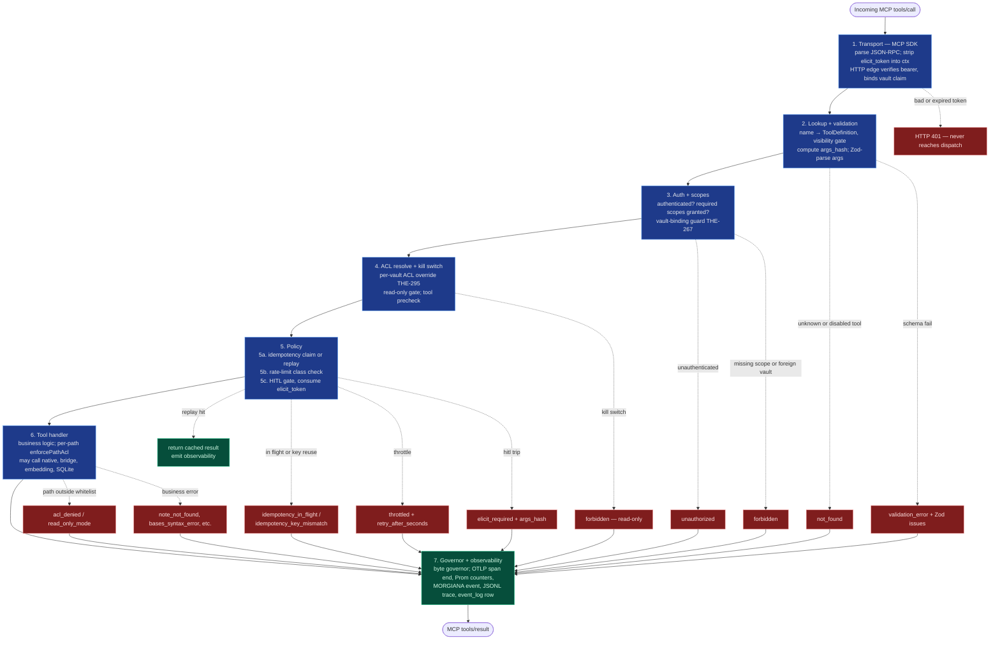

# obsidian-tc — Architecture and Topology

> **Scope note (updated 2026-07-12):** obsidian-tc is the **converged memory engine** — vault read/write, search, *and* the retrieval intelligence folded in from the now-retired knowledge-mcp-server, then measured far past it. The 2026-07 retrieval campaign shipped: a general BM25+dense hybrid (enriched BM25 + enriched dense + hop-ordered wikilink expansion fused under RRF k=10 — this closed THE-196), contextual chunk enrichment (+0.223 nDCG, default on), per-vault GraphRAG edge isolation (THE-310), k-means chunk clustering + ACT-R activation recompute as offline CLI passes, and an n=136 golden-set eval harness with a statistical ship rule; mechanisms that lost their A/B (rerankers, learned sparse, ColBERT, convex fusion, query decomposition, MMR, the class router's lexical short-circuit) ship dark behind flags with numbers recorded. The v1.6–v1.7 line added the **experiential work-memory tier** (§11) and the composite context surfaces (`vault_context`, `reflect`). The earlier 2026-06-19 note — which scoped retrieval intelligence *out* — is **superseded** by the 2026-06-25 single-converged-product decision (THE-233): obsidian-tc *is* the engine. The Python ML sidecar and native `kmeansAssign`/`actrDecayScore` reservations were removed (THE-298 truth pass). The typed-atom MemIR substrate (claim atoms, `authoritative_claims`, bi-temporal) remains a downstream engine-build phase (THE-235), not part of this v1.x line.

**Status:** shipped in v1.0.2 (2026-06-21); reconciled 2026-07-02 (THE-298 truth pass); memory-engine sections added 2026-07-12 at v1.7.0. This document records the architecture and topology of the v1.x line as it actually ships.
**Tool surface:** the 146-tool G2.1 surface across 31 domains — see [`docs/G2.1-tools.md`](docs/G2.1-tools.md) — extended additively post-1.0 (the facade meta-tools, structured formats, the knowledge domain, the vendor-docs read surface, the M8 work-memory domain, the git and remotely-save bridges). What `tools/list` *advertises* is shaped by the `toolFacade` mode (§10); every registered tool stays callable by name.
**Linear:** THE-115

## Scope and inheritance

This sub-doc commits the topology, IPC contracts, and dispatch pipeline for V1. It inherits the G2.1 r2 tool surface and the polyglot architecture from G1.

**Resolved here:**
- G2 architecture parent's open question 3 (plugin discovery) — precise probe contract in §6.
- G2 architecture parent's open question 4 (sidecar lifecycle) — **resolved by removal**: the V2 ML sidecar was cut from scope; no sidecar process, config block, or dispatch shim ships (see the scope note above).
- G2.1 r2 cross-cutting #7 (companion plugin discovery probe endpoint contract) — §6.
- G2.1 r2 cross-cutting #8 (HITL threshold policy location) — §7. **Shipped as hardcoded floors** (a tool's `destructive` flag plus per-scope HITL floors), evaluated in the dispatch pipeline; the config-driven per-vault threshold model from the original design was dropped at implementation.
- Where `execute:<plugin>` scope check fires (G2.1 cross-cutting #1's location question) — §8. ACL layer. Scope class itself remains G2.4's call.
- Streaming support in V1 — §9. No, pagination covers it.
- MCP protocol version — §10. **2025-11-25**, negotiated (guarded in `test/tool-surface-2025.test.ts`). Streamable HTTP for remote, STDIO for local. Capabilities advertise `tools`/`prompts`/`resources` **without `listChanged`** (the surface is static, registered once at startup); HITL is the server's own elicit-token flow (§4c), not the MCP `elicitation` client capability.

**Forward-routed to G2.3-G2.5:** see end of doc.

---

## 1. Component boundaries

Thirteen named components in V1. Each component has an owner of state, a language, and a clear NOT-responsible-for boundary.

### Server-side (single process)

**(1) Transport layer.** TypeScript on Bun + Hono. Parses MCP messages (JSON-RPC 2.0 over STDIO or Streamable HTTP per MCP 2025-11-25). Owns connection lifecycle, message framing, protocol-version negotiation. NOT responsible for tool semantics, vault state, or auth decisions.

**(2) Auth layer.** TypeScript. Validates JWT bearer tokens (or accepts `none` mode if bound to localhost). Two verification routes selected by the token's protected header (THE-297): **HS256 verifies only against the shared `jwtSecret`; asymmetric algorithms (RS256 / ES256 / EdDSA by default, configurable via `auth.algorithms`) verify only against a local JWKS** (`auth.jwks` inline or `auth.jwksFile`, loaded once at transport boot — deliberately no URL fetch). Key rotation is `kid`-based inside the JWKS (publish old + new keys together). The strict routing makes the classic alg-confusion attack (public key used as HMAC secret) structurally impossible. Owns token validation, scope extraction, and caller-context construction. NOT responsible for per-resource access control (that's ACL), throttling (Policy), or session state (workspace_memory).

**(3) ACL layer.** TypeScript. Evaluates each tool's declarative ACL annotation against the request's scopes + vault + paths-in-args. Owns read/write/delete/execute/admin scope checks against folder glob patterns. The root `acl` block is the inherited default; a `vaults[]` entry may carry its own `acl` override (THE-295), applied at dispatch once the input names that vault. Path checks run against the symlink-canonical (realpath-resolved) vault-relative path — the vault root is a **mandatory** argument to `enforcePathAcl` (THE-286), so no callsite can silently fall back to a lexical check — with both rule and path NFC-normalized (THE-272), and `.obsidian/**`, `.git/**`, `.trash/**` hard-denied regardless of allowlists (THE-268; the bookmark/workspace config files are exempted). NOT responsible for: scope syntax design (G2.4 owns that), HITL thresholds (Policy), or data ownership semantics.

**(4) Policy layer.** TypeScript. Three checks in order: idempotency-key replay, rate-limit class enforcement, HITL gate. Owns pre-impl gate decisions. NOT responsible for ACL (already done upstream), tool dispatch, or observability emission.

**(5) Tool router.** TypeScript. Maps tool name → implementation function via static lookup table built at server start. Owns the dispatch table. NOT responsible for argument validation (each tool's Zod schema does that), pre-dispatch checks (auth/ACL/policy did those).

**(6) Tool implementations.** TypeScript, one file per tool (or small group) in `packages/server/src/tools/`. Each impl owns its argument schema declaration (Zod — parsed at dispatch), business logic, output construction, error emission with structured payload. NOT responsible for cross-tool concerns (transport, auth, observability emit — those wrap the impl).

**(7) Plugin bridges.** TypeScript HTTP clients. Owns REST calls to `/obsidian-tc/v1/*` endpoints on the Local REST API plugin's port, response parsing, error translation to obsidian-tc's error taxonomy. Every bridge call first passes the probed capability snapshot gate — including the companion API-version floor (THE-282, §6): an incompatible companion degrades every bridge tool with the non-retryable `plugin_incompatible`. NOT responsible for tool semantics — tool impls call into bridges.

**(8) Embedding provider interface.** TypeScript. `EmbeddingProvider` interface plus per-provider implementations (Ollama, OpenAI, Voyage, Cohere). Each provider owns its API specifics, dimensions, cost estimation. The `embeddings` config block is global (one provider per server). NOT responsible for chunk storage or retrieval logic.

**(9) Native module.** Rust via napi-rs, packaged at `@the-40-thieves/obsidian-tc-native`. As shipped it owns four pure primitives: cosine similarity, **batched** cosine similarity (`cosineBatch`), a Unicode tokenizer, and BM25 term scoring — plus, on Unix only, symlink-safe note read/atomic-write helpers. With the FTS5 substrate landed (THE-291), the tokenizer + BM25 primitives are **fallback and auxiliary paths**, not the primary text-search engine: they rank the JS disk-scan fallback for `search_text` and score the `find_capability` facade's catalog search; the primary text candidate generator is the `notes_fts` trigram index (component 10). Batched cosine (`cosineBatch`) is the brute-force semantic fallback when sqlite-vec is unavailable, scoring the whole candidate set in one boundary crossing per query; the per-pair `cosineSimilarity` entry point measured 13–22× slower than pure JS and is deliberately NOT used on that path (THE-420). RRF and the sqlite-vec wrapper are deferred (sqlite-vec is loaded as a SQLite extension at the TS/db layer; RRF is a V2 hybrid-fusion input), and the V2-reserved `kmeansAssign` / `actrDecayScore` stubs were removed with the V2 ML scope. Every export has a numerically identical pure-JS fallback. NOT responsible for SQLite schema, transport, business logic.

**(10) SQLite cache.** **One shared `cache.db` for the whole server** at `<config.cacheDir>/cache.db` (`cacheDir` is a top-level config field, default `.obsidian-tc`; `cli.ts` opens it exactly once). Vault isolation is **logical (row-scoped), not physical (file-scoped)**: most tables carry a `vault_id` column and queries filter on it — `chunks`, `notes`, `workspace_sessions`, `capture_queue`, `memory_entities`, `idempotency_keys`, `elicit_tokens`, and `event_log` (nullable). The exceptions, stated plainly: `chunk_embeddings` and the runtime `vec_chunks` vec0 index are keyed by `chunk_id` only — the sqlite-vec KNN is global over the index, so since THE-287 the candidate metadata join scopes to the requesting vault **in SQL** and a crowded top-N falls back to the exhaustive, vault-scoped brute-force scan; `memory_relations` is keyed by entity ids (which are vault-scoped rows). The `vault_edges` wikilink graph now carries its own `vault_id` column (migration `20260703_001`, THE-310) with a per-vault uniqueness index — GraphRAG edges are vault-isolated, no longer an exception. The driver is runtime-selected: `bun:sqlite` under Bun, `better-sqlite3` under Node, built-in `node:sqlite` as the last-resort fallback when better-sqlite3 cannot be resolved (e.g. inside the packed `.mcpb`); `sqlite-vec` loads as an optional extension. The `notes` metadata table (versioned migration) plus the `notes_fts` FTS5 trigram virtual table (runtime-provisioned like `vec_chunks`, so an FTS5-less adapter still opens the DB) back the accelerated text/metadata query layer (THE-291); their absence degrades to disk scans. Schema is versioned via the `schema_migrations` table. A sibling `experiential.db` holds the low-trust membrane tier on its own migration chain. An hourly maintenance sweep (config `maintenance` block, THE-292) purges expired idempotency/elicit rows, trims `event_log` to retention, and runs `PRAGMA optimize`. NOT responsible for vault files — those live in the vault and the server reads them via REST or filesystem. **V2 note:** physically separate per-vault DB files (`<vault cache dir>/cache.db`) behind a storage-backend abstraction are the **planned V2 storage rewrite**. In the v1.x line the shared-file + `vault_id` layout is the committed reality — additive schema changes only — and no doc should describe per-vault DB files as current.

**(11) Observability emitters.** TypeScript. OTLP span exporter, Prometheus counters/histograms, MORGIANA event emitter, JSONL trace writer, event_log row inserter. All emitters receive the same context from the dispatcher. NOT responsible for data they observe (read-only on tool context).

**Background schedulers (not separate components — timers inside the single server process):** the cache.db **maintenance sweep** (THE-292; `maintenance` block, default hourly, unref'd; emits a `tc.maintenance.sweep` MORGIANA event + a `sweep_run` event_log row per run) and the **SleepTime plane scheduler** (THE-296; `plane` block, default every 240 minutes) which runs the registered consolidation jobs (synthesis + audit) — started only when both `plane.enabled` and the inference gateway are configured, since the jobs degrade to DB churn without it.

### Obsidian-side (separate process, lives inside the Obsidian app)

**(12) Companion plugin.** TypeScript, standard Obsidian plugin packaged as `obsidian-tc`. Extends Local REST API plugin with `/obsidian-tc/v1/*` routes. Owns command palette dispatch and the per-plugin bridge endpoints (Dataview, Tasks, Templater, QuickAdd, Text Extractor OCR, Excalidraw, make.md). Runs a startup shape self-check over the Obsidian internals it duck-types (THE-282), surfaced on `/probe` as `shape_ok` / `shape_warnings`. Ships `versions.json` (version → `minAppVersion`) for community-store submission. NOT responsible for vault data — Obsidian owns it.

**(13) Local REST API plugin.** Third-party dependency (`coddingtonbear/obsidian-local-rest-api`). HTTP server inside Obsidian process on port 27124 (default). Owns filesystem-level vault access via HTTP. NOT responsible for obsidian-tc-specific endpoints — companion plugin extends.

### Boundary kinds

**Hard boundaries (process / language):**
- Server ↔ Companion plugin: HTTP over the Local REST API plugin's port. Shared bearer token.
- TypeScript core ↔ Rust native: napi-rs FFI. Sync calls, copy-on-boundary memory.

**Hard boundaries (data ownership):**
- Vault files: Obsidian owns. Server reads via REST API plugin (HTTP) or direct filesystem (with care — only for read paths; writes always go through REST API plugin to keep Obsidian's index consistent).
- SQLite cache: server owns **one shared `cache.db`** (rows scoped by `vault_id` — see component 10 for the exceptions). Companion plugin never touches it.
- Idempotency / elicit tokens: server-only state in SQLite.

**Soft boundaries (TS module-level, single process):**
- Transport / auth / ACL / policy / router / tools / bridges / embedding providers / observability — all in `packages/server/src/`, separate directories, single Bun process.

### Dependency chain (what must be installed for what to work)

```
Filesystem (the vault folder)            (all that M1 CRUD, M2 search, and M3 format
                                          reads/writes need — no Obsidian required, THE-255)
Obsidian app + Local REST API plugin     (required ONLY for the Tier-3 live-action tools below)
      └─ Companion plugin                (rides Local REST API; required for the command
                                          palette + ANY bridge tool)
          ├─ Dataview                    (required for search_dql, validate_dql, eval_dataview_field)
          ├─ Tasks                       (required for tasks_filter)
          ├─ Templater                   (required for list_templates, execute_template)
          ├─ QuickAdd                    (required for list_quickadd_actions, trigger_quickadd)
          ├─ Text Extractor              (required for ocr_attachment, ocr_bulk)
          ├─ Excalidraw                  (required for excalidraw tools)
          └─ make-md                     (required for makemd_list_spaces, makemd_query)
```

Not in the chain, by design: the **workspace, bookmark, and periodic-note tools read and write `.obsidian/*.json` and vault files directly** through the filesystem backend (`tools/m3`), so they need no companion bridge; and **embeddings always use the configured provider** (component 8) — a Smart Connections / Smart Context bridge was designed but never shipped.

Tools failing any link in the chain return `plugin_missing` with the specific plugin name in `details.plugin`.

---

## 2. Dispatch pipeline

This section grounds every per-tool annotation in G2.1 (acl, hitl, idem, ratelimit) to a specific evaluation point.

The capabilities that pipeline governs, by access scope:

<!-- BEGIN GENERATED: tools-summary -->
**146 governed capabilities**, grouped by access scope.

**read** (86) — `audit_provenance`, `bundle_files`, `bundle_folder`, `eval_dataview_field`, `find_link_cycles`, `find_notes_by_property`, `find_notes_by_tag`, `find_orphans`, `find_unresolved_links`, `generate_uri`, `get_attachment`, `get_backlinks`, `get_entity`, `get_index_status`, `get_link_strength`, `get_note_tags`, `get_outgoing_links`, `get_periodic_note`, `get_session_traces`, `get_vault`, `git_diff`, `git_log`, `git_status`, `knowledge_challenge`, `knowledge_get_critical`, `knowledge_search`, `list_attachments`, `list_bookmarks`, `list_capture_queue`, `list_commands`, `list_contradictions`, `list_kanban_boards`, `list_notes`, `list_periodic_notes`, `list_properties`, `list_quickadd_actions`, `list_snapshots`, `list_tags`, `list_tasks`, `list_templates`, `list_vaults`, `list_workspaces`, `makemd_list_spaces`, `makemd_query`, `note_exists`, `ocr_attachment`, `ocr_bulk`, `plur_get`, `plur_recall`, `plur_recall_hybrid`, `plur_similarity_search`, `query_base`, `query_canvas`, `query_datacore`, `query_entity_graph`, `read_base`, `read_canvas`, `read_excalidraw`, `read_frontmatter`, `read_kanban_board`, `read_metadata_fields`, `read_note`, `read_notes`, `read_property`, `read_snapshot`, `reflect`, `remotely_save_status`, `resolve_daily_note`, `search_dql`, `search_jsonlogic`, `search_omnisearch`, `search_regex`, `search_semantic`, `search_text`, `search_vault`, `server_health`, `session_bootstrap`, `snapshot_note`, `suggest_links`, `tasks_filter`, `validate_dql`, `vault_context`, `vault_graph_search`, `vault_health_score`, `work_episodes`, `work_search`

**write** (41) — `add_bookmark`, `add_kanban_card`, `add_observation`, `add_tag`, `append_note`, `append_to_periodic_note`, `commit_capture`, `copy_note`, `create_base`, `create_canvas`, `create_entity`, `create_excalidraw`, `create_periodic_note`, `end_session`, `enqueue_capture`, `execute_template`, `find_or_create_periodic_note`, `format_table`, `git_stage`, `insert_table_column`, `insert_table_row`, `link_entities`, `move_kanban_card`, `open_workspace`, `patch_note`, `prune_hub_links`, `record_retrieval_feedback`, `remotely_save_trigger`, `remove_tag`, `restore_note`, `rewrite_link`, `save_workspace`, `sort_table_by_column`, `start_session`, `update_base`, `update_canvas`, `update_excalidraw`, `update_frontmatter`, `update_task`, `work_forget`, `write_note`

**delete** (5) — `delete_attachment`, `delete_note`, `move_attachment`, `move_note`, `remove_bookmark`

**bulk** (3) — `bulk_create_notes`, `bulk_move_notes`, `bulk_set_property`

**execute** (3) — `execute_command`, `git_commit`, `trigger_quickadd`

**admin** (8) — `add_vault`, `get_metrics`, `get_server_config`, `index_vault`, `inspect_acl`, `refresh_plugin_capabilities`, `reload_vault`, `reset_vault_cache`
<!-- END GENERATED: tools-summary -->



### Per-layer specification

**Layer 1: Transport (MCP SDK boundary).** The MCP TypeScript SDK parses JSON-RPC over STDIO or Streamable HTTP; malformed JSON-RPC is rejected at the protocol layer before dispatch. The `tools/call` handler strips a caller-supplied `elicit_token` out of the arguments into the caller context, so the token never perturbs the args hash — the token is bound to the hash of the call *without* it (`packages/server/src/mcp/server.ts`). There is no separate normalized request type: the dispatch entry point is `registry.dispatch(name, args, ctx)` with a per-request `CallerContext` (caller identity, granted scopes, `authenticated`, resolved vault + optional vault binding, elicit token, DB handle).

**Layer 2: Auth (HTTP edge + dispatch).** Two modes: `none` (no token; the config refuses to validate if HTTP is bound to a non-loopback host) and `jwt`. In `jwt` mode the token's protected header routes verification (THE-297): **HS256 verifies only against the shared `jwtSecret`; RS256 / ES256 / EdDSA (the default `auth.algorithms` allowlist) verify only against a local JWKS** (`auth.jwks` inline or `auth.jwksFile`, loaded once at transport boot — no URL fetch), with `kid`-based key selection for rotation. Either side may be absent; tokens for the missing side reject. HS256-only deployments are unchanged, and `auth.mode: "jwt"` accepts a JWKS in place of `jwtSecret`. Optionally, obsidian-tc acts as an OAuth 2.0 resource server (RFC 9728 Protected Resource Metadata + `WWW-Authenticate` challenge) when `auth.resource` + `auth.authorizationServers` are configured; there is no in-repo authorization server (no token issuance / DCR / OIDC).

The HTTP edge **authenticates only** — it verifies the bearer and derives caller + scopes + optional vault binding; a missing, invalid, or expired token is an **HTTP 401** and never reaches dispatch. Authorization stays in dispatch: a tool with required scopes rejects an unauthenticated caller with `unauthorized`, and a caller missing a required scope gets `forbidden` with `details.required`. On stdio (trusted parent process, auth `none`) the caller runs with full scopes.

**Layer 3: Lookup, validation, scope, and ACL (in `registry.dispatch`, in this order):**

1. **Tool lookup + visibility.** Unknown tool → `not_found`. A `toolVisibility`-disabled tool rejects with the same `not_found`, indistinguishable from unregistered.
2. **args_hash** — SHA-256 of tool name + canonicalized (key-sorted) args, truncated to 32 hex chars; the same derivation elicit tokens and idempotency keys bind to.
3. **Input validation.** The tool's declared Zod schema parses the args **at dispatch** (not in the handler); failure → `validation_error` carrying the Zod issues.
4. **Auth + scope grant** (see Layer 2): `unauthorized` / `forbidden`.
5. **Vault binding (THE-267).** A bearer token may carry a `vault` claim; the HTTP edge binds the caller to that vault (or the server's default vault when the claim is absent), and dispatch rejects a call naming a different vault with `forbidden`. The trusted stdio transport is unbound.
6. **Per-vault ACL resolve (THE-295).** The root `acl` block is the default; when the input names a vault carrying its own `acl` override, the rest of the dispatch — the read-only kill switch, the central path-ACL stage, and every handler-side `enforcePathAcl` — runs under **that vault's** ACL. "Agent may write vault A but only read vault B" works in one process.
7. **Read-only kill switch.** A mutating tool (`destructive: true` or a mutating scope family) under effective `acl.readOnly: true` → `forbidden` ("vault is read-only").
8. **Tool precheck.** An optional per-tool precondition hook runs here — after ACL, before HITL — so a rejected precheck never consumes the single-use elicit token.

Per-**path** folder ACL is enforced **as a dispatch stage** (THE-414), not a handler convention: each tool declares the vault paths it touches via `def.pathAcl(input) -> {op, path}[]`, and dispatch calls `enforcePathAcl` for every declared path **after the HITL gate and before the handler** — so containment no longer depends on a handler remembering to gate. Handler-side `enforcePathAcl` calls are retained as defense-in-depth, and the `acl-extraction-coverage` test fails CI if a mutating path-touching tool declares neither a `pathAcl` extractor nor a documented exemption (computed/dynamic paths that cannot be extracted statically stay handler-enforced). Each declared path is checked against the effective `acl.readPaths` / `writePaths` / `deletePaths` glob whitelists (an omitted field is unrestricted for that op kind unless `strictReadDefault` fails reads closed). Paths are realpath-canonicalized through symlinks (THE-269/286) and NFC-normalized (THE-272) before matching; `.obsidian/**`, `.git/**`, `.trash/**` are hard-denied (THE-268). Outside the whitelist → `acl_denied` with `details.{path, op}`; the kill switch on a path op → `read_only_mode`. The `inspect_acl` admin tool shares the same evaluator and reports what `denied_by` a given (vault, path, op, scopes) tuple.

**Layer 4 (shown as 5 in the diagram): Policy.** Three sub-checks in order. Each can short-circuit.

**4a. Idempotency (claim-based, THE-208/293).** A keyed call **claims** an in-flight row in `idempotency_keys` before executing. A duplicate finds the row: completed → the cached result is replayed without re-running the handler; still in-flight → `idempotency_in_flight`; the same key with a different tool or args → `idempotency_key_mismatch`. An expired or crashed in-flight row may be reclaimed after the configurable `idempotencyReclaimSeconds` window (default 60; THE-293) — raise it for legitimately slow keyed bulk ops so a concurrent duplicate cannot false-reclaim and double-execute. The completion row (result blob, `idempotencyTtlSeconds` TTL, default 24 h) is written by dispatch after the handler succeeds — not by the tool impl. This gate runs before throttle/HITL so two concurrent identical requests can't each consume the elicit token.

**4b. Rate limit.** Each tool resolves to a scope class (`read | write | delete | bulk | execute | admin`). Token-bucket per **(caller-hash, scope class, vault)** against the `throttle:` config block (per-minute + burst tiers; `throttle.enabled: false` runs the gate unenforced). Trip → `throttled` with `details.{scope_class, retry_after_seconds, current_burst, current_rate}` and a rate-limit-hit counter increment. Runs before HITL so a throttled call never burns the confirmation.

**4c. HITL gate.** The shipped gate is a **hardcoded floor, not a config table**: a tool requires human confirmation iff `def.destructive === true` **or** one of its required scopes carries a HITL floor (`scopeRequiresHitl` — e.g. `execute:command`). When it trips without a valid token, dispatch returns `elicit_required` carrying the **`args_hash` to confirm against** — the server does **not** mint a token into the error. A confirmation token is issued out-of-band via the exported `issueElicitToken` API (32-char hex, 16 bytes entropy; row in `elicit_tokens` bound to vault + tool + args through the `args_hash` derivation; TTL default 5 min, `elicitTtlSeconds`) and resubmitted as the `elicit_token` argument. On resubmit it is validated and **consumed atomically** (`UPDATE ... WHERE consumed_at IS NULL`) — single-use, and it cannot authorize a different tool or different args (the tool name is baked into the hash). There is no per-vault threshold table and no conditional threshold evaluation; that design was dropped at implementation (§7). Tools with *conditional* confirmation (overwrite a non-empty note, cross-folder move, non-dry-run link rewrite) call the same machinery from the handler via `requireConfirmation`, so ordinary creates and dry-runs never demand confirmation.

**Layer 6: Handler.** The tool function. Owns:
- Business logic (may call native module, plugin bridge, embedding provider, SQLite)
- Per-path folder ACL: the authoritative gate is the central dispatch stage (THE-414, Layer 3); handlers keep `enforcePathAcl` calls as defense-in-depth, and own enforcement for the computed/dynamic paths that cannot be declared statically
- Output construction
- Business errors: `note_not_found`, `bases_syntax_error`, etc.

Compute budgets (THE-293) also live at the handler layer: regex search runs in a worker thread under a true execution timeout (`governor.regexTimeoutMs`, default 2000 ms — a catastrophic-backtracking pattern terminates with `compute_budget_exceeded` instead of hanging the event loop, with an inline-scan fallback when the worker cannot start), and JSONLogic evaluation carries a 10k op budget counted on every node.

**Layer 7: Governor + observability.** The byte governor serializes the result once (memoized for the transport formatter, THE-294); a result over `governor.maxResponseBytes` → `overflow`. Observability always fires, regardless of success/failure:
- **OTLP span**: one root span per tool call named `obsidian_tc.<tool>` (SERVER kind), attributes in the `obsidian_tc.*` namespace (`vault_id`, `tool`, `caller_hash`, `scopes_required`, `status`, `error_code`, `elicit_used`, `overflow_b`).
- **Prometheus**: increments `obsidian_tc_tool_calls_total{vault, tool, status}`, records `obsidian_tc_tool_duration_seconds` histogram.
- **MORGIANA event**: CloudEvents 1.0 JSONL spooled per-vault per-day under the cache dir (HTTP push only when `morgiana.httpEndpoint` is set); an emit failure drops the event and feeds a `morgiana_emit_dropped_total` counter — fail-soft, never blocking dispatch.
- **event_log row**: SQLite audit insert (`args_hash` included) for local debug replay.
- **JSONL trace**: when a workspace session is active, the audit row is mirrored into the session's trace file.

### Cross-cutting concerns through the pipeline

- **args_hash** computed once at dispatch entry, shared by the idempotency gate, the elicit-token binding, and the audit row.
- **CallerContext** attached at the transport boundary, available through the handler (some tools surface `caller` in output).
- **Per-vault ACL resolution** happens at dispatch when the input names a vault; the resolved ACL rides the context for the kill switch and every handler-side path check.
- **Result serialization** happens once (THE-294): the byte-governor's canonical string is memoized by result identity and reused by the transport formatter, so a successful payload is not stringified twice on the dispatch path.

---

## 3. IPC contracts

Two live boundaries. Each gets a wire protocol, auth, versioning, and error spec. (A third boundary — a Python ML sidecar — existed in the original G2.2 design and was removed with the V2 ML scope; see §3.3.)

### 3.1 Server ↔ Companion Plugin

**Wire:** HTTP/1.1 over the Local REST API plugin's port (default `127.0.0.1:27124`). The Local REST API plugin runs an HTTP server inside the Obsidian process; the companion plugin registers additional routes via the REST API plugin's extension hooks.

**Auth:** shared bearer token in `Authorization: Bearer <api_key>` header. The token is the Local REST API plugin's configured API key (set in its plugin settings). Vault config `restApiKey` mirrors this value.

**Versioning:** URL path version (`/obsidian-tc/v1/`). Bump to v2 on breaking changes. The companion reports `obsidianTcApiVersion: "1"` on `/probe`; the server compares it against its compiled-in `EXPECTED_COMPANION_API` (THE-282). A different major marks the capability snapshot incompatible and **every bridge tool degrades with the non-retryable `plugin_incompatible` error** (carrying the companion's version, the expected version, and an update hint) — bridge tools only; the direct-filesystem tool surface is unaffected. A companion that predates probe versioning (absent field) is treated as compatible, since it answered the v1 probe shape.

**Wire format:** JSON request/response. Error envelope:

```json
{
  "ok": false,
  "code": "plugin_missing | plugin_unreachable | invalid_input | internal_error",
  "message": "human-readable description",
  "details": { /* tool-specific */ }
}
```

Success envelope:

```json
{
  "ok": true,
  "result": { /* endpoint-specific */ }
}
```

**Routes (as shipped — `packages/plugin/src/routes.ts`, all under `/obsidian-tc/v1`):**

```
GET    /obsidian-tc/v1/probe                → capability discovery (see §6)
GET    /obsidian-tc/v1/commands/list        → list command palette commands
POST   /obsidian-tc/v1/commands/execute     → run command palette command
POST   /obsidian-tc/v1/dataview/dql         → execute DQL query
POST   /obsidian-tc/v1/dataview/eval        → eval Dataview field expression
POST   /obsidian-tc/v1/dataview/validate    → parse DQL without exec
POST   /obsidian-tc/v1/tasks/filter         → run Tasks plugin filter expression
GET    /obsidian-tc/v1/templater/list       → list templates with metadata
POST   /obsidian-tc/v1/templater/execute    → run Templater template
GET    /obsidian-tc/v1/quickadd/actions     → list configured QuickAdd actions
POST   /obsidian-tc/v1/quickadd/trigger     → fire QuickAdd action by name
POST   /obsidian-tc/v1/ocr/attachment       → Text Extractor OCR, one attachment
POST   /obsidian-tc/v1/ocr/bulk             → Text Extractor OCR, bulk
POST   /obsidian-tc/v1/excalidraw/read      → read Excalidraw note
POST   /obsidian-tc/v1/excalidraw/write     → create/update Excalidraw
POST   /obsidian-tc/v1/makemd/spaces        → list make.md spaces
POST   /obsidian-tc/v1/makemd/query         → query make.md space
```

There are no `/active`, `/smart-connections/*`, `/context/bundle`, `/workspaces/*`, `/bookmarks/*`, or `/periodic-notes/*` routes: the workspace / bookmark / periodic-note tools operate on `.obsidian/*.json` and vault files directly (component chain, §1), and the Smart Connections / Smart Context embedding bridge was never shipped.

**Plugin-bridge timeouts:** per-vault via the `bridges` config block (`VaultBridgesConfigSchema`): `timeoutMs` default 5000, `probeTimeoutMs` default 500, `ocrTimeoutMs` and `templaterTimeoutMs` default 30000. Timeout → `plugin_unreachable`.

### 3.2 TypeScript core ↔ Rust native (napi-rs)

**ABI:** napi-rs v3 (`napi8`) pinned in `packages/native/package.json` (`engines.node >= 24`). Server consumes via Bun workspace link as `@the-40-thieves/obsidian-tc-native`.

**Prebuild distribution (as shipped):** the umbrella package stays **unscoped at the napi level** (`napi.binaryName = "obsidian-tc-native"`) while `napi prepublish` generates and publishes one scoped platform sub-package per built triple into the umbrella's `optionalDependencies`. The publish matrix builds **eight** triples, including the two linux musl triples so Alpine/musl hosts load the native addon instead of the pure-JS fallback (linux musl is cross-compiled via `napi build -x` / cargo-zigbuild):

```
@the-40-thieves/obsidian-tc-native-linux-x64-gnu
@the-40-thieves/obsidian-tc-native-linux-arm64-gnu
@the-40-thieves/obsidian-tc-native-linux-x64-musl
@the-40-thieves/obsidian-tc-native-linux-arm64-musl
@the-40-thieves/obsidian-tc-native-darwin-x64
@the-40-thieves/obsidian-tc-native-darwin-arm64
@the-40-thieves/obsidian-tc-native-win32-x64-msvc
@the-40-thieves/obsidian-tc-native-win32-arm64-msvc
```

A hand-written `index.js` loader (replacing the napi-generated one) tries a locally-built `.node`, then the matching platform sub-package, and otherwise loads the numerically-identical pure-JS `fallback.ts`/`fallback.js`, exposing `module.exports.nativeLoaded` so callers can tell which backend is active. It never throws on a missing prebuild.

**Calls (sync, CPU-bound):**

```typescript
// packages/native/src/lib.rs → exposed as TS via napi-rs (shipped surface: 3 exports)
export function cosineSimilarity(a: number[], b: number[]): number;   // f64 arrays; 0 for empty/mismatched length
export function tokenize(text: string): string[];                     // Unicode lowercase alphanumeric terms
export function bm25Score(                                            // one query term's BM25 contribution (k1=1.2, b=0.75)
  tf: number, docLen: number, avgDocLen: number, docFreq: number, docCount: number,
): number;

// Deferred / removed: dotProduct and reciprocalRankFusion are not implemented (RRF is a V2
// hybrid-fusion input; the sqlite-vec wrapper lives at the TS/db layer, not here). The V2
// stubs kmeansAssign / actrDecayScore were removed with the V2 ML scope (see top-of-doc note).
// Inputs are plain f64 arrays; cosineSimilarity also accepts the document vector as a
// zero-copy Float32Array on the brute-force path (THE-266).
```

**Memory:** napi-rs copies typed arrays on the boundary. For 768-dim embeddings (3KB) the copy is ~100µs; for 1536-dim (6KB) ~200µs. Acceptable.

**Async:** all calls sync in V1. napi-rs supports async, but our ops are CPU-bound and short; sync simplifies error handling and observability span lifetime.

**Errors:** Rust `panic!` → JS throws. Tool impl catches with `internal_error` code and `details.native_op` field for debugging. Rust `Result::Err` returns are mapped to JS exceptions via napi-rs `Error::from_reason`.

### 3.3 Server ↔ Python ML sidecar — removed

A Python ML sidecar (FastAPI on localhost, NetworkX / HDBSCAN / scikit-learn ops) was specced here in the original G2.2 design and removed with the V2 ML scope (see the scope note at the top of this document). No sidecar code, config block, or `sidecar.call` dispatch helper exists in the shipped tree.

---

## 4. Deployment modes

Five modes. Per-mode constraints:

| Aspect | STDIO local | HTTP local | HTTP remote | Docker | Standalone binary |
|---|---|---|---|---|---|
| Process model | Subprocess of MCP client | Background daemon | Background daemon on remote host | Container with bind-mount | Compiled Bun binary |
| Bind address | N/A | `127.0.0.1` enforced | Non-loopback requires `jwt` | Per `docker run -p` | Per configured transport |
| Auth required | `none` OK | `none` OK | `jwt` REQUIRED (fail-closed config interlock: refuses `none` mode on a non-loopback host) | Per HTTP mode | Per configured transport |
| Cold start | ~500ms (Bun JIT + native load) | One-time daemon start; <50ms per request | Same as HTTP local + tunnel latency | ~1s (container start) | ~100ms (bytecode-compiled, no JIT warmup) |
| Multi-client | 1 client per process | Many clients | Many clients | Many clients | 1 (STDIO) or many (HTTP) |
| Companion plugin location | Same machine | Same machine | Same machine as server (NOT same as client) | On the host (not in container) | Same machine as binary |
| Native module | Prebuild for platform, else pure-JS fallback | Same | Same | Pure-JS fallback (image ships no node_modules; `bun:sqlite` is the DB driver) | Pure-JS fallback (no node_modules to resolve a prebuild from) |
| Vault access | Same machine | Same machine | Same machine as server | Bind-mounted into container | Configurable path |
| MCP transport | STDIO | Streamable HTTP | Streamable HTTP over CFTunnel/SSH | Streamable HTTP | STDIO or HTTP |

### Mode-specific notes

The CLI has no per-transport flags: transports are chosen by the config's `transports` block (`transports.stdio` default true; `transports.http.enabled` default false, port default 8765). The shipped invocation surface is `obsidian-tc <vault-dir | config.json>` (zero-config from a bare vault folder — a single vault `main` with all defaults — or a config file), `obsidian-tc serve [--config <path> | <path>]`, plus `config show`, `config validate`, `plugin install --vault <p>`, `version`, and `help`. With no path, `OBSIDIAN_TC_CONFIG` is used.

**STDIO local.** Default for Claude Desktop / Claude Code installs. Client launches `obsidian-tc <vault-dir | config.json>` as a subprocess. One subprocess per client. Auth `none` is the typical config; trust boundary is the parent process.

**HTTP local.** User enables `transports.http` in config and runs the server once as a daemon. Multiple MCP clients on the same machine connect to `localhost:8765` (default port). Faster than STDIO because the Bun process and native module stay warm. Cold-start savings compound for autonomous-agent workloads with many short calls. Auth `none` accepted on localhost.

**HTTP remote.** Server runs on a remote host (Hetzner, cave, etc.) with the vault co-located. Clients connect over Cloudflare Tunnel or SSH local-forward. The config **refuses to validate with `auth.mode: "none"` on a non-loopback HTTP host** — this is a fail-closed schema interlock (F2), not a runtime flag. JWT (HS256 or JWKS-verified asymmetric) required. DNS-rebinding / cross-origin protection on the HTTP edge is on by default (THE-271).

**Docker.** Multi-stage image on glibc `oven/bun:1-slim`; the runtime stage ships only `packages/server/dist` and `ENTRYPOINT ["bun", "/app/packages/server/dist/cli.js"]` — so the container invocation is `docker run -v /path/to/vault:/vault ghcr.io/the-40-thieves/obsidian-tc:<tag> /vault` (a mounted vault folder or config path; the `serve` / `config` / `plugin install` subcommands are available). It runs under Bun, so `bun:sqlite` is the active DB driver and the native module + sqlite-vec degrade to pure-JS. Vault bind-mounted; companion plugin runs in the user's Obsidian on the host (not in container — Obsidian is a GUI app). Container talks to Obsidian's Local REST API plugin on the host's network; requires `--network host` on Linux or explicit port mapping on macOS/Windows. Built + pushed to ghcr.io by `publish.yml` on a version tag.

**Standalone binary.** `bun build --compile --bytecode` (in `publish.yml`) produces a single executable per platform: macOS x64/arm64, Windows x64, Linux x64/arm64 (Windows arm64 is not a `bun --compile` target — covered by the npm install). No Bun install required for users. Distributed via GitHub releases. The native module is not bundled into the binary — the loader finds no prebuild and uses the pure-JS fallback.

### Edge case: vault on laptop, agents on a server

Two topologies:

**Topology A — server colocated with vault (recommended).** obsidian-tc + Obsidian + REST API plugin all run on the laptop. Agent on Hetzner tunnels MCP calls to laptop's obsidian-tc HTTP endpoint via Cloudflare Tunnel. Server↔plugin calls are local (low latency); only the agent↔server hop crosses the network.

**Topology B — server colocated with agent.** obsidian-tc runs on Hetzner, agent connects via local socket. Server tunnels back to laptop's Obsidian REST API plugin via Cloudflare Tunnel for every vault op. Every plugin bridge call now incurs tunnel RTT. Rejected as default; documented as available for users with specific reasons (e.g., laptop is offline most of the day).

Recommendation surfaces in docs (G2.5).

---

## 5. Multi-vault registry

### Config file location

**As shipped:** config is a **JSON** file loaded from an explicit path — the `OBSIDIAN_TC_CONFIG` env var or the CLI's config-path argument — via `loadConfig(path)` (`packages/server/src/config/load.ts`), validated by `ServerConfigSchema`. A bare vault directory also works (zero-config: a single vault `main` with all defaults). There is no XDG / `%APPDATA%` auto-discovery. The CLI ships `serve`, `config show`, `config validate`, and `plugin install` subcommands. Secrets are kept off disk via env: `OBSIDIAN_TC_JWT_SECRET`, `OBSIDIAN_TC_PLUR_ENDPOINT`, `OBSIDIAN_TC_PLUR_TOKEN`.

### Schema (as shipped — `ServerConfigSchema`, exported from `@the-40-thieves/obsidian-tc-shared`)

The shipped schema (`packages/shared/src/config.schema.ts`) is flatter than the G2.2 design sketch. Key reconciliations vs the original design: **auth is `none | jwt` only** (no `oauth` / DCR mode; `jwt` covers HS256 via `jwtSecret` and RS256/ES256/EdDSA via a local JWKS — THE-297); **ACL is a global block with an optional per-vault override** (`vaults[].acl`, THE-295 — the root block is the inherited default); **embeddings providers are ollama / openai / voyage / cohere** (no `custom`), configured globally; there is **no `sidecar` block** (the V2 ML scope was dropped); HITL is **hardcoded floors + per-scope**, not a per-vault `hitl_thresholds` table; and throttle / governor / observability / maintenance / plane are first-class top-level blocks.

```typescript
const ServerConfigSchema = z.object({
  cacheDir: z.string().default(".obsidian-tc"),      // ONE shared cache.db lives here (top-level, not per-vault)
  vaults: z.array(VaultConfig).min(1),       // VaultConfig: { id, name?, path, acl?, restApiUrl?, restApiKey?,
                                             //   mode?, bridges?, plugins?, commands?, memory?, workspace? }
                                             //   vaults[].acl (THE-295): same shape as the root acl block;
                                             //   absent -> the root ACL is the inherited default
  plur: PlurConfig.optional(),               // GLOBAL read proxy: { endpoint?, apiKey?, apiPrefix, timeoutMs }
  auth: z.object({                           // none | jwt ONLY (no oauth mode)
    mode: z.enum(["none", "jwt"]).default("none"),
    jwtSecret: z.string().min(32).optional(),      // HS256 shared secret
    tokenTtlSeconds: z.number().int().positive().default(86400),
    jwks: z.record(z.string(), z.unknown()).optional(),   // THE-297: inline JWKS (asymmetric verification)
    jwksFile: z.string().optional(),                      // THE-297: JWKS path, loaded once at boot (no URL fetch)
    algorithms: z.array(z.string()).optional(),           // THE-297: asymmetric allowlist, default RS256/ES256/EdDSA
    resource: z.string().url().optional(),                // THE-278: RFC 9728 Protected Resource Metadata (opt-in)
    authorizationServers: z.array(z.string().url()).optional(),
    resourceName: z.string().optional(),
    scopesSupported: z.array(z.string()).optional(),
  }),                                        // refine: mode "jwt" requires jwtSecret OR jwks OR jwksFile
  acl: z.object({                            // GLOBAL default; overridable per vault via vaults[].acl
    readOnly: z.boolean().default(false),          // kill switch
    defaultScopes: z.array(z.string()).default([]),
    rules: z.array(z.object({ glob: z.string(), scopes: z.array(z.string()) })).default([]),  // last-match-wins
    readPaths: z.array(z.string()).optional(),     // per-op whitelist; OMITTED = unrestricted for that op kind
    writePaths: z.array(z.string()).optional(),
    deletePaths: z.array(z.string()).optional(),
    strictReadDefault: z.boolean().default(false), // THE-268: undefined readPaths fails CLOSED on the request path
  }).default({}),
  embeddings: z.object({                     // GLOBAL: one provider per server
    provider: z.enum(["ollama", "openai", "voyage", "cohere"]).default("ollama"),
    model: z.string().default("nomic-embed-text"),
    dimensions: z.number().int().positive().default(768),
    baseUrl: z.string().url().optional(), apiKey: z.string().optional(),
  }).default({}),
  transports: z.object({
    stdio: z.boolean().default(true),
    http: z.object({
      enabled: z.boolean().default(false),
      host: z.string().default("127.0.0.1"),
      port: z.number().int().min(1).max(65535).default(8765),
      enableDnsRebindingProtection: z.boolean().default(true),  // THE-271
      allowedHosts: z.array(z.string()).default([]),
      allowedOrigins: z.array(z.string()).default([]),
    }).default({}),
  }).default({}),
  governor: z.object({
    maxResponseBytes: z.number().int().positive().default(1_000_000),
    regexTimeoutMs: z.number().int().positive().default(2000),  // THE-293: regex worker-time budget
  }).default({}),
  toolVisibility: ToolVisibilityConfig.optional(),  // THE-219: allowed/hidden/disabled/…Tags/requireReadOnly
  toolFacade: z.object({                            // THE-219/275: what tools/list advertises
    mode: z.enum(["triad", "domain", "flat"]).default("triad"),
  }).default({}),
  throttle: ThrottleConfig,        // enabled + per-class tiers read/write/delete/bulk/execute/admin
                                   //   + maxConcurrentWritesPerVault
  observability: ObservabilityConfig,   // otel{} / prometheus{} / morgiana{} / retention{}
  maintenance: z.object({                           // THE-292: periodic cache.db sweep
    enabled: z.boolean().default(true),
    intervalMinutes: z.number().int().positive().default(60),
  }).default({}),
  plane: z.object({                                 // THE-296: SleepTime consolidation scheduler
    enabled: z.boolean().default(true),
    intervalMinutes: z.number().int().positive().default(240),
  }).default({}),
  idempotencyTtlSeconds: z.number().int().positive().default(86400),
  idempotencyReclaimSeconds: z.number().int().positive().default(60),  // THE-293: in-flight reclaim window
  elicitTtlSeconds: z.number().int().positive().default(300),
})
// F2 fail-closed interlock (.superRefine): refuse the config when transports.http.enabled &&
// auth.mode === "none" && host is non-loopback — never serve an unauthenticated routable host.
```

### Vault resolution algorithm

For any tool call with a `vault` field:

1. If `args.vault` set, use it (unknown id → `vault_not_found`).
2. Else use the server's default vault: the `OBSIDIAN_TC_DEFAULT_VAULT` env var when it names a configured vault, otherwise the **first vault in the config**.

HTTP callers may additionally be bound to a single vault by their token's `vault` claim (THE-267): a bound caller's tool call naming any other vault is rejected with `forbidden`, and a claimless token is confined to the server's default vault. The trusted stdio transport retains full multi-vault access.

Cross-vault ops: **none shipped.** Every vault tool takes a single `vault` argument (`search_vault` included — it is the *mode* router across text/regex/semantic/jsonlogic/dql, not a multi-vault fan-out). A caller searching several vaults issues one call per vault. A `vaults: VaultId[]` fan-out was a design-era idea that did not ship in v1.x.

### Per-vault isolation guarantees

- **SQLite cache.** One **shared** `cache.db` for the whole server at `<config.cacheDir>/cache.db`; isolation is logical — rows are scoped by `vault_id` and queries filter on it (see component 10 for the exact table list and the `chunk_embeddings` / `vec_chunks` exceptions; `vault_edges` carries a per-vault `vault_id` since THE-310, and the vec0 KNN candidate join is vault-scoped in SQL since THE-287). Schema versioned via the `schema_migrations` table. **V2 note:** physically separate per-vault DB files are the planned V2 storage rewrite; do not describe them as current.
- **JSONL traces.** Vault-relative under the per-vault `workspace.traceFolder` (default `.obsidian-tc/traces` inside the vault — a dot-folder, so it stays out of Obsidian's graph), path-safe via `resolveVaultPath` and ACL-checked via `enforcePathAcl`. Retention 90 days (`observability.retention.tracesDays`).
- **Embedding provider.** The `embeddings` block is **global** — one provider per server, not per-vault. (Per-vault providers were a design-era idea that did not ship.)
- **ACL.** The root `acl` block is the inherited default; a `vaults[]` entry may carry its own `acl` override (THE-295), enforced at dispatch for the read-only kill switch and every handler-side path check. "Write vault A, read-only vault B" works in one process.
- **`event_log` rows.** Isolated by their `vault_id` column in the shared `cache.db`, not by physical DB separation. No cross-vault analytics in V1 (admin tool `get_metrics` can filter to one vault or aggregate across all).

### Reload semantics

`reload_vault(vault_id)` — **as shipped, a validation probe, not a hot reload** (`packages/server/src/tools/m1/registry-tools.ts`):

1. Re-read and re-validate the on-disk config (when the server was started from a config file).
2. Error with `vault_not_found` if the vault is no longer in the config.
3. Return `{vault, reloaded_at}`. **The running server keeps its startup config until restart** — hot-applying config deltas (ACL, timeouts, `plugins.force*`) was deferred at implementation; it does not touch the cache and does not re-fire the capability probe.

`reset_vault_cache(vault_id)` (destructive, HITL-gated) drops a vault's cached rows (chunks, embeddings, idempotency keys; optionally the event log).

Adding or removing a vault: requires server restart. Config file edit + restart. Removed vault's cached rows are preserved in `cache.db` for safety (manual cleanup if user wants).

Reasoning: dynamic vault add/remove is a small ergonomic win that complicates dispatch (vault registry is consulted on every request; making it write-able requires locking). Deferred to V1.x if real workloads need it.

---

## 6. Plugin discovery probe

### Trigger points

The probe fires:
1. At server start, once per configured vault.
2. Not on every tool call (probe results are cached for the vault's lifetime in memory). As shipped, `reload_vault` does **not** re-fire the probe (it only re-validates the config file — §5); refreshing a vault's capability snapshot requires a server restart.

### Probe call

Server fires `GET /obsidian-tc/v1/probe` to the configured Local REST API plugin endpoint with `Authorization: Bearer <vault.restApiKey>`, timeout 500ms (configurable via `bridges.probeTimeoutMs`).

### Probe response

```json
{
  "ok": true,
  "result": {
    "plugin_version": "0.1.0",
    "obsidian_version": "1.7.4",
    "obsidianTcApiVersion": "1",
    "vault_path": "my-vault",
    "capabilities": {
      "dataview":            { "installed": true,  "version": "0.5.66" },
      "tasks":               { "installed": true,  "version": "7.13.0" },
      "templater":           { "installed": true,  "version": "2.4.4" },
      "quickadd":            { "installed": false },
      "excalidraw":          { "installed": true,  "version": "2.4.0" },
      "text-extractor":      { "installed": true,  "version": "0.7.0" },
      "make-md":             { "installed": false }
    },
    "shape_ok": true
  }
}
```

The capability keys are exactly the companion's bridgeable plugin set (`CAP_IDS` in `packages/plugin/src/routes.ts`): dataview, tasks, templater, quickadd, excalidraw, text-extractor, make-md. `vault_path` is the **vault name** (`app.vault.getName()`), not a filesystem path. `shape_ok` / `shape_warnings` report the companion's startup shape self-check over the Obsidian internals it duck-types (THE-282). Companion plugin uses Obsidian's plugin registry to populate `capabilities` — no probes to individual plugins; the companion already runs in the same Obsidian process and has the inventory.

### Validation

What the server does with the probe response (as shipped):

1. **`obsidianTcApiVersion` is compared against the server's `EXPECTED_COMPANION_API`** ("1"). A different major marks the capability snapshot `incompatible`, and **every bridge tool then degrades with the non-retryable `plugin_incompatible` error** (companion version + expected version + an update hint in `details`) instead of silently diverging (THE-282). An absent field (a companion predating probe versioning) is treated as compatible — it answered the v1 probe shape. Only bridge tools are affected; the vault itself keeps serving the direct-filesystem tool surface.
2. **`vault_path` (the vault name) and the companion/Obsidian versions are recorded** into the capability snapshot for ops visibility (`get_server_config` / degrade messages). There is no path-vs-config enforcement and no refuse-to-serve behavior on the probe — the value is a display name, not a filesystem path.
3. **Unknown response fields are treated as absent** (forward-compat by construction).

### Cache

Probe result stored per vault in the in-memory capability cache. Lifetime: until server restart. No on-disk caching (probe is cheap; staleness across restarts is a bigger risk than re-probing).

### Failure handling

| Failure | Behavior |
|---|---|
| 404 (companion plugin not installed) | Log warning `companion plugin not detected on vault <id>`. All plugin-bridged tools return `plugin_missing` with `details.plugin: "obsidian-tc-companion"` (+ an install hint: `obsidian-tc plugin install --vault <path>`). Direct file ops (read_note, write_note, etc.) still work via the filesystem backend. |
| Timeout (`probeTimeoutMs` exceeded) | Mark the vault's companion unreachable. Plugin-bridged tools return `plugin_unreachable`. |
| Malformed JSON | Log error with response body. Treat as unreachable/missing. |
| `obsidianTcApiVersion` major mismatch | Snapshot marked `incompatible`; every bridge tool degrades with non-retryable `plugin_incompatible` + update hint (THE-282). |

### Config override

Vault config `plugins` block (camelCase, JSON — schema in §5):

```json
{
  "plugins": {
    "forceEnabled": ["dataview", "tasks"],
    "forceDisabled": ["excalidraw"],
    "probeSkip": false
  }
}
```

Use cases:
- `forceEnabled`: CI environments without a real Obsidian instance running. Combined with `probeSkip: true`, lets test runners assert on tool behavior without booting Obsidian.
- `forceDisabled`: test the `plugin_missing` error path without uninstalling the plugin. Or operationally disable an expensive bridge.
- `probeSkip`: deterministic startup for CI; documented as "advanced usage."

### Discoverability

`get_server_config` admin tool (G2.1 Domain 28) returns `plugins_detected: Record<vault_id, string[]>` so operators and callers can see what was actually detected. Useful for debugging tools returning `plugin_missing` unexpectedly. `server_health` additionally reports the non-identifying capability flags — `native_loaded`, `vec_enabled`, `fts_enabled` — and an `index` block (`reconcile` pending/ok/degraded, `reconcile_at`, `write_failures`, `notes_ready`; per-vault error detail for authenticated callers only).

---

## 7. HITL gate — shipped model

### Decision (as shipped)

**Hardcoded floors, evaluated in the dispatch pipeline (§2 Layer 4c).** A tool requires a human-in-the-loop confirmation iff its definition sets `destructive: true` **or** one of its required scopes carries a HITL floor (`scopeRequiresHitl` — the G2.4 scope floors, e.g. `execute:command`). There is no per-vault threshold table, no conditional threshold rules, and no `hitl_thresholds` config block: the config-driven per-vault threshold model from the original G2.2 design was dropped at implementation in favor of the simpler, audit-friendly floor. The gate runs after the throttle check (a rate-limited call doesn't burn the confirmation) and last before the handler (the token is spent only once the call is cleared to execute).

### Elicit token lifecycle

- **Trip:** the gate (or a handler-side `requireConfirmation` for conditional cases) throws `elicit_required` carrying the `args_hash` to confirm against (plus any proposed-change detail). The error does **not** carry a token.
- **Mint:** via the exported `issueElicitToken` API — random 32-char hex (16 bytes of entropy), inserted into `elicit_tokens` with `vault_id`, `tool_name`, `args_hash`, optional `proposed_change_json` + `caller`, `created_at`, `expires_at` (`created_at` + TTL, default 5 min — matching the `elicitTtlSeconds` config default), `consumed_at: NULL`. Minting is a deliberate out-of-band step (an operator/host action), not something the server hands to the requesting agent.
- **Resubmit:** the caller re-invokes the same tool with the token as an `elicit_token` argument; the transport strips it before hashing, so the hash binds the call without the token.
- **Use:** single-use. Consumption is an atomic `UPDATE ... WHERE consumed_at IS NULL` — a replay (or a concurrent double-spend) fails the update and the call trips `elicit_required` again.
- **Scope:** verification checks vault + `args_hash` (and the tool name is baked into the hash derivation), so a token cannot authorize a different tool or different args. This is hard binding, not advisory.
- **Expiry hygiene:** expired rows are rejected on read and purged by the periodic maintenance sweep (THE-292).

### Historical: the original G2.2 config-driven design (superseded at implementation)

> The G2.2 design placed thresholds in a per-vault `hitl_thresholds` config block with conditional rules (e.g. `bulk_create_notes_count: 50`, `move_note_cross_folder: true`), on the argument that hardcoded thresholds couple policy to code and per-vault config lets operators tune a human-primary vault for less friction and an agent-sandbox vault for more confirmations. It was superseded at implementation: the shipped v1 gate is the hardcoded destructive-flag + scope-floor model above, which keeps the safety floor non-configurable (an agent cannot be handed a config that silently disables its own confirmations). The G2.4 idea of scope-based overrides shipped as the `scopeRequiresHitl` floors themselves — per-scope, additive, and not raisable by config. If real workloads need tunable thresholds, that is a v1.x additive change (a config block that can only *lower* the trip point, never disable the floor).

---

## 8. Where the scope check fires (cross-cutting #1 location commit)

G2.1 cross-cutting #1 asks G2.4 Security to formalize the `execute:<plugin>` scope class. G2.2 commits **only on where** the check happens, not on the class shape.

### Decision

**ACL layer** of the dispatch pipeline (§2 Layer 3). Not tool impls, not policy, not transport.

### Why ACL

The ACL layer is the natural home for declarative access decisions. It already evaluates `read:vault/...`, `write:vault/...`, `delete:vault/...` against tool annotations. Adding `execute:<plugin>` (or whatever G2.4 picks) is a parser extension to the existing scope-matching code.

### Why not the other layers

- **Tool implementations.** Scattering scope checks across a hundred-plus tools means: (a) every new scope class requires touching every tool that uses it; (b) scope-check bugs are tool-local; (c) the security audit surface grows by 123×. Rejected.
- **Policy.** Policy handles HITL/throttle/idempotency — operational concerns. Mixing access control into the same layer violates separation. Rejected.
- **Transport.** Transport is pre-auth. Scope checks require the resolved caller context. Rejected.

### What G2.2 leaves to G2.4

G2.4 decides:
- Scope claim structure in JWTs (e.g., `"scopes": ["read:vault", "execute:dataview"]` array vs `"scopes": { "read": ["vault"], "execute": ["dataview"] }` map).
- Whether `execute:<plugin>` is a first-class scope class or collapses to `read:plugin/<name>` / `write:plugin/<name>`.
- The `safe_commands` allowlist format for `execute_command`.
- The grammar of glob patterns inside scopes (`write:vault/02-projects/**` syntax).

G2.2's commitment to "ACL layer" means G2.4 can iterate on scope syntax without rewriting other components.

---

## 9. Streaming response support

### Decision for V1

**No streaming.** All tools return a single MCP response. Pagination (G2.1 conventions: `cursor` / `limit` / `overflow`) handles large result sets.

### V1 reasoning

MCP 2025-11-25 supports tool result streaming via partial-result notifications. But:

1. **Client support is uneven.** Claude Desktop and Claude Code support partial results well. Cursor's MCP support varies per version. Custom MCP clients (autonomous agents built on the TS or Python SDK) may not implement partial-result handlers; they'd see only the final result anyway.
2. **Complexity multiplier.** Streaming touches: transport (chunk framing), observability (span lifetime across chunks, partial Prometheus increments), error handling (failure mid-stream — abort vs complete-with-partial), idempotency cache (storing a partial result is messy; do you replay the stream or the final?). V1 ship time is finite; this is non-trivial work for marginal benefit.
3. **Pagination covers the dominant case.** Every G2.1 tool returning large payloads — `bundle_folder`, `bundle_files`, `search_*`, `query_base`, `list_*`, `find_*` — already paginates. The single-tool edge case is `read_note` on a huge note, which is bounded by the upcoming response-byte governor (G2.1 cross-cutting #2 → G2.4).

### V1.x forward path

Add streaming as an opt-in `stream: true` flag on specific tools (`bundle_folder`, `search_semantic`, `query_base`) if production workloads need it. Schema-compatible addition (default off). Re-evaluate at V1.2 after first three months of production use.

### V2 reasoning

V2 retrieval ops (GraphRAG, hybrid fusion) are batch-shaped by nature: the result set is computed atomically before ranking. Streaming offers minimal benefit unless the result set exceeds pagination's practical limit (current ceiling: 1000 items per page, can be raised). Re-evaluate at V2 design.

---

## 10. MCP protocol version target

### Decision

**MCP spec 2025-11-25.** Latest stable as of design date 2026-05-18.

Source: modelcontextprotocol.io spec endpoint and the official 2026 roadmap blog confirming no new spec cut since November 2025.

### Wire protocols

- **STDIO** for local deployments (Claude Desktop, Claude Code subprocess pattern).
- **Streamable HTTP** for HTTP local and HTTP remote modes. SSE is being phased out per the spec evolution; obsidian-tc V1 ships Streamable HTTP only — no SSE compatibility shim.

### Version negotiation

Handled by the MCP TypeScript SDK, not custom code: the initialize exchange (STDIO) / `MCP-Protocol-Version` header (Streamable HTTP) follow the spec's negotiation rules, and unknown client capabilities are treated as absent. obsidian-tc adds no version gate of its own on top of the SDK's.

### Server-advertised capabilities

- **`tools`**: yes — the full registered tool surface (the 128-tool G2.1 set plus post-1.0 additive tools). What `tools/list` *advertises* is shaped by the `toolFacade` mode: `triad` (default — `find_capability` / `describe_capability` / `call_capability`, with `find_capability` scored by the in-process tokenizer + BM25), `domain` (~a dozen domain meta-tools), or `flat` (the full surface). Every tool stays callable by name in every mode, and `call_capability` routes through the same dispatch pipeline (all gates fire unchanged).
- **`resources`**: yes — vault notes are advertised as MCP resources (`resources/list` + `resources/read` over `obsidian-tc://<vault>/<path>` URIs) when a vault registry is present, enforcing the same read scope + folder ACL inline.
- **`prompts`**: yes — a small set of built-in static prompt templates (`prompts/list` + `prompts/get`).
- **`elicitation`**: **as shipped, HITL does NOT use MCP's `elicitation` capability.** It uses a custom token pattern: a destructive / HITL-floor call returns an `elicit_required` error carrying the `args_hash` to confirm against; a token minted out-of-band via the `issueElicitToken` API is resubmitted as an `elicit_token` argument (single-use, 5-min TTL, bound to the tool + args through the hash, consumed via an atomic `UPDATE`). This works with any MCP client regardless of elicitation support. Adopting the native `elicitation` primitive is a possible V1.x change.
- **`sampling`**: no. Server does not request LLM completions from clients.

### Tool annotations (MCP 2025-11-25 feature)

**As shipped, the `tools/list` handler emits `name`, `title`, `description`, `inputSchema`, and derived MCP `annotations`** (`readOnlyHint` / `destructiveHint` / `openWorldHint`), plus an optional `outputSchema` and `icons` when a tool declares them (`packages/server/src/mcp/server.ts`). Schemas are serialized as JSON Schema 2020-12 (the MCP 2025-11-25 default dialect). Annotations remain advisory hints — enforcement does not depend on them: the scope/ACL/Policy gates in `registry.dispatch` are the source of truth. The annotations are **derived from the registry's own enforcement predicates**, so the client-visible safety contract cannot drift from server-side behavior:

| MCP annotation | Derivation (emitted) |
|---|---|
| `readOnlyHint` | `true` iff the tool is non-mutating — the exact `mutating` predicate the dispatch read-only kill switch uses (`destructive !== true` and no mutating scope family among `requiredScopes`) |
| `destructiveHint` | mirrors `def.destructive === true` (the same flag that drives the HITL gate) |
| `openWorldHint` | `false` for every tool (no external network calls except caller-configured embedding providers) |

`idempotentHint` is **not** emitted — the G2.1 idempotency classes govern the dispatch idempotency gate, not the advertised annotations.

### Re-verification points

The MCP spec moves fast (Streamable HTTP itself was new in 2025-03-26; structured outputs / annotations in 2025-06-18; SEP-1865 MCP Apps formalized early 2026). Re-verify spec version:

1. **At G3 Simplicity Check.** Before any code is written — confirm 2025-11-25 is still current. Migrate target if a newer stable cut has landed.
2. **At G4 Implement kickoff.** Final lock before scaffolding the transport layer.
3. **At v1.0 release candidate.** Last chance to bump.

Protocol evolution is the most likely external factor to invalidate G2.2 decisions. The dispatch pipeline (§2) and IPC contracts (§3) are MCP-version-agnostic by design (they consume normalized internal types, not raw MCP shapes), so a spec migration touches Transport and tool registration only.

---

## 11. The memory engine (v1.6–v1.7)

The experiential tier is a **membrane**: a physically separate `experiential.db` beside the
authored `cache.db`, with its own migration chain (applied identically by every entry point
that opens it). Nothing in it can reach an authored chunk except through query-time
composition; there are no cross-file foreign keys.

**Write side.**
- `chunk_retrievals` — every serve-path retrieval (search, graph, context, reflect) appends
  hits at the TOOL layer (eval runs never log), carrying rank/score/surface/session and two
  later-stamped axes: `outcome` (−1/0/+1 feedback) and `cited_in_response` (two-stage citation
  inference: ROUGE-L + stored-embedding cosine, then an optional gateway judge with a
  parse-failure kill switch).
- `agent_episodes` — the registry's `onEpisode` hook captures every dispatch outcome
  (capture-everything on the ACTION axis; the CONTENT axis `experiential.captureContent`
  defaults OFF and is secret-scanned when on). Rows are born `pending` with a channel trust;
  a deterministic pre-ingest poison scanner marks injection-shaped content born-`ineligible`
  (never auto-raised). Bi-temporal validity + a per-caller `prev_id` chain.

**Evaluation (`obsidian-tc reflect`, sleep-time).** Pending episodes promote to `eligible`
under deterministic rules; unstable clusters (same caller+tool+args showing both ok and
error) are held; an optional gateway judge reviews a capped sample and can only LOWER.
The same pass runs gateway-gated preference extraction into a **versioned preference
profile** updated only by typed deltas (add/strengthen/weaken/retract with weight counters —
never monolithic regeneration), with an append-only delta audit.

**Read side.** M8 tools (`work_search`, `work_episodes`, `work_forget`,
`record_retrieval_feedback`) enforce the reader contract: eligible-only by default,
tombstones honored, expiry honored, trust floor 0.3, caller partition. `vault_context`'s
opt-in `include_work` leg rides the same contract.

**Composite surfaces (M7).** `vault_context(query?, token_budget)` returns budget-packed
graph-reranked chunks grouped by note + synthesis patterns + open contradictions + a lessons
leg (decision/postmortem chunks, engine-first with BM25 backfill); with no query it
bootstraps from the memory folder's `_next-session.md` through a **prewarm cache whose TTL
is enforced at read time** (plus a signal-content hash, so an edited note invalidates).
`reflect(query, mode?)` is the third verb: recall → gateway synthesis with source
provenance, a challenge mode delegating to the red-team core, and opt-in persistence with
`source_model` + chunk-id frontmatter.

**Deletion.** `forget` propagates: episodes tombstone (erase mode scrubs content but keeps
the attribution skeleton); an already-deleted note's derived state is cleared (activation
always; retrieval history kept under the audit default, deleted under erase; prewarm bundles
invalidated; regenerating artifacts reported, never rewritten). Every forget appends to a
**hash-chained `forget_log`** — editing, removing, or reordering any entry breaks
verification.

**Derive layer + flywheel.** Access statistics are views over the retrieval log
(`chunk_access_stats`), never columns mutated on the authored store; `linear:` frontmatter
links notes to issues. The `metrics` and `gaps` CLIs (gap floor calibrated as p5 of the
golden set's top-1 scores) feed a cycle-close session that writes the scorecard back into
the vault.

**Vector index.** `vec_chunks` is a vec0 table with `vault_id` as a **partition key** (KNN
prunes to the query vault's shard — the cross-vault crowding class is structurally gone) and
`+path`/`+model` aux columns; a legacy-shaped table is rebuilt in place from
`chunk_embeddings` at boot, no re-embed.

**Graph densification (experimental, dark).** `vault_edges` ships with only human-authored edges (`links_to` / `unresolved`, `edge_kind='literal'`), so a multi-hop query whose bridge notes are not explicitly linked cannot traverse. Graph densification (`retrieval.densify.*`, all off by default) adds *derived* edges on their own edge_types — `shared_tag` (frontmatter tag co-occurrence), `similar_to` (vec0 kNN, no egress), and `semantically_similar_to` (LLM Pass-3 through the **local** gateway, injection-defended, batch-only via the `densify-llm` CLI) — reconciled full-state per kind so they never touch the literal layer. The walk optionally unions them under `includeInWalk`, down-weighted (`derivedWeight`) so a soft edge never outranks an authored link at equal hop. Boundaries: derived + rebuildable, **never** written back into notes as wikilinks (the isnad boundary), hub exclusion at edge creation, no remote egress by default. It is **unmeasured** — the THE-135 query-time virtual-hop hit an 80% bridge-recall ceiling below the champion (0.831), so it ships dark pending a multi-hop golden-set A/B, joining sparse / ColBERT / rerank. Design note: `docs/plans/2026-07-13-graph-densification.md`.

## Cross-cutting items for G2.3-G2.5 (carry-forward + new)

Inherited from G2.1 r2:

1. `execute:<plugin>` ACL scope class formalization → G2.4 Security.
2. Token-budget governor for response bytes (`overflow_bytes` flag) → G2.4.
3. Idempotency key TTL exact value → G2.3 Storage.
4. HITL elicit token lifetime + single-use vs reusable → G2.4. (G2.2 §7 commits to 5min single-use as the default; G2.4 confirms.)
5. Memory entity materialization folder per-vault config → G2.3 + G2.4.
6. `safe_commands` default allowlist for `execute_command` → G2.4.
7. ~~Companion plugin discovery probe endpoint contract~~ → **RESOLVED in G2.2 §6.**
8. ~~HITL threshold policy location~~ → **RESOLVED in G2.2 §7** (shipped as hardcoded floors — see §7).

New from G2.2:

9. **Native module per-function fallback impls.** G2.2 commits the fallback mechanism (TS implementations registered when native unavailable); G2.5 owns the per-function pure-JS code + the prebuild matrix.
10. ~~Sidecar wheel distribution.~~ **Removed with the V2 ML scope** — no sidecar ships.
11. **Cross-platform config path resolution edge cases.** What happens with no `$HOME` (containers), write-restricted filesystems, symlinked dirs? → G2.3 Storage.
12. ~~Resource primitive deferral confirmation.~~ → **RESOLVED: MCP `resources` shipped** (§10 — notes-as-resources over `obsidian-tc://` URIs).
13. **`elicit_tokens` schema.** SQLite table for elicit tokens introduced in G2.2 §7. Shipped shape: token, vault_id, tool_name, args_hash, proposed_change_json, caller, created_at, expires_at, consumed_at.
14. **MCP spec re-verification at G3 and G4.** Calendar reminder, not a design item → G3 / G4 kickoff checklists.

---

## V1 → V2 forward-compat (architecture-level)

Architectural hooks baked into V1 so V2 is an upgrade, not a rewrite:

- **Plugin bridge URL space versioned (`/v1/`).** Companion plugin can ship `/v2/` routes alongside `/v1/` without breaking V1 server. Server selects version based on its compiled-in expectation, and an incompatible companion API major degrades bridge tools visibly (`plugin_incompatible`, THE-282) rather than silently.
- **Native module V2 stubs removed.** The `kmeansAssign` / `actrDecayScore` reservations were removed with the V2 ML scope; the shipped `@the-40-thieves/obsidian-tc-native` exports four pure primitives — cosine similarity, batched cosine similarity, a Unicode tokenizer, BM25 term scoring — plus the Unix-only symlink-safe note read/write helpers.
- **SQLite schema has V2-reserved columns** (chunks.cluster_id, chunks.decay_score, chunks.activation_count, chunks.last_accessed_at — per G2-architecture parent). V2 lights them up without migration.
- **Storage rewrite seam.** The shared-`cache.db` + `vault_id` layout (component 10) is committed for v1.x with additive-only schema changes; the V2 storage rewrite moves to physically separate per-vault DB files behind a storage-backend abstraction without changing the tool surface.
- **ACL/Policy layers are scope-aware.** V2 may add scope `agent:autonomous-l3` for restricted scopes. Handler already exists in the ACL parser; G2.4 commits scope grammar that V2 extends.
- **`event_log` rows include `args_hash`.** V2 retrieval training can replay traced calls (privacy-preserving since hash, not args).

---

## Status

Shipped in v1.0.2 (2026-06-21); reconciled to the shipped v1.x line on 2026-07-02 (THE-298 truth pass — shared-DB storage truth, sidecar removal, shipped HITL/auth/probe/CLI behavior); §11 (the memory engine) added 2026-07-12 at v1.7.0, covering the experiential tier, composite context surfaces, dependency-aware deletion, the derive/flywheel layer, and the partitioned vector index. The full design (G2.1–G2.5) is committed and implemented; this document is the architecture record for the v1.x line.

## References

- [`docs/G2.1-tools.md`](docs/G2.1-tools.md) — the 143-tool surface specification (extended additively post-1.0)
- [`CHANGELOG.md`](CHANGELOG.md) — the authoritative record of post-1.0 changes
- [`CONTRIBUTING.md`](CONTRIBUTING.md) — development setup and conventions
- MCP specification 2025-11-25 — https://modelcontextprotocol.io/specification/2025-11-25
- MCP 2026 roadmap — https://blog.modelcontextprotocol.io/posts/2026-mcp-roadmap/
- Linear epic: THE-113. G2.2 ticket: THE-115. Truth pass: THE-298.
