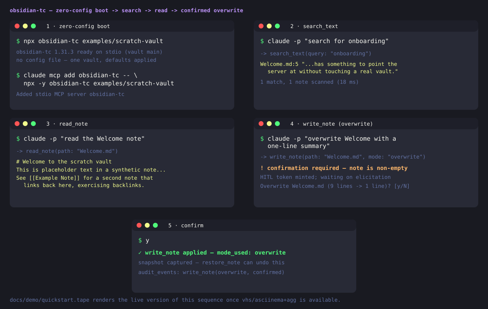

# obsidian-tc



> Obsidian Turbocharged — governed, agent-ready vault access over MCP.

[](https://www.gnu.org/licenses/agpl-3.0)


## What it is

obsidian-tc is a governed, agent-ready [Model Context Protocol](https://modelcontextprotocol.io)
server for [Obsidian](https://obsidian.md) vaults, for humans and agents alike. Instead of raw
filesystem access to years of notes, every tool call runs through one pipeline — auth, folder
ACLs, a read-only kill switch, HITL confirmation on destructive ops, and an audit log. It also
adds fused retrieval (full-text, vector, graph) and a memory tier — episodes, decay, forgetting —
living *inside* your vault under that same ACL.
**163 tools across 31 domains** (all visible by default; 97 with opt-in `profile: "core"`), via a
3-tool facade. Pitch: [docs/WHY.md](./docs/WHY.md).

## 60-second start

No install:

```sh
npx obsidian-tc /path/to/vault
```

Every note tool and lexical search work immediately. Semantic search defaults to a bundled
embedder — see [When NOT to use](#when-not-to-use-obsidian-tc) below for which install methods it
reaches today.

For multi-vault, auth, or ACLs, use a config file:

```bash
npm install -g obsidian-tc
obsidian-tc ./obsidian-tc.config.json   # Node >= 24 or Bun >= 1.1
```

Also ships as a Docker image, `.mcpb` bundle, and standalone binaries. More:
[docs/QUICKSTART.md](./docs/QUICKSTART.md).

## When NOT to use obsidian-tc

Honest guidance — this is a heavier product than most alternatives:

- **Smallest possible footprint, read-only access, or no MCP at all.** A single trusted human
  over one vault, a read-only wrapper, or the Obsidian URI/Local REST API plugin directly may be
  all you need — see the [full comparison](https://obsidian-tc.the40thieves.io/getting-started/compare/). This mostly
  pays off with autonomous or multi-agent access.
- **Zero setup, source checkouts only for now.** The vault is read directly off disk; semantic
  search defaults to a bundled offline embedder; npm/Docker need an explicit provider until
  published — see [Embeddings](https://obsidian-tc.the40thieves.io/configuration/embeddings/).
- **Zero-config trades away auth/ACLs.** `obsidian-tc /path/to/vault` boots with auth off, no
  folder ACL — fine only because it's local-only; governance is opt-in. Detail: [SECURITY.md](./SECURITY.md).
- **AGPL-3.0's network-copyleft terms.** Not permissive; a commercial license may exist — see
  [License](#license).
- **Single-maintainer project.**
- **Everything inside Obsidian, or vault-independent memory.** See the
  [comparison](https://obsidian-tc.the40thieves.io/getting-started/compare/) above.

Migrating from another MCP server: [docs/CUTOVER.md](./docs/CUTOVER.md).

## How it compares

Most Obsidian MCP projects are vault-access servers, retrieval engines, or memory engines, rarely
more than one. obsidian-tc is the only one we know of that is all three, with memory living **in
the vault** under the same ACL as every other write. [Full 9-project table and "where the others
win"](https://obsidian-tc.the40thieves.io/getting-started/compare/).

| | Tools | Group | What it's for |
|---|---|---|---|
| **obsidian-tc** | 163 (3-tool facade) | all three | governed access + retrieval + in-vault memory |
| [obsidian-local-rest-api](https://github.com/coddingtonbear/obsidian-local-rest-api) | 18 | access | Obsidian's own built-in MCP server; one bearer key, no ACL |
| [basic-memory](https://github.com/basicmachines-co/basic-memory) | ~35 | memory | entities/relations in a separate, portable markdown KB |

---

## More

<details><summary>Table of contents</summary>

[TC Bridge](#tc-bridge-the-companion-obsidian-plugin) ·
[Status](#status) ·
[Architecture](#architecture) ·
[The interface](#the-interface-3-tools-163-governed-capabilities) ·
[Cursor / VS Code](#install-in-cursor--vs-code) ·
[Docs](#docs) ·
[Trademark](#trademark) ·
[License](#license) ·
[Contributing](#contributing)

</details>

### TC Bridge: the companion Obsidian plugin

If you arrived here from Obsidian's plugin browser: the **TC Bridge** listing points here because
the plugin lives in this repo, but it's a small optional bridge, not the server described above. It
extends [Local REST API](https://github.com/coddingtonbear/obsidian-local-rest-api) with endpoints
for Obsidian-only features (Templater, Dataview, Tasks, Excalidraw, Git, Remotely Save). Every
filesystem-level feature works without it.

- **Install Local REST API first**; TC Bridge reuses its bearer-token auth, desktop-only. The
  plugin is not the server — governance/retrieval run in the obsidian-tc process, installed
  separately ([60-second start](#60-second-start)); reaching the bridges needs
  `restApiUrl`/`restApiKey` in the vault config
  ([step 6](./docs/QUICKSTART.md#6-optional-light-up-the-plugin-bridges-live-mode)). That key is a
  vault root password — read the [trust boundary](./SECURITY.md#companion-plugin-trust-boundary) first.
- **Formerly "Obsidian Turbocharged."** Settings migrate on first load — details in
  [packages/plugin/README.md](./packages/plugin/README.md).

### Status

**Shipped — v1.31.3**, published to npm as provenance-signed packages, container image on GHCR.
Milestones: [Roadmap](https://obsidian-tc.the40thieves.io/roadmap/); releases:
[CHANGELOG.md](./CHANGELOG.md).

Retrieval changes are measured, not asserted: a statistical ship rule gates every ranking change
against a private golden set. Headline figures once on this README were withdrawn 2026-08-07 as
unreproducible — full account and a public-corpus result since:
[docs/EVALUATION.md](./docs/EVALUATION.md).

### Architecture

Polyglot monorepo:

| Package | Language | Purpose |
|---|---|---|
| `packages/server` | TypeScript (Bun) | MCP layer, auth, routing, tools, plugin bridges |
| `packages/plugin` | TypeScript | Companion Obsidian plugin extending Local REST API |
| `packages/shared` | TypeScript | Shared Zod schemas and types |
| `packages/native` | Rust (napi-rs) | Optional acceleration, pure-JS fallback |

Dispatch-pipeline and package-layout detail: [ARCHITECTURE.md](./ARCHITECTURE.md).

<!-- BEGIN GENERATED: tools-summary -->
**163 governed capabilities**, grouped by access scope.

**read** (96) — `audit_provenance`, `bundle_files`, `bundle_folder`, `diagnose_retrieval`, `episode_stats`, `eval_dataview_field`, `explain_answer`, `find_link_cycles`, `find_notes_by_property`, `find_notes_by_tag`, `find_orphans`, `find_unresolved_links`, `gap_report`, `generate_uri`, `get_attachment`, `get_backlinks`, `get_entity`, `get_index_status`, `get_link_strength`, `get_note_tags`, `get_outgoing_links`, `get_periodic_note`, `get_session_traces`, `get_vault`, `git_diff`, `git_log`, `git_status`, `graph_centrality`, `graph_communities`, `graph_path_between`, `knowledge_challenge`, `knowledge_get_critical`, `knowledge_search`, `list_attachments`, `list_bookmarks`, `list_capture_queue`, `list_commands`, `list_contradictions`, `list_goals`, `list_kanban_boards`, `list_notes`, `list_periodic_notes`, `list_properties`, `list_quickadd_actions`, `list_snapshots`, `list_tags`, `list_tasks`, `list_templates`, `list_vaults`, `list_workspaces`, `makemd_list_spaces`, `makemd_query`, `note_exists`, `note_quality_report`, `ocr_attachment`, `ocr_bulk`, `plur_get`, `plur_recall`, `plur_recall_hybrid`, `plur_similarity_search`, `query_base`, `query_canvas`, `query_datacore`, `query_entity_graph`, `read_base`, `read_canvas`, `read_excalidraw`, `read_frontmatter`, `read_kanban_board`, `read_metadata_fields`, `read_note`, `read_notes`, `read_property`, `read_snapshot`, `reflect`, `remotely_save_status`, `resolve_daily_note`, `search_dql`, `search_jsonlogic`, `search_omnisearch`, `search_regex`, `search_semantic`, `search_text`, `search_vault`, `server_health`, `session_bootstrap`, `snapshot_note`, `suggest_links`, `tasks_filter`, `validate_dql`, `vault_context`, `vault_graph_search`, `vault_health_score`, `work_episode_chain`, `work_episodes`, `work_search`

**write** (46) — `add_bookmark`, `add_kanban_card`, `add_observation`, `add_tag`, `append_note`, `append_to_periodic_note`, `close_goal`, `commit_capture`, `copy_note`, `create_base`, `create_canvas`, `create_entity`, `create_excalidraw`, `create_periodic_note`, `end_session`, `enqueue_capture`, `execute_template`, `find_or_create_periodic_note`, `format_table`, `git_stage`, `insert_table_column`, `insert_table_row`, `link_entities`, `move_kanban_card`, `open_workspace`, `patch_note`, `prune_hub_links`, `record_retrieval_feedback`, `remotely_save_trigger`, `remove_tag`, `rename_entity`, `restore_note`, `rewrite_link`, `save_workspace`, `set_goal`, `sort_table_by_column`, `start_session`, `unlink_entities`, `update_base`, `update_canvas`, `update_excalidraw`, `update_frontmatter`, `update_task`, `work_forget`, `work_result`, `write_note`

**delete** (6) — `delete_attachment`, `delete_entity`, `delete_note`, `move_attachment`, `move_note`, `remove_bookmark`

**bulk** (3) — `bulk_create_notes`, `bulk_move_notes`, `bulk_set_property`

**execute** (3) — `execute_command`, `git_commit`, `trigger_quickadd`

**admin** (9) — `add_vault`, `get_metrics`, `get_server_config`, `index_vault`, `inspect_acl`, `inspect_visibility`, `refresh_plugin_capabilities`, `reload_vault`, `reset_vault_cache`
<!-- END GENERATED: tools-summary -->

### The interface: 3 tools, ~163 governed capabilities

By default the server advertises just **three meta-tools** instead of a wall of 163:
`find_capability`, `describe_capability`, `call_capability` (invoke by name, same pipeline as a
direct call). `toolFacade.mode` selects `triad` (default), `domain`, `flat`, or `auto` — boundary-
only, no gate bypassed.

### Install in Cursor / VS Code

[](cursor://anysphere.cursor-deeplink/mcp/install?name=obsidian-tc&config=eyJjb21tYW5kIjoibnB4IiwiYXJncyI6WyIteSIsIm9ic2lkaWFuLXRjIl0sImVudiI6eyJPQlNJRElBTl9UQ19DT05GSUciOiIvQUJTT0xVVEUvUEFUSC9UTy9vYnNpZGlhbi10Yy5jb25maWcuanNvbiJ9fQ==)
[](vscode:mcp/install?%7B%22name%22%3A%22obsidian-tc%22%2C%22type%22%3A%22stdio%22%2C%22command%22%3A%22npx%22%2C%22args%22%3A%5B%22-y%22%2C%22obsidian-tc%22%5D%2C%22env%22%3A%7B%22OBSIDIAN_TC_CONFIG%22%3A%22%2FABSOLUTE%2FPATH%2FTO%2Fobsidian-tc.config.json%22%7D%7D)

Or by hand — Cursor (`mcpServers`) / VS Code (`servers`), same object:
`{"command": "npx", "args": ["-y", "obsidian-tc"], "env": {"OBSIDIAN_TC_CONFIG": "/ABS/config.json"}}`.
A `.mcpb` bundle (`bun run bundle`) also installs into Claude Desktop / other MCPB hosts.

### Docs

- [docs/QUICKSTART.md](./docs/QUICKSTART.md) — install to first governed write, ~5 min
- [docs/WHY.md](./docs/WHY.md) / [SECURITY.md](./SECURITY.md) — threat model, governance
- [docs/CUTOVER.md](./docs/CUTOVER.md) — migrating from another Obsidian MCP server
- [docs/EVALUATION.md](./docs/EVALUATION.md) — how retrieval changes are measured
- [ARCHITECTURE.md](./ARCHITECTURE.md) — dispatch pipeline, package layout
- Docs site: <https://obsidian-tc.the40thieves.io> (full comparison under Getting Started)

### Trademark

obsidian-tc is independent and community-built, **not** affiliated with or endorsed by Obsidian
or its maker, Dynalist Inc. "Obsidian" is a Dynalist Inc. trademark, used only nominatively.
Official app: [obsidian.md](https://obsidian.md).

### License

AGPL-3.0-only. See [LICENSE](./LICENSE) and the
[licensing FAQ](https://obsidian-tc.the40thieves.io/licensing/); a commercial exception may
exist — open a [discussion](https://github.com/The-40-Thieves/obsidian-tc/discussions).
Contributions under the [DCO](https://developercertificate.org/); sign-off in
[CONTRIBUTING.md](./CONTRIBUTING.md#license-and-sign-off-dco).

### Contributing

See [CONTRIBUTING.md](./CONTRIBUTING.md) / [Code of Conduct](./CODE_OF_CONDUCT.md).
Security: [SECURITY.md](./SECURITY.md).
