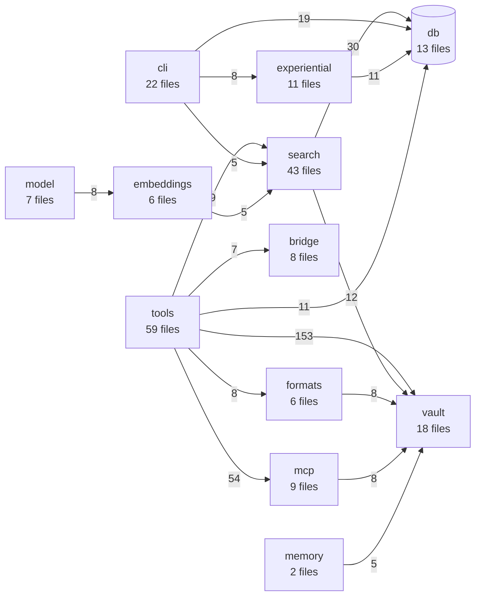

# obsidian-tc — structural map

Generated 2026-07-23 against `f1360b8`. Every path below was verified against the
filesystem, not inferred. Counts in the hand-written sections come from
`find` / `wc -l` / `tokei`, excluding `node_modules`, `dist`, and `target`. The generated
regions state their own method.

<!-- BEGIN GENERATED: tree-headline-scale -->
**Scale:** 862 tracked code files · 130,402 lines.

TypeScript 123,101 · JavaScript 3,840 · Python 1,526 · SQL 953 · Rust 668 · Shell 314.

Counted from `git ls-files` over `.ts`, `.tsx`, `.js`, `.mjs`, `.cjs`, `.rs`, `.py`, `.sql`, `.sh` — tracked sources only, so build output and gitignored caches cannot inflate it. §7 carries the module graph.
<!-- END GENERATED: tree-headline-scale -->

> §7's dependency-graph sections (scale, subsystem diagram, fan-in/out) are **generated** from the
> real module graph — run `just map`, and `just map-check` gates them in ci-docgen. Everything
> else here is still hand-written and can drift; THE-470 covers the rest.

---

## 1. Workspace packages

Root `package.json` declares four bun workspaces; `docs/` and `services/` are separate.

| path | package name | role |
|---|---|---|
| `packages/server` | `obsidian-tc` | the MCP server — all tools, retrieval, indexing, storage, transports |
| `packages/shared` | `@the-40-thieves/obsidian-tc-shared` | Zod config schema + shared types. Consumed by server and plugin |
| `packages/native` | `@the-40-thieves/obsidian-tc-native` | Rust/napi-rs module — batched cosine similarity, prebuilt per target |
| `packages/plugin` | `@the-40-thieves/obsidian-tc-plugin` | Obsidian companion plugin exposing REST extensions |
| `docs/` | `obsidian-tc-docs` | Astro Starlight site + `docs/wiki/`. **Separate workspace** — root `bun audit` and overrides do not reach it |
| `services/bge-m3-service` | (python) | embedding sidecar; deps hash-locked via `uv pip compile --generate-hashes` |
| `services/docs-ingest` | (python) | vendor-docs ingestion |

Note `packages/server`'s own `tsconfig` maps the shared package to `../shared/src`
via `paths`, so a typecheck does **not** require `packages/shared/dist` to be built.
A fresh `git worktree add` has no `node_modules` at all — run `bun install` at the
root first, or vitest silently resolves against the wrong tree.

---

## 2. Directory tree

```
packages/
  native/          Rust napi-rs module
    src/           lib.rs — cosine_similarity, cosine_batch
    benches/       Criterion benches (dims x docs matrix)
    bench/         JS-vs-native comparison harness
  plugin/
    src/           Obsidian plugin; routes.ts is the REST surface (953 lines)
  shared/
    src/           config.schema.ts (1283 lines) — the Zod config surface
      schemas/     shared Zod fragments
    test/
  server/
    src/           see §3
    test/          301 test files
    eval/          retrieval eval harness (run.ts, metrics, compare, stats)
      perf/        perf harness — scenarios, gate, baseline
        collectors/  per-domain metric collectors
    scripts/
      docgen/      render.ts — generates marker regions in docs; drift-gated in CI
    bun-smoke/     minimal boot smoke test
scripts/           repo-level check-*.mjs guards (vault-leak, config-threading,
                   release-lag, version-coherence, boundaries)
services/
  bge-m3-service/  Python embedding sidecar
  docs-ingest/     Python vendor-docs ingestion
```

---

## 3. Module boundaries — `packages/server/src`

| subsystem | files | lines | notes |
|---|---:|---:|---|
| `tools/` | 58 | 10,999 | domains m1–m8 + admin. The MCP tool surface (~144 capabilities) |
| `search/` | 42 | 7,464 | retrieval + indexing. Includes `graph_search_stages/` (THE-465) |
| `mcp/` | 6 | 2,146 | registry + facade + transport binding |
| `experiential/` | 10 | 1,868 | work-memory tier: activation, retrieval log, forget, citations |
| `vault/` | 16 | 1,667 | filesystem primitives — paths, links, ACL, snapshots, prune |
| `formats/` | 6 | 1,241 | canvas, base, dataview, kanban parsing |
| `scheduler/` | 2 | 796 | unified background scheduler + durable job queue (THE-517) |
| `plane/` | 7 | 791 | generative plane; `jobs/` holds the contradiction detector |
| `bridge/` | 8 | 745 | Obsidian plugin bridge clients |
| `migrations/` | 19 | 722 | hand-registered SQL. **Two chains** — see below |
| `model/` | 7 | 638 | model-service clients |
| `embeddings/` | 6 | 608 | providers incl. the deterministic fake used in tests |
| `capability/` | 6 | 577 | `defineTool` and the capability registry |
| `db/` | 10 | 517 | provisioning, migrate runner, experiential store |
| `cli/` | 2 | 506 | arg parsing |
| others | — | — | auth, capture, config, doctor, gateway, memory, metrics, morgiana, otel, plur, transports, util, workspace |

**Migrations have two separate chains, deliberately:**
- `cache.db` → `CACHE_MIGRATIONS` in `src/db/provision.ts`
- `experiential.db` → an inline array in `src/cli.ts` (~line 146)

Neither auto-discovers. A new migration needs a `readFileSync` const **and** an array
entry, or it silently never runs. Versions collide across chains by design.

---

## 4. Oversized files (>500 lines)

| lines | file |
|---:|---|
| **1661** | `packages/server/src/cli.ts` |
| **1474** | `packages/server/src/search/indexer.ts` |
| **1283** | `packages/shared/src/config.schema.ts` |
| **1057** | `packages/server/src/mcp/registry.ts` |
| 958 | `packages/server/src/tools/m7/knowledge-tools.ts` |
| 953 | `packages/plugin/src/routes.ts` |
| 787 | `packages/server/src/tools/m1/notes-tools.ts` |
| 779 | `packages/server/eval/run.ts` |
| 534 | `packages/server/src/formats/bases-expr.ts` |
| 514 | `packages/server/src/tools/m3/base-tools.ts` |
| 514 | `packages/server/src/tools/m2/search-tools.ts` |
| 510 | `packages/server/src/search/derived-edges.ts` |

THE-466 targets `cli.ts`, `indexer.ts`, `graph_search.ts`, `registry.ts`. Two updates:
**`graph_search.ts` is already done** (THE-465 took it 1066 → 237), and
**`config.schema.ts` at 1283 is not in its scope but is now the third-largest file.**

---

## 5. Entry points and execution surfaces

- **CLI** — `src/cli.ts`, args in `src/cli/args.ts`. Subcommands include `index`,
  `metrics`, `contribution-report`, `citation-infer`, `reflect`, `config show`.
- **MCP** — `src/mcp/registry.ts` dispatch; a 3-meta-tool facade fronts ~144 capabilities.
  STDIO and Streamable HTTP transports in `src/transports/`.
- **Obsidian plugin** — `packages/plugin/src/routes.ts` REST surface, reached via `src/bridge/`.
- **Scheduled** — one unified scheduler (`src/scheduler/`), registrations in `cli.ts`,
  `db/maintenance.ts`, `experiential/activation.ts`, `plane/plane.ts`.
- **Eval** — `eval/run.ts` (retrieval quality) and `eval/perf/` (performance gate).

---

## 6. Test topology

301 test files in `packages/server/test/`, flat (not mirroring `src/`).

| subsystem | src files | dedicated tests |
|---|---:|---:|
| search | 42 | ~7 |
| vault | 16 | ~7 |
| tools/m3 | 9 | ~5 |
| formats | 6 | ~5 |
| mcp | 6 | ~4 |
| scheduler | 2 | ~4 |
| metrics | 2 | ~4 |
| tools/m2 | 3 | ~3 |
| db | 10 | ~2 |
| plane | 7 | ~2 |
| tools/m1 | 9 | ~2 |
| otel | 1 | ~2 |
| tools/m8 | 2 | ~1 |
| experiential | 10 | ~1 |
| embeddings | 6 | ~1 |
| **tools/m7** | **3** | **0** ← no dedicated test file |

**`tools/m7` has no test file named for it.** That is `knowledge-tools.ts` (958 lines),
holding all four `graphSearch` call sites, THE-451's HyDE param, and THE-536's
`adaptiveRrf` threading. It is covered indirectly by `vault-context`, `reflect-tool`,
and `knowledge-search` tests, but nothing is named for the module.

`experiential` (10 files, ~1 test) and `embeddings` (6 files, ~1) are next thinnest.

---

## 7. Dependency graph

`dependency-cruiser` is already a dev dependency, configured by `.dependency-cruiser.cjs`
and wrapped by `scripts/check-boundaries.mjs` (THE-525).

### Regenerating this

```sh
git ls-files 'packages/server/src/**/*.ts' 'packages/shared/src/**/*.ts' > /tmp/srcfiles.txt
xargs -a /tmp/srcfiles.txt ./node_modules/.bin/depcruise \
  --config .dependency-cruiser.cjs --output-type json > /tmp/depgraph.json
```

Two traps, both of which cost time the first go:

1. **Never pass a directory.** dependency-cruiser 18.x declares support for
   `typescript >=2.0.0 <7.0.0` and this repo is on TypeScript 7 — given a directory
   it enumerates **zero** `.ts` files and reports *"no dependency violations found
   (0 modules)"*. A false green. `check-boundaries.mjs` documents this and guards
   against it by refusing to report success on an empty file list.
2. **In zsh, `depcruise $FILES` passes one argument, not many** — zsh does not
   word-split unquoted parameters the way bash does. Use `xargs -a` or `${=FILES}`.

Other useful `--output-type` values: `mermaid`, `dot`, `ddot`, `archi`, `d2`.
No renderer is installed locally (no graphviz/d2/plantuml), but `mermaid` renders
natively in GitHub markdown, which is why this section uses it.

### Scale

<!-- BEGIN GENERATED: tree-scale -->
**289 modules · 1183 dependencies · 87 distinct subsystem pairs · 492 cross-subsystem imports.**
<!-- END GENERATED: tree-scale -->

**Why `plugin` never appears in the diagram below.** `packages/plugin/src` is now in the scan (it
was not before — its modules were absent from every number on this page, including the 36KB
`routes.ts`). Adding it moved the module and dependency counts and moved **nothing else**: the
subsystem-pair and cross-subsystem-import counts are unchanged, because the plugin imports only
`obsidian` and its own `./routes` — it has **zero** imports from `server` or `shared`.

That is not a gap in the scan. The plugin talks to the server over **HTTP**, so the coupling is a
wire contract, and an import graph structurally cannot show it. Read the absence as "no import
edge exists", never as "these two are unrelated" — the companion-plugin bridge in
`ARCHITECTURE.md` §5 is where that relationship is actually documented.

### Subsystem graph

<!-- BEGIN GENERATED: tree-subsystem-graph -->
Edge labels are import counts. Only edges with weight ≥ 5 are shown; the full
set is 87 pairs.


<!-- END GENERATED: tree-subsystem-graph -->

### Fan-in / fan-out

<!-- BEGIN GENERATED: tree-fan -->
| most depended-on | imports | most dependent | imports |
|---|---:|---|---:|
| `vault` | 190 | `tools` | 272 |
| `db` | 93 | `cli` | 47 |
| `mcp` | 63 | `search` | 46 |
| `search` | 42 | `mcp` | 17 |
| `embeddings` | 15 | `experiential` | 16 |
<!-- END GENERATED: tree-fan -->

The shape is layered and largely acyclic at the subsystem level: the tool surface
depends downward on vault primitives and storage, with few back-edges. That is a
healthier structure than §4's file sizes on their own would suggest — the large
files are large, but they are not tangled.

### Violations

**21 total, all baselined** in `.dependency-cruiser-known-violations.json`
(exactly 21 entries, so the baseline is neither stale nor hiding anything new):

- **17 × `no-circular` (error)** — all the barrel-file pattern, e.g.
  `tools/m1/index.ts` ↔ `tools/m1/notes-tools.ts`. A domain index re-exports its
  members while members import the index for shared types. Conventional, and not
  a layering break.
- **4 × `no-orphans` (warn)** — modules nothing imports.
