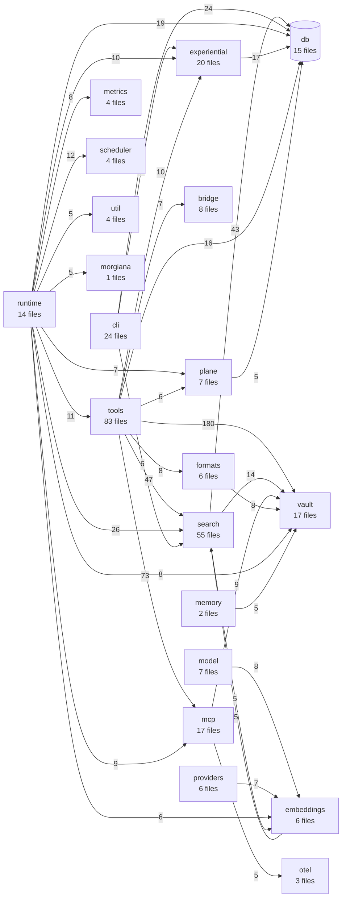

# obsidian-tc — structural map

Every count in this file is now **generated** — §3 (module boundaries), §4 (largest files) and
§7 (dependency graph) all come from `git ls-files` via `scripts/gen-tree-map.mjs`, refreshed by
`just map` and gated by `just map-check` in ci-docgen. The generated regions state their own
method. Prose outside the markers is hand-written and can still drift.

§3 and §4 were hand-maintained until 2026-07-31, each carrying its own "last measured" stamp, and
both were stale within a DAY of being stamped — §3 claimed `search/` had 51 files while the
generated diagram in the same file already said 52. That is why they are derived now.

<!-- BEGIN GENERATED: tree-headline-scale -->
**Scale:** 1,110 tracked code files · 171,938 lines.

TypeScript 158,512 · JavaScript 9,141 · Python 1,640 · SQL 1,543 · Rust 742 · Shell 360.

Counted from `git ls-files` over `.ts`, `.tsx`, `.js`, `.mjs`, `.cjs`, `.rs`, `.py`, `.sql`, `.sh` — tracked sources only, so build output and gitignored caches cannot inflate it. §7 carries the module graph.
<!-- END GENERATED: tree-headline-scale -->

> §3, §4 and §7 are **generated** from the real module graph and `git ls-files` — run `just map`;
> `just map-check` gates them in ci-docgen. Narrative prose outside the markers is hand-written
> and can still drift.

---

## 1. Workspace packages

Root `package.json` declares four bun workspaces; `docs/` and `services/` are separate.

| path | package name | role |
|---|---|---|
| `packages/server` | `obsidian-tc` | the MCP server — all tools, retrieval, indexing, storage, transports |
| `packages/shared` | `@the-40-thieves/obsidian-tc-shared` | Zod config schema + shared types. Consumed by server and plugin |
| `packages/native` | `@the-40-thieves/obsidian-tc-native` | Rust/napi-rs module — batched cosine similarity, prebuilt per target |
| `packages/plugin` | `@the-40-thieves/obsidian-tc-plugin` | Obsidian companion plugin exposing REST extensions |
| `docs/` | `obsidian-tc-docs` | Astro Starlight site + `docs/wiki/`. **Separate workspace** — root `bun audit` and overrides do not reach it |
| `services/bge-m3-service` | (python) | embedding sidecar; deps hash-locked via `uv pip compile --generate-hashes` |
| `services/docs-ingest` | (python) | vendor-docs ingestion |

Note `packages/server`'s own `tsconfig` maps the shared package to `../shared/src`
via `paths`, so a typecheck does **not** require `packages/shared/dist` to be built.
A fresh `git worktree add` has no `node_modules` at all — run `bun install` at the
root first, or vitest silently resolves against the wrong tree.

---

## 2. Directory tree

```
packages/
  native/          Rust napi-rs module
    src/           lib.rs — cosine_similarity, cosine_batch
    benches/       Criterion benches (dims x docs matrix)
    bench/         JS-vs-native comparison harness
  plugin/
    src/           Obsidian plugin; routes.ts is the REST facade (80 lines)
      routes/      one module per integration family (15) + types/envelope
  shared/
    src/           config.schema.ts (116 lines) — re-export facade
      config/      the Zod config surface, split by domain (8 leaves)
      schemas/     shared Zod fragments
    test/
  server/
    src/           see §3
    test/          429 test files
    eval/          retrieval eval harness (run.ts, metrics, compare, stats)
      perf/        perf harness — scenarios, gate, baseline
        collectors/  per-domain metric collectors
    scripts/
      docgen/      render.ts — generates marker regions in docs; drift-gated in CI
    bun-smoke/     minimal boot smoke test
scripts/           repo-level check-*.mjs guards (vault-leak, config-threading,
                   release-lag, version-coherence, boundaries)
services/
  bge-m3-service/  Python embedding sidecar
  docs-ingest/     Python vendor-docs ingestion
```

---

## 3. Module boundaries — `packages/server/src`

Generated — see `scripts/gen-tree-map.mjs`. The numbers are derived from `git ls-files`; the
`notes` column is prose and lives in that script, keyed by directory name.

<!-- BEGIN GENERATED: tree-subsystem-table -->
| subsystem | files | lines | notes |
|---|---:|---:|---|
| `tools/` | 83 | 16,358 | domains m1–m8 + admin. The MCP tool surface |
| `search/` | 55 | 10,777 | retrieval + indexing. Includes `graph_search_stages/` (THE-465) and `indexing/` (WP3) |
| `experiential/` | 20 | 4,533 | work-memory tier: activation, retrieval log, forget, citations |
| `mcp/` | 17 | 4,425 | registry + facade + transport binding. `registry/` holds the dispatch pipeline (WP4) |
| `runtime/` | 14 | 3,287 | **composition root** (WP5) — stores, governance, wiring, transports, shutdown |
| `cli/` | 24 | 3,103 | arg parsing + subcommands |
| `vault/` | 17 | 1,991 | filesystem primitives — paths, links, ACL, snapshots, prune |
| `doctor/` | 10 | 1,807 | `obsidian-tc doctor` — checks, report rendering, runner |
| `migrations/` | 42 | 1,543 | hand-registered SQL. **Two chains** — see below |
| `scheduler/` | 4 | 1,374 | unified background scheduler + durable job queue (THE-517) |
| `db/` | 15 | 1,368 | provisioning, migrate runner, experiential store |
| `formats/` | 6 | 1,241 | canvas, base, dataview, kanban parsing |
| `plane/` | 7 | 1,076 | generative plane; `jobs/` holds the contradiction detector |
| `workspace/` | 3 | 1,039 | session tracking |
| `metrics/` | 4 | 852 | Prometheus catalog + `/metrics` endpoint, gauge sources, ingest stats |
| `bridge/` | 8 | 745 | Obsidian plugin bridge clients |
| `providers/` | 6 | 731 |  |
| `embeddings/` | 6 | 665 | providers incl. the deterministic fake used in tests |
| `model/` | 7 | 646 | model-service clients |
| `transports/` | 3 | 646 | stdio, HTTP and the shared serve loop |
| `capability/` | 6 | 605 | `defineTool` and the capability registry |
| `memory/` | 2 | 453 | entity extraction and materialization for the memory folder |
| `auth/` | 3 | 427 | JWT verification, JWKS, RFC 9728 protected-resource metadata |
| `graph/` | 1 | 381 | graph analytics (centrality, components) behind the health tools |
| `config/` | 3 | 321 | config load, `explain`, and the security-profile resolver |
| `gateway/` | 2 | 285 | inference-gateway client — the `judge`/`synthesize` roles |
| `plur/` | 2 | 214 | PLUR client (local + remote) for the experiential plane |
| `otel/` | 3 | 190 | OpenTelemetry tracing, attributes, context propagation |
| `capture/` | 1 | 126 | the capture queue |
| `util/` | 4 | 116 | concurrency, error shapes, ISO week, pagination |
| `morgiana/` | 1 | 101 | Morgiana observability emitter (spike, paused) |

Derived from `git ls-files packages/server/src` over `.ts`/`.sql`, tests excluded — 387 files across 31 subsystems. Top-level files (`cli.ts`, `hash.ts`, …) belong to no subsystem and are not counted here.
<!-- END GENERATED: tree-subsystem-table -->

**Migrations have two separate chains, deliberately:**
- `cache.db` → `CACHE_MIGRATIONS` in `src/db/provision.ts`
- `experiential.db` → `experientialMigrations` in **`src/cli/shared.ts`**
  *(was an inline array in `src/cli.ts` before WP5 reduced that file to argument dispatch)*

Neither auto-discovers. A new migration needs a `readFileSync` const **and** an array
entry, or it silently never runs. Versions collide across chains by design.

---

## 4. Largest files (>500 lines)

Generated — see `scripts/gen-tree-map.mjs`.

<!-- BEGIN GENERATED: tree-largest-files -->
| lines | file |
|---:|---|
| 811 | `packages/server/src/doctor/checks.ts` |
| 748 | `packages/server/src/cli/commands/doctor.ts` |
| 742 | `packages/server/src/runtime/server-runtime.ts` |
| 732 | `packages/server/src/cli/args.ts` |
| 714 | `packages/server/src/mcp/server.ts` |
| 696 | `packages/server/src/tools/m8/experiential-tools.ts` |
| 670 | `packages/server/src/search/derived-edges.ts` |
| 647 | `packages/server/src/tools/m2/search-tools.ts` |
| 623 | `packages/server/src/scheduler/job-queue.ts` |
| 620 | `packages/server/src/metrics/registry.ts` |
| 603 | `packages/server/src/mcp/registry/dispatch.ts` |
| 597 | `packages/server/src/experiential/citation.ts` |
| 586 | `packages/server/src/tools/m3/base-tools.ts` |
| 573 | `packages/server/src/scheduler/scheduler.ts` |
| 565 | `packages/server/src/search/graph_search.ts` |
| 564 | `packages/server/src/search/query_cache.ts` |
| 534 | `packages/server/src/formats/bases-expr.ts` |
| 526 | `packages/server/src/transports/http.ts` |
| 525 | `packages/server/src/tools/m3/periodic-tools.ts` |
| 519 | `packages/shared/src/config/retrieval.schema.ts` |
| 503 | `packages/server/src/tools/m6/bulk-tools.ts` |

21 file(s) over 500 lines, from the same `git ls-files` source set as the module graph (`.ts` under packages/{server,shared,plugin}/src, tests excluded). The biome `noExcessiveLinesPerFile` cap of 700 counts CODE lines, so a file can appear here — raw `wc -l` — while sitting well under the cap.
<!-- END GENERATED: tree-largest-files -->
| 900 | `packages/server/eval/run.ts` *(dev tooling, outside `src/`)* |

**The structural refactor program (THE-466, merged 2026-07-31) removed every entry that
used to head this table.** Seven concentration targets, 9,422 → 842 lines (91.1% removed), measured
at merge. <!-- facts-check:ignore -->

The totals used to read "8,380 → 791" — the SIX-row sums, left unchanged when `notes-tools.ts`
(1,042 → 51) was added as the seventh row. `9,422 − 1,042 = 8,380` and `842 − 51 = 791`, which is
how the arithmetic gave itself away. The `after` column is a snapshot **as merged**, not a live
measurement: `knowledge-tools.ts` is 100 lines today, two more than at merge, because a later PR
routed it through the shared query encoder. That is why this row is marked historical rather than
gated — a dated measurement is not a current fact.

| file | before | after |
|---|---:|---:|
| `tools/m7/knowledge-tools.ts` | 1,588 | 98 |
| `shared/src/config.schema.ts` | 1,565 | 116 |
| `search/indexer.ts` | 1,518 | 56 |
| `mcp/registry.ts` | 1,500 | 331 |
| `cli.ts` | 1,256 | 110 |
| `tools/m1/notes-tools.ts` | 1,042 | 51 |
| `plugin/src/routes.ts` | 953 | 80 |

`graph_search.ts` was taken 1066 → 237 earlier by THE-465.

A repo-wide biome `noExcessiveLinesPerFile` cap of **700** now guards against
re-concentration — see `biome.json`. Note it counts **code** lines, not `wc -l`:
comment-only lines and the leading header block are free, so raw and counted
orderings differ (`mcp/server.ts` is largest raw at 701 but 583 counted; the true
counted maximum is `runtime/server-runtime.ts` at 628). To re-derive the cap, lower
it until lint fails and read the diagnostic — do not compute it from `wc -l`.

The remaining entries are **concentration points, not refactor debt**. Split one only
while adding a coherent service: `server-runtime.ts` when it gains cache/model resource
ownership; `mcp/server.ts` when protocol adaptation is separated from elicitation and
resources/prompts; `derived-edges.ts` when tag/kNN/reconciliation policies separate;
`m2/search-tools.ts` when shared retrieval orchestration lands; `job-queue.ts` when
durable leases separate from execution/retry policy.

---

## 5. Entry points and execution surfaces

- **CLI** — `src/cli.ts`, args in `src/cli/args.ts`. Subcommands include `index`,
  `metrics`, `contribution-report`, `citation-infer`, `reflect`, `config show`.
- **MCP** — `src/mcp/registry.ts` dispatch; a 3-meta-tool facade fronts 151 registered tools.
  STDIO and Streamable HTTP transports in `src/transports/`.
- **Obsidian plugin** — `packages/plugin/src/routes.ts` REST surface, reached via `src/bridge/`.
- **Scheduled** — one unified scheduler (`src/scheduler/`), registrations in `cli.ts`,
  `db/maintenance.ts`, `experiential/activation.ts`, `plane/plane.ts`.
- **Eval** — `eval/run.ts` (retrieval quality) and `eval/perf/` (performance gate).

---

## 6. Test topology

429 test files in `packages/server/test/`, flat (not mirroring `src/`). The full suite is
**3,093 tests** (417 files, 1 skipped) as of 2026-07-31.

| subsystem | src files | dedicated tests |
|---|---:|---:|
| search | 42 | ~7 |
| vault | 16 | ~7 |
| tools/m3 | 9 | ~5 |
| formats | 6 | ~5 |
| mcp | 6 | ~4 |
| scheduler | 2 | ~4 |
| metrics | 2 | ~4 |
| tools/m2 | 3 | ~3 |
| db | 10 | ~2 |
| plane | 7 | ~2 |
| tools/m1 | 9 | ~2 |
| otel | 1 | ~2 |
| tools/m8 | 2 | ~1 |
| experiential | 10 | ~1 |
| embeddings | 6 | ~1 |
| **tools/m7** | **3** | **0** ← no dedicated test file |

**`tools/m7` has no test file named for it.** That is `knowledge-tools.ts` (now a 98-line facade over `tools/m7/knowledge/`),
holding all four `graphSearch` call sites, THE-451's HyDE param, and THE-536's
`adaptiveRrf` threading. It is covered indirectly by `vault-context`, `reflect-tool`,
and `knowledge-search` tests, but nothing is named for the module.

`experiential` (10 files, ~1 test) and `embeddings` (6 files, ~1) are next thinnest.

---

## 7. Dependency graph

`dependency-cruiser` is already a dev dependency, configured by `.dependency-cruiser.cjs`
and wrapped by `scripts/check-boundaries.mjs` (THE-525).

### Regenerating this

```sh
git ls-files 'packages/server/src/**/*.ts' 'packages/shared/src/**/*.ts' > /tmp/srcfiles.txt
xargs -a /tmp/srcfiles.txt ./node_modules/.bin/depcruise \
  --config .dependency-cruiser.cjs --output-type json > /tmp/depgraph.json
```

Two traps, both of which cost time the first go:

1. **Never pass a directory.** dependency-cruiser 18.x declares support for
   `typescript >=2.0.0 <7.0.0` and this repo is on TypeScript 7 — given a directory
   it enumerates **zero** `.ts` files and reports *"no dependency violations found
   (0 modules)"*. A false green. `check-boundaries.mjs` documents this and guards
   against it by refusing to report success on an empty file list.
2. **In zsh, `depcruise $FILES` passes one argument, not many** — zsh does not
   word-split unquoted parameters the way bash does. Use `xargs -a` or `${=FILES}`.

Other useful `--output-type` values: `mermaid`, `dot`, `ddot`, `archi`, `d2`.
No renderer is installed locally (no graphviz/d2/plantuml), but `mermaid` renders
natively in GitHub markdown, which is why this section uses it.

### Scale

<!-- BEGIN GENERATED: tree-scale -->
**397 modules · 1758 dependencies · 118 distinct subsystem pairs · 790 cross-subsystem imports.**
<!-- END GENERATED: tree-scale -->

**Why `plugin` never appears in the diagram below.** `packages/plugin/src` is now in the scan (it
was not before — its modules were absent from every number on this page, including the 36KB
`routes.ts`). Adding it moved the module and dependency counts and moved **nothing else**: the
subsystem-pair and cross-subsystem-import counts are unchanged, because the plugin imports only
`obsidian` and its own `./routes` — it has **zero** imports from `server` or `shared`.

That is not a gap in the scan. The plugin talks to the server over **HTTP**, so the coupling is a
wire contract, and an import graph structurally cannot show it. Read the absence as "no import
edge exists", never as "these two are unrelated" — the companion-plugin bridge in
`ARCHITECTURE.md` §5 is where that relationship is actually documented.

### Subsystem graph

<!-- BEGIN GENERATED: tree-subsystem-graph -->
Edge labels are import counts. Only edges with weight ≥ 5 are shown; the full
set is 118 pairs.


<!-- END GENERATED: tree-subsystem-graph -->

### Fan-in / fan-out

<!-- BEGIN GENERATED: tree-fan -->
| most depended-on | imports | most dependent | imports |
|---|---:|---|---:|
| `vault` | 229 | `tools` | 361 |
| `db` | 141 | `runtime` | 142 |
| `search` | 100 | `search` | 67 |
| `mcp` | 92 | `cli` | 67 |
| `experiential` | 35 | `experiential` | 24 |
<!-- END GENERATED: tree-fan -->

The shape is layered and largely acyclic at the subsystem level: the tool surface
depends downward on vault primitives and storage, with few back-edges. That is a
healthier structure than §4's file sizes on their own would suggest — the large
files are large, but they are not tangled.

### Violations

**Zero.** `.dependency-cruiser-known-violations.json` is an **empty array**, and the
unreachable-production allowlist in `scripts/check-boundaries.mjs` is an **empty Map**.

Both were emptied on 2026-07-31:

- The **17 × `no-circular`** entries were all one bug wearing 17 hats — an implementation
  imported its family's `M{n}Deps` type from `./index`, while `index.ts` imported that
  implementation to build its registrar. WP7 extracted the type into a leaf
  `tools/m{1,2,3}/shared.ts` per family, following the pattern `tools/m5/shared.ts`
  already used. Barrels stay as outward-facing registration facades; public surfaces
  unchanged.
- The **`no-orphans`** entry for `vault/backend.ts` (`FilesystemBackend`) was resolved by
  **deletion** — an ADR found 1 selection point, 0 production constructions, 0 second
  implementations, 0 external type references, and 33 files / 215 call sites already
  bypassing the seam.

**Neither zero is an inert gate.** Reintroducing a single type-only back-edge produces
**8** `no-circular` errors; planting one unreachable module reports
`UNWIRED … (1 unexpected)`. Both were watched failing and restored.
