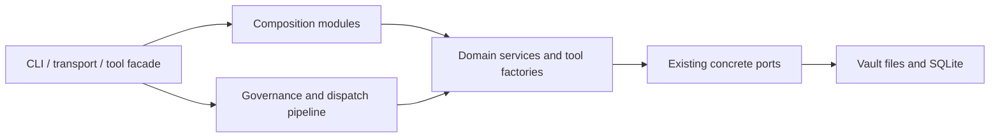

# Refactor map: reduce complexity concentration without changing behavior

| | |
|---|---|
| **Status** | Proposed (not implemented) |
| **Date** | 2026-07-30 |
| **Origin** | Cross-vendor structural review (Codex), reviewed commit `721cc5f` |
| **Re-verified against** | `main` @ `6bdcf4a` (v1.13.1), 2026-07-30 |
| **Scope** | Structural refactors only. No capability, schema, protocol, policy, or default changes. |

> **Provenance and verification.** The analysis below came from an external structural review against
> `721cc5f`. Every mechanically checkable claim was re-verified against `main` @ `6bdcf4a` before this
> document was accepted into the repo. Results:
>
> | claim | verdict |
> |---|---|
> | `knowledge-tools.ts` 1588 · `indexer.ts` 1518 · `registry.ts` 1500 · `cli.ts` 1256 · `routes.ts` 953 | confirmed exact |
> | `config.schema.ts` **1588** | **wrong — it is 1565.** The review reused `knowledge-tools.ts`'s figure. Corrected in the table below. |
> | boundary gate breaks on Windows via `npx.cmd` | confirmed, `scripts/check-boundaries.mjs:64` |
> | `FilesystemBackend` never constructed in `src/` | confirmed — and already recorded deliberately at `check-boundaries.mjs:144` |
> | 17-entry circular-dependency baseline | confirmed |
>
> **Line anchors in this document are from `721cc5f` and will rot.** Locate targets by symbol name,
> not by line number. This is not hypothetical: THE-651 cited `graph_search.ts:51-52` for a comment
> that had moved to ~L94, and the cited lines held an unrelated *correct* docblock — from which the
> natural conclusion was "already fixed, close the ticket". Anchors in this document are therefore
> given as symbol names wherever possible.

## Why this document exists

The repository has strong behavioral coverage and deliberate policy gates, but several modules
concentrate too many responsibilities:

| Module | Lines (verified `6bdcf4a`) | Concentrated responsibilities |
|---|---:|---|
| `packages/server/src/tools/m7/knowledge-tools.ts` | 1,588 | schemas, retrieval helpers, seven tools, persistence, prompt calls |
| `packages/shared/src/config.schema.ts` | 1,565 | every configuration domain, defaults, cross-field validation, JSON Schema export |
| `packages/server/src/search/indexer.ts` | 1,518 | planning, embedding, deduplication, persistence, single-note and whole-vault orchestration |
| `packages/server/src/mcp/registry.ts` | 1,500 | tool metadata, visibility, policy, idempotency, audit, telemetry, dispatch |
| `packages/server/src/cli.ts` | 1,256 | process composition, stores, observability, tools, jobs, bridges, schedulers, transports, shutdown |
| `packages/plugin/src/routes.ts` | 953 | bridge protocol helpers and routes for eleven unrelated plugin families |

The goal is not to minimize line counts. The goal is to make dependency direction visible, keep
policy ordering testable, and reduce the amount of code that must be understood for one change.

## Standing constraints

Every extraction must preserve these invariants:

1. Existing public imports keep working through facade modules.
2. Tool names, schemas, descriptions, visibility, scopes, and response shapes remain byte-for-byte
   compatible unless an existing test normalizes non-semantic ordering.
3. Dispatch gate order remains unchanged.
4. No tool handler bypasses `ToolRegistry.dispatch`.
5. Vault mutation still passes path ACL, idempotency, HITL, audit, and index-on-write behavior.
6. No new storage or framework abstraction is introduced without a second production implementation.
7. Generated configuration JSON Schema remains unchanged after each config extraction.
8. Each PR removes or extracts one responsibility and has a rollback-sized diff.

## Dependency rule



Domain modules must not import the CLI, transport implementations, or barrel files that re-export
the importing module. Type-only contracts should live in leaf modules when that breaks a cycle.

## Recommended order

| Order | Work package | Why now |
|---:|---|---|
| 0 | Repair boundary-check execution; resolve the unreachable-backend decision | The refactor safety gate must be trustworthy before moving modules |
| 1 | Split configuration schema declarations | Low runtime risk; establishes the facade pattern |
| 2 | Split M7 tool factories | Mostly separable definitions with focused existing tests |
| 3 | Split index planning, embedding, persistence | Establishes seams needed to simplify boot wiring |
| 4 | Split dispatch policy stages from registry storage | Highest policy risk; do after the pattern is proven |
| 5 | Extract CLI composition modules | Depends on stable seams from WP2–WP4 |
| 6 | Split plugin routes by integration family | Independent package; parallelisable |
| 7 | Shrink the circular-dependency baseline | Uses the new leaf contracts |

## WP0 — Make structural gates reliable

### WP0.1 Cross-platform boundary command

**Target:** `scripts/check-boundaries.mjs`, the `NPX` constant and its `execFileSync` call site.

The wrapper selects `npx.cmd` on Windows. The repo's own comment there says this throws **ENOENT**;
the external review reported **EINVAL** in its environment. Either way contributors cannot run the
gate CI trusts. The wrapper also works around dependency-cruiser's unsupported TypeScript 7 directory
scan by passing explicit paths.

**Change**

- Resolve dependency-cruiser's JS entry point via `import.meta.resolve` or `createRequire().resolve()`.
- Launch it with `process.execPath`, not a package-manager shim.
- Keep the explicit tracked-file list and the zero-module floor until dependency-cruiser officially
  supports this TypeScript version *and* a measured directory scan sees the same graph.
- Extract report parsing into a pure function with a fixture test.
- Add a Windows CI invocation or a platform-neutral unit test for command construction.

**Do not** enable `shell: true`; remove the zero-module guard; or accept a lower module count to make
the gate green.

**Acceptance:** runs on Windows and Linux; both report the same first-party module count from a clean
tree; a zero-module fixture fails; a real violation is parsed, not treated as a process crash.

### WP0.2 Decide the `FilesystemBackend` seam

**Targets:** `packages/server/src/vault/backend.ts` (`FilesystemBackend`),
`scripts/check-boundaries.mjs` `UNREACHABLE_ALLOWLIST`,
`docs/plans/2026-06-25-headless-vaultbackend-adr.md`.

`FilesystemBackend` is tested but never constructed in `src/`. This is **already known and
deliberately recorded** — the allowlist entry reads *"tested, never constructed in src/"*. It is not a
newly discovered defect; it is an unresolved decision.

| Option | Benefit | Cost | Valid when |
|---|---|---|---|
| Wire into production | Makes the documented seam real; one I/O boundary | Broad mutation-path refactor, possible policy duplication | A second backend or a concrete test seam is needed now |
| Delete and correct docs | Removes dead architecture and its allowlist exception | Gives up a planned port | Filesystem functions remain the only production implementation |

**Recommendation:** decide in a dedicated ADR before touching call sites. Deletion is the simpler
outcome unless an inventory finds at least two production call paths needing interchangeable
backends. Do not keep the class because a future backend is imaginable — constraint 6.

**Acceptance:** module reachable from a declared entry point or deleted; allowlist entry removed;
architecture docs match production construction; vault-backend and index-on-write tests green.

## WP1 — Split configuration schemas behind the current facade

**Target:** `packages/shared/src/config.schema.ts` (1,565 lines).

```text
packages/shared/src/config/
  vault.schema.ts        auth-acl.schema.ts     retrieval.schema.ts
  indexing-embeddings.schema.ts                 runtime.schema.ts
  observability.schema.ts                       tools.schema.ts
  server.schema.ts
packages/shared/src/config.schema.ts   ← compatibility facade, re-exports only
```

**Slices:** vault/bridge/plugin/command/memory/workspace → auth+ACL → retrieval/ranking/experiential
→ embeddings/indexing → transports/governor/throttle/writes →
observability/snapshots/maintenance/watch/scheduler/plane/Plur → tool visibility/facade/bootstrap →
compose `ServerConfigObject`, cross-field refinements and `configJsonSchema()` in `server.schema.ts`.

**Constraints:** leaf schemas import Zod and shared scalars only; leaves must not import
`server.schema.ts` or the facade; cross-domain `.superRefine` lives only in `server.schema.ts`;
runtime defaults stay exported from the facade.

**Verification:** `config:schema:check`; shared `config.schema.test.ts`; server `config.test.ts`,
`config-load.test.ts`, `config-explain.test.ts`, `hardened-config.test.ts`, `docgen-config.test.ts`;
plus an added hash assertion proving generated JSON Schema is byte-unchanged.

**Trade-off:** more files and imports. Accepted because a retrieval setting no longer requires editing
a module that also owns auth, scheduler, and transport config.

## WP2 — Split M7 by tool while sharing one retrieval runtime

**Target:** `packages/server/src/tools/m7/knowledge-tools.ts` (1,588 lines).

```text
packages/server/src/tools/m7/knowledge/
  schemas.ts  deps.ts  retrieval-runtime.ts  vault-context.ts  reflect.ts
  graph-search.ts  knowledge-search.ts  knowledge-critical.ts
  knowledge-challenge.ts  contradictions.ts  index.ts
packages/server/src/tools/m7/knowledge-tools.ts   ← facade
```

Extractions, located by symbol rather than line: output contracts and `M7Deps` → `schemas.ts` /
`deps.ts`; cache/policy helpers, budgeting, retrieval options, contradiction lookup →
`retrieval-runtime.ts` / `contradictions.ts`; context bootstrap, prewarm, packing, lessons/work
inclusion → `vault-context.ts`; reflection prompt, sources, governed persistence → `reflect.ts`; one
file per remaining tool.

`retrieval-runtime.ts` exposes a constructed object with dense/sparse/ColBERT query encoding plus
cached graph-search behavior. Tool modules receive it and `M7Deps`; they must not construct their own
caches or policy records. `buildKnowledgeTools` stays an explicit ordered array — composition, not a
new tool framework.

**Verification:** `vault-context.test.ts`, `vault-context-syntheses-scope.test.ts`,
`reflect-tool.test.ts`, `reflect-persist-governed.test.ts`, `knowledge-search.test.ts`,
`knowledge-get-critical.test.ts`, `knowledge-challenge-evidence.test.ts`, `list-contradictions.test.ts`,
dispatch parity, ACL extraction coverage — plus a new snapshot of ordered M7 tool metadata taken
before and after.

**Risk controls:** keep output schemas beside the tool family, exported only where tests require;
preserve unavailable/degraded response variants exactly; preserve lazy embedding thunks so cache hits
do not trigger provider calls; keep `persistGovernedNote` inside the governed handler.

## WP3 — Separate indexing plan, encoding, and persistence

**Target:** `packages/server/src/search/indexer.ts` (1,518 lines).

```text
packages/server/src/search/indexing/
  types.ts  note-plan.ts  embed-batches.ts  dedup.ts
  persist-note-plan.ts  index-note.ts  index-vault.ts
packages/server/src/search/indexer.ts   ← facade
```

**Required contract:** planning is side-effect free except reads; encoding performs external provider
calls but no DB writes; persistence runs in the existing write transaction and performs no embedding
calls; orchestrators decide ordering.

**Verification:** `indexer.test.ts`, `ingest-indexer.test.ts`, `dedup-index-plan.test.ts`,
`dedup-unresolved.test.ts`, `index-selfheal.test.ts`, `index-stream-walk-equivalence.test.ts`,
`index-vault-ingest-telemetry.test.ts`, `index-on-write-coverage.test.ts`, indexing perf collectors,
plus new transaction-rollback coverage proving partial persistence cannot survive a failed plan.

**Do not** add a generic vector-backend port here; make SQLite calls async; change representation
fingerprints, chunk IDs, batching defaults, or edge timing; or move observability into the indexer.

## WP4 — Turn registry dispatch into an explicit policy pipeline

**Target:** `packages/server/src/mcp/registry.ts` (1,500 lines). **Highest risk — `ToolRegistry.dispatch`
is a security boundary.**

```text
packages/server/src/mcp/registry/
  types.ts  tool-store.ts  input-binding.ts  policy-gates.ts
  idempotency.ts  result-governance.ts  dispatch-observability.ts  dispatch.ts
packages/server/src/mcp/registry.ts   ← facade
```

Order to preserve — **the code is the source of truth; this diagram is a review aid, not authorization
to reorder:**


**Strategy:** move types and pure helpers first (no logic change) → extract tool storage/listing/
visibility → extract observability callbacks with identical inputs and error redaction → extract
idempotency returning explicit states (`claimed | replay | mismatch | in_flight`) → represent pipeline
state as one internal object instead of a growing positional parameter list → move the dispatch body
last, one contiguous stage per commit.

**Verification:** the full dispatch suite — `dispatch-parity`, `dispatch-guards`, `dispatch-abort`,
`dispatch-throttle`, `cross-vault-binding`, `vault-arg-dispatch`, `acl-fail-closed`,
`acl-extraction-coverage`, every idempotency test, dispatch metrics/OTEL/Morgiana/profile/episode/
internal-error tests, `hitl-multi-round-trip`.

**Add a table-driven gate-trace test** recording which stages ran for: success, schema failure, ACL
failure, HITL failure, replay, overflow, abort, handler error. It must fail on accidental reordering.

**Do not** generalize into registerable middleware — a fixed pipeline is easier to audit.

## WP5 — Reduce `run_serve` to a composition root

**Target:** `packages/server/src/cli.ts` (1,256 lines).

```text
packages/server/src/runtime/
  stores.ts  governance.ts  indexing-wiring.ts  bridge-wiring.ts
  tool-wiring.ts  plane-wiring.ts  scheduler-wiring.ts
  transport-wiring.ts  shutdown.ts  server-runtime.ts
```

```ts
interface ServerRuntime {
  registry: ToolRegistry;
  start(): Promise<void>;
  close(reason: string): Promise<void>;
}
```

An ownership boundary, not a service locator. Each wiring function accepts only what it needs and
returns owned resources plus an idempotent cleanup callback.

**Order:** stores → governance → indexing/watcher/reconciliation → bridge clients and capability
snapshots → M1–M8 tool deps and registration → plane jobs and scheduler → transports → signals and
ordered shutdown.

**Acceptance:** `cli.ts` owns argument dispatch and process exit only; the runtime is constructible in
a test without parsing process arguments; every opened resource has one visible owner and idempotent
cleanup; startup order and graceful-shutdown timeout unchanged; transport and smoke tests green; a
boot-failure test proves already-opened resources close in reverse ownership order.

**Do not** add a DI container or reflection; expose every local as public runtime state; combine
profile/preset behavior with this extraction; or change scheduler/transport defaults.

## WP6 — Split plugin routes by integration family

**Target:** `packages/plugin/src/routes.ts` (953 lines).

One module per integration — `probe`, `commands`, `git`, `remotely-save`, `dataview`, `quickadd`,
`ocr`, `excalidraw`, `makemd`, `omnisearch`, `datacore`, `metadata-menu`, `daily-notes`, `templater`,
`tasks` — plus shared `types.ts` and `envelope.ts`, with `routes.ts` as facade. The file count is
appropriate here: each integration tracks a different external plugin API.

Each exports `buildXRoutes(app): RouteDef[]`; `buildRoutes` concatenates in the current order.
Envelope handling (`ok`, `fail`, `safeHandler`) stays shared and applied once.

**Verification:** existing `routes.test.ts`; a route-table snapshot covering method/path order and
uniqueness; hostile-app coverage continues to invoke every returned route; probe output and version
handshake unchanged.

**Risk controls:** retain defensive duck typing per boundary; do not create a generic plugin API
abstraction; do not normalize distinct external error shapes beyond the existing envelope; preserve
destructive-operation safeguards such as Excalidraw overwrite handling.

## WP7 — Retire circular-dependency allowances

**Source:** `.dependency-cruiser-known-violations.json` — **17 entries verified on `6bdcf4a`.**

Most cycles pass through tool-family `index.ts` barrels. After leaf types and factories exist: move
shared dependency types out of barrel entry points → have implementations import leaf types directly →
keep barrels as outward-facing registration facades → remove each baseline entry in the same PR that
removes its cycle.

Do not replace a direct cycle with a larger indirect one, and do not add a new allowlist entry.
Regenerate the tree map and compare both module count and dependency direction.

## Pull-request template

**Problem** — the mixed responsibility and the change pressure it creates.
**Structural change** — moved symbols, new dependency direction, explicit statement that behavior and
public contracts are unchanged.
**Equivalence evidence** — focused tests, package typecheck, generated-output drift checks, boundary
graph result, before/after public export list where applicable.
**Risk and rollback** — the security, persistence, or lifecycle invariant at risk, and how to revert
without reverting unrelated work.
**Baseline reduction** — lines removed from an excessive-file override, cycles removed, allowlist
entries removed, or test import time improved. Every refactor PR should reduce one measurable baseline.

## Suggested issue breakdown

Single-commit or small-PR sized. Assign tracker IDs before adding any source TODOs.

1. Make boundary-check process invocation cross-platform.
2. Decide and implement the `FilesystemBackend` outcome.
3. Extract vault/auth/ACL config schemas.
4. Extract retrieval/indexing config schemas.
5. Extract runtime/tool config schemas; preserve generated-schema hash.
6. Extract M7 schemas and retrieval runtime.
7. Extract vault-context and reflect tool factories.
8. Extract remaining M7 tool factories; add metadata parity snapshot.
9. Extract index note planning and embedding batches.
10. Extract deduplication and transactional persistence.
11. Extract single-note and vault indexing orchestrators.
12. Extract registry public types and tool storage.
13. Extract dispatch observability and idempotency.
14. Extract fixed dispatch pipeline with gate-trace tests.
15. Extract store/governance/index runtime wiring from CLI.
16. Extract tool/plane/scheduler/transport wiring and shutdown.
17. Split plugin core/Git/backup routes.
18. Split remaining plugin integration routes.
19. Remove barrel-driven cycles and shrink the known-violations file.

## Definition of complete

- no production source file requires an excessive-lines lint exception;
  **note (2026-07-30):** this was satisfied vacuously — `noExcessiveLinesPerFile` had no
  repo-wide setting, only three dead per-file `overrides` (`cli.ts`, `registry.ts`,
  `indexer.ts`) capped far above their post-refactor sizes. Closed by replacing those with a
  single repo-wide override for `packages/*/src/**/*.ts` at `maxLines: 1100` — non-vacuous
  today (see `biome.json`).
- the known circular-dependency baseline is empty;
- the unreachable-production allowlist is empty;
- generated configuration and tool metadata are unchanged unless separately approved;
- dispatch gate-trace tests make policy order explicit;
- CLI boot and shutdown are testable without process argument parsing;
- full build, lint, typecheck, tests, generated-output checks and boundary checks pass on supported
  development platforms.
