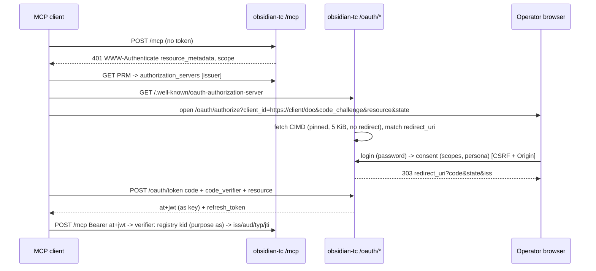

# A bundled OAuth 2.1 authorization server for obsidian-tc (design v2, G1)

Status: **design decided by the owner 2026-10-03 (§12), not built.** Written 2026-10-03 against `main` `b620c349`
(v1.32.0). Supersedes the 2026-09-24 authorization-server design note in this directory: that note's
shape (bundled opt-in AS, CIMD default, DCR behind a flag, separate state file) stands, but `main` has
moved under it. The auth registry now holds asymmetric signing keys and already serves
`/.well-known/jwks.json`. `auth.db` is taken by that registry. `oidc` mode shipped a pinned,
size-capped egress fetcher. The HITL codec still exists only when `auth.jwtSecret` does. This
revision builds on that code instead of beside it, settles the library question with a measurement,
and splits the build into PR-sized slices.

Browser and public clients (CORS, `Origin`) and hosted packaging (Railway and similar) are separate
pieces of work. This note designs only what the AS needs from them: §4.9 and §9.

## 0. The one-paragraph version

Today obsidian-tc is only a resource server. It verifies HS256, registry ES256/EdDSA, JWKS and OIDC
tokens, binds them to an audience, and serves RFC 9728 metadata when told where an authorization
server is. There is no authorization server, so a client with no prior relationship (a claude.ai
connector, `codex mcp login`, Gemini CLI, Grok Build, Cursor) cannot get a token. This note adds an
opt-in, in-process authorization server under `auth.as`, **written in-repo on Hono + jose + SQLite**
rather than on a library. It signs ES256 RFC 9068 access tokens with a **registry key of its own
purpose**. The existing verifier checks those tokens in process, with no loopback JWKS fetch. Clients
register by **Client ID Metadata Document** by default, by DCR when `auth.as.dynamicRegistration` is
on, or from config. A **single operator** logs in with a password set from the CLI or a one-time
setup token. Grants live in a new `oauth.db`. Hand-minted HS256 tokens keep working unchanged, and
bring-your-own external servers (`jwt` + `jwksUri`, `oidc`, Cloudflare Access managed OAuth) stay
first-class.

## 1. What exists on `main` (read 2026-10-03)

| piece | state | where |
| --- | --- | --- |
| Verifier | alg-routed: HS256 only to the secret or an HS256 registry key; a `kid` the registry holds decides by the ROW's `alg`; else remote `jwksUri`, else inline/file JWKS. One allowlist for every path. `aud`/`iss` enforced when configured. Age cap `auth.tokenTtlSeconds` from `iat`. `jti` revocation on every path | `auth/verifier.ts`, `auth/jwt.ts`, `auth/jwt-boot.ts` |
| Auth registry | `<cacheDir>/auth.db` (own migration chain) + `<cacheDir>/auth-keys/` (0700 dir, 0600 key files, `O_NOFOLLOW`, fd-checked). Tables `auth_keys` (HS256/ES256/EdDSA, `active→retiring→retired`, grace ≤ 7 d, `public_jwk`) and `auth_tokens` (issued and revoked `jti`, tombstones). Fails closed when lost (per-table markers). **One active key per deployment**: a unique partial index on `state = 'active'` | `auth/registry.ts`, `auth/registry-markers.ts`, `auth/signing-keys.ts`, `auth/key-files.ts`, migrations `20260930_901`, `_903` |
| JWKS | `/.well-known/jwks.json` already served from `registry.publishedJwks()` (active + in-window retiring asymmetric keys, public members only; 503 for a lost registry) | `transports/http.ts` |
| `oidc` mode | external IdP verification: discovery at boot, exact `issuer`, `typ` checks, claim mapping. Egress through `fetchBoundedText`: https only, no redirects, timeout, byte cap, public-address check, then a connection **pinned** to the validated addresses (no DNS rebinding) | `auth/oidc*.ts`, `gateway/plain-http.ts` |
| PRM | RFC 9728 document at `/.well-known/oauth-protected-resource[/mcp]` and the 401 `WWW-Authenticate` challenge, only when `auth.resource` + `auth.authorizationServers` are set; URLs come from config, never `Host` | `auth/protected-resource.ts` |
| Personas | `persona` claim → `{vaults, scopes, toolVisibility}`; unknown persona refused; the persona's scopes REPLACE the token's (never a union) | `auth/persona.ts` |
| Scope failures | enforced at dispatch as a `forbidden` tool error, not an HTTP 403 challenge | `ARCHITECTURE.md` Layer 2 |
| HITL codec | `createElicitCodec(opts.auth.jwtSecret, …)` on HTTP, so **no codec at all** under `oidc` mode or an asymmetric-only `jwt` deployment; stdio uses a per-process random secret | `transports/http.ts`, `elicit.ts`, `elicit-request-state.ts` |
| Server-local secret | `<cacheDir>/server-secrets/wiki-generated.key`, created 0600 through the key-file helpers, read with the same descriptor checks | `tools/m7/knowledge/wiki-generated-seal.ts` |
| Mint CLI | `obsidian-tc token mint` signs with the registry's active key, inherits `aud` from config, records the `jti` | `cli/commands/token-mint.ts` |
| Runtime | Bun 1.4.2 primary (`Bun.serve` + Hono fetch handler), Node ≥ 24 via `@hono/node-server`; `hono` ^4.13.9, `jose` ^6.2.12, `zod` ^4.6.5, `@modelcontextprotocol/server` 2.2.0 | `transports/serve.ts`, `packages/server/package.json` |

The SDK split was confirmed against the v2 docs (context7 `/websites/ts_sdk_modelcontextprotocol_io_v2`).
v2 keeps the resource-server helpers in `@modelcontextprotocol/server` (`verifyBearerToken`,
`bearerAuthChallengeResponse`, `oauthMetadataResponse`, `buildOAuthProtectedResourceMetadata`). It
moved every authorization-server helper (`mcpAuthRouter`, `OAuthServerProvider`, the
authorize/token/revoke/register handlers) to `@modelcontextprotocol/server-legacy/auth`. The docs
describe that package as a "frozen copy of v1 code … planned for removal in v3". It needs Express,
and its stated reason is "MCP servers should use dedicated OAuth providers". So the SDK offers no
supported AS to adopt.

## 2. Standards and clients

**MCP authorization 2026-07-28** (fetched 2026-10-03):

- The AS MUST implement OAuth 2.1 for public and confidential clients. It MUST offer RFC 8414 or
  OIDC discovery.
- On registration, CIMD is a SHOULD. DCR is a MAY and "deprecated and retained for backwards
  compatibility". Pre-registration is the third mechanism.
- The AS SHOULD return `iss` on every authorization response, error responses included (RFC 9207).
  If it does, it MUST advertise `authorization_response_iss_parameter_supported: true`. When that is
  advertised, clients reject a response without `iss` and compare the value byte-for-byte. A future
  revision is expected to make this a MUST.
- Clients MUST send `resource` (RFC 8707) on both the authorize and the token request.
- Protected resources MUST validate the audience, MUST NOT accept passthrough tokens, and SHOULD NOT
  list `offline_access` in PRM or the challenge.
- Insufficient scope SHOULD be a 403 whose single challenge names every scope the operation needs.
  Servers MUST honour scope hierarchies.

**claude.ai / Claude Code** (claude.com connector authentication docs, fetched 2026-10-03):

- CIMD is used only if AS metadata has `client_id_metadata_document_supported: true` **and** `none`
  in `token_endpoint_auth_methods_supported`. Otherwise Claude falls back to DCR, which registers a
  new client on every fresh connection.
- Only the FIRST `authorization_servers` entry is used.
- PRM `resource` must equal the URL the user typed.
- PKCE is always S256.
- `offline_access` is appended when AS metadata lists it.
- An invalid refresh token must get `invalid_grant`, and refresh tokens must rotate for public
  clients.
- The token endpoint takes form-urlencoded bodies, and `/register` takes JSON.
- Timeouts are 10 s for discovery and token requests and 30 s for refresh.
- The hosted callback is `https://claude.ai/api/mcp/auth_callback`. Claude Code needs loopback
  redirects matched **without the port** for both `127.0.0.1` and `localhost`.
- `client_credentials` is not supported.

**ChatGPT connectors** (OpenAI Apps auth docs, developers.openai.com/plugins/build/auth, fetched
2026-10-03):

- CIMD is preferred whenever AS metadata has `client_id_metadata_document_supported: true`, with
  DCR as the fallback.
- ChatGPT's client document lists both `none` (public client, S256 PKCE) and `private_key_jwt` in
  `token_endpoint_auth_methods_supported`. Its legacy singular `token_endpoint_auth_method` prefers
  `private_key_jwt`. An AS that reads only the singular field refuses ChatGPT with
  `invalid_client`. That is a real incident: HarperFast/oauth issue 244, fixed by treating the list
  as authoritative.
- When the AS advertises only `none`, ChatGPT resolves to `none` + PKCE. When `private_key_jwt` is
  advertised, ChatGPT presents an assertion on every code exchange and refresh. Per that issue's
  live capture, the assertion's `aud` is the token-endpoint URL rather than the issuer, which
  RFC 7523bis forbids.
- **Hard requirements**, copied into §9 as acceptance criteria:
  - `code_challenge_methods_supported: ["S256"]`; servers that omit it are unsupported.
  - RFC 9207 `iss` on authorization responses, matched exactly against metadata. With `iss`
    supported, ChatGPT uses the stable redirect URI
    `https://chatgpt.com/connector_platform_oauth_redirect`.
  - `resource` accepted on the authorize and token requests and copied into the access token's
    `aud`.
  - RFC 8414 metadata at the well-known path.

**Codex CLI** does CIMD when it is advertised and `none` is listed, with a fixed loopback redirect
(`--oauth-client-registration auto|cimd|dcr`). This and the next two rows are carried from the
2026-09-24 note's research and were not re-measured:

- Gemini CLI: DCR (unverified whether it does CIMD).
- Grok Build: DCR inferred, CIMD inferred **no** (unverified).
- Cursor: DCR with a `cursor://` private-use redirect, no CIMD (unverified).

**Consequence:** **CIMD + `none` + RFC 9207 `iss`** covers claude.ai and Claude Code, ChatGPT and
Codex with no client table and **no DCR**. The claude.ai custom-connector dialog also recommends
CIMD. So DCR off by default blocks none of them. DCR is still needed only for clients without
CIMD: Gemini CLI, Grok Build and Cursor, **all three unverified**. The S8 conformance tests
re-check each one.

## 3. Library decision: an in-repo minimal AS on Hono + jose + SQLite

| candidate | verdict | evidence |
| --- | --- | --- |
| `@modelcontextprotocol/server-legacy/auth` | **no** | deprecated, frozen, Express-only, removal planned in v3 (SDK v2 docs) |
| `oidc-provider` 9.12.2 (panva, MIT) | **no** | **Measured under Bun 1.4.2** (scratch spike, 2026-10-03). Discovery works (S256, `client_id_metadata_document_supported: true`, `authorization_response_iss_parameter_supported: true`, RFC 8414 path 200). But it prints `WARNING: Unsupported runtime. Use Node.js v22.x LTS`. Its handler is a Node `(req, res)` callback (Koa 3), mountable on Express/Koa per its docs, and Hono-on-`Bun.serve` hands us a fetch `Request`, so mounting needs a fetch→Node bridge (`transports/serve.ts` records why mixing the Node-compat HTTP machinery into a `Bun.serve` process already broke once). CIMD is an experimental feature (`ack: 'draft-02'`) whose breaking changes ship in MINOR releases. Storage is its adapter interface, not our migration chain. Its keys would be its own, not the registry's |
| `@node-oauth/oauth2-server` 5.3.0 (MIT) | **no** | framework-agnostic grant engine around a user-supplied model (`saveToken`, `getAuthorizationCode`, …), with PKCE in its guide. Its docs show no RFC 8414 metadata, CIMD, RFC 8707 resource binding or RFC 9207 `iss`, so every MCP-specific piece would still be ours, on top of an abstraction we would bend to fit JWT access tokens and refresh families. Last release 2026-04-15 |
| `@cloudflare/workers-oauth-provider` 1.2.1 (MIT) | **reference only** | the closest design to the MCP 2026-07-28 profile (CIMD, DCR, RFC 8707/9207/9728, hash-only storage), but bound to Workers: a KV namespace `OAUTH_KV`, `global_fetch_strictly_public`, service bindings |
| `oauth4webapi` 3.8.8 | n/a | client-only |
| Better Auth 1.7.7 (`better-auth` + `@better-auth/mcp` + `@better-auth/cimd`, MIT) | **strong runner-up**; see §3.1 | **measured under Bun 1.4.2 + Hono + `bun:sqlite`** (scratch spike, 2026-10-03), and it fits. The handler is fetch-native (`auth.handler(c.req.raw)`). The schema migrates programmatically into a `bun:sqlite` database (12 tables). Metadata is complete for the MCP profile: CIMD, S256 only, RFC 9207 `iss`, `none` + `private_key_jwt`. PRM is bound to the configured resource, and the JWKS serves ES256. What stops it is the security record on exactly this surface (§3.1) |
| **in-repo on Hono + jose + SQLite** | **chosen** | everything hard already exists here and is tested: key generation, key files, rotation and JWKS (registry); alg-routed verification; pinned SSRF-safe egress (`fetchBoundedText`); a migration runner; Hono routing. What remains is protocol glue: about eight routes, eight tables, PKCE (one SHA-256 compare) and a consent page |

**Rationale.** The MCP profile is a narrow slice of OAuth 2.1: authorization code + PKCE S256,
rotating refresh tokens, one resource, CIMD/DCR/static clients, RFC 9207 `iss` and RFC 8414
metadata. Better Auth is the one maintained library that fits a Bun-primary Hono server without a
runtime bridge (§3.1). Every other candidate needs a bridge or is a frozen, deprecated package. More
decisive: the parts a library would own are the parts this repo already
owns, with stricter guarantees than any candidate's defaults:

- 0600 `O_NOFOLLOW` key files
- per-purpose fail-closed registry markers
- `jti` revocation on every verify path
- egress pinned against DNS rebinding

Adopting `oidc-provider` or Better Auth would mean a second key store, a second fetch path and a second storage
layer, each to be kept in agreement with ours. The cost of building it ourselves is review
discipline. Every slice in §11 gets the security-lane cross-vendor review, and every threat in §8
carries a RED test. `workers-oauth-provider` is the design reference we check behaviour against
(refresh reuse window, hash-only storage), not code we import.

### 3.1 Head-to-head: Better Auth vs `oidc-provider` vs in-repo

Better Auth's `mcp()` plugin is built on its OAuth 2.1 provider (`@better-auth/oauth-provider`). It
needs the `jwt()` plugin for signing keys and pairs with `cimd()` for the MCP 2026-07-28 profile.
Its docs state that "MCP deprecates Dynamic Client Registration (DCR), so Better Auth never enables
DCR implicitly". The facts below come from context7 `/better-auth/better-auth` and the 2026-10-03
spike:

| | Better Auth 1.7.7 | `oidc-provider` 9.12.2 | in-repo (Hono + jose + SQLite) |
| --- | --- | --- | --- |
| runs on Bun + Hono `Bun.serve` | **yes, measured**; fetch-native handler | runs, but warns "Unsupported runtime"; Node `(req,res)` callback needs a bridge | yes (it is the existing stack) |
| storage | its own schema (12 tables: `user`, `session`, `account`, `verification`, `jwks`, `oauthClient`, `oauthRefreshToken`, `oauthAccessToken`, `oauthConsent`, …) through its adapter; `bun:sqlite` works; its own migration runner | adapter interface (we write it) | our migration chain, `oauth.db` (§4.8) |
| endpoints | authorize, token, revoke, introspect, userinfo, end-session, JWKS, PRM; DCR opt-in; device flow; `client_credentials` **advertised by default** | full OIDC OP | exactly §4.3 |
| CIMD | yes (`cimd()`, `metadataProfile: "mcp-2026-07-28"`); fetcher is injectable (`fetchClientMetadataResource`), so ours could be passed in | experimental, `ack: 'draft-02'`, breaking changes in minors | ours, on `fetchBoundedText` |
| PKCE / `iss` / audience | S256 only, `authorization_response_iss_parameter_supported: true`; `resource` → `aud` | S256 / `iss` / `resourceIndicators` | same, by construction |
| client auth | `none`, `client_secret_*`, `private_key_jwt` | all | `none` (+ static secret), which is all ChatGPT, Claude and Codex need (§2); `private_key_jwt` is a follow-up |
| refresh | rotation, `refreshTokenReuseInterval` | rotation | rotation + one-step window (§4.6) |
| signing keys | `jwt()` plugin: its own `jwks` table, private key AES-256-GCM-encrypted with the app secret, interval rotation. A custom `adapter` (`getJwks`/`createJwk`) could bridge to our registry, but must hand back private keys, which our registry deliberately keeps out of any database | its own | **the registry** (0600 files, per-purpose, fail-closed) |
| login / consent | we supply both pages; email+password and passkey plugins exist | we supply interactions | we build them (§4.5) |
| footprint | 41 MB `node_modules` (spike install), 26 packages | 3.4 MB, 40 packages | 0 new packages |
| cadence | very fast (1.7.7 published 2026-09-30) | steady, single maintainer | ours |
| **security record on this surface** (GitHub advisories, `better-auth/better-auth`) | **8 advisories in 2026 in the provider/OIDC/MCP plugins**, all fixed. Three are the exact classes §8 guards: parallel requests reusing one authorization code (GHSA-7w99-5wm4-3g79, high), concurrent refreshes minting extra valid refresh tokens (GHSA-392p-2q2v-4372, high), and tokens targeting APIs the user did not authorize (GHSA-p2fr-6hmx-4528). The others: `javascript:` redirect URIs (GHSA-86j7-9j95-vpqj), plain PKCE allowed (GHSA-9h47-pqcx-hjr4), refresh without the client secret (GHSA-pw9m-5jxm-xr6h), unrestricted client creation (GHSA-xr8f-h2gw-9xh6), and a device-approval page hiding the client (GHSA-q84f-53jg-9ppm). Core also had a **critical** 2026-09-30 advisory (OAuth state reusable as a magic link, GHSA-965c-763c-88jm) | mature, few advisories (not re-counted here) (u) | none yet; every §8 row is a RED test before code |

**Verdict (owner decision, 2026-10-03): in-repo AS. Better Auth is the documented fallback, under
the flip conditions below.**

Better Auth genuinely beats `oidc-provider` for this stack. It also beats the in-repo plan on
breadth: `private_key_jwt`, the device flow, passkeys, and a CIMD implementation that already
exists. It loses on three things that matter more for an auth core serving one operator:

- **(1) Attack surface.** We need about eight routes. Better Auth brings user/account/session
  machinery, social and magic-link sign-in, `client_credentials`, introspection and userinfo, and
  each must be disabled and kept disabled across fast minors. Whether every one can be fully
  disabled is not yet confirmed (u).
- **(2) Key custody.** A second, database-resident private-key store, or an adapter that pulls
  private keys out of our 0600 files. That gives up the registry's "no private key in any database"
  invariant.
- **(3) Record.** The 2026 advisories cluster on races in code exchange and refresh rotation, the
  exact properties §8 must prove. They are fixed, but adopting the library means tracking a fast
  patch stream on the auth core, with a cross-vendor review per bump.

The in-repo cost is about one PR per slice (§11), protected by RED tests for those same classes.
**Flip conditions** (any one moves the recommendation to Better Auth):

- the owner later wants `private_key_jwt`, the device flow, or other breadth sooner than the slices
  deliver it, and values that over a minimal surface. Passkeys alone are not a flip condition:
  §4.11 adds them in-repo;
- a spike shows every unused Better Auth endpoint can be removed, not just left unused;
- six months pass with no new advisory in `@better-auth/oauth-provider`.

### 3.2 Bring-your-own: external authorization servers obsidian-tc can sit behind

This list is for operators who do not want the bundled AS. obsidian-tc stays a resource server
(`jwt` + `jwksUri` + `audience` + `issuer`, or `oidc` mode), so any candidate must meet five
conditions:

- **(R1)** It issues **JWT access tokens verifiable by JWKS**. The RS does no RFC 7662
  introspection, so opaque tokens are unusable.
- **(R2)** It can set `aud` to `auth.resource`, ideally from the RFC 8707 `resource` parameter
  every MCP client sends.
- **(R3)** It serves RFC 8414 or OIDC discovery. MCP clients must try both.
- **(R4)** It supports PKCE S256.
- **(R5)** It lets clients register with no prior relationship: CIMD, or DCR (open/anonymous).

Rotating refresh tokens matter for public clients.

Research was done 2026-10-03 from vendor docs, release notes and search results. Nothing below was
verified by running a flow. **(u)** marks a cell with no primary source, so treat it as unverified.
"n/a" for ARM64 means SaaS only.

| AS | hosting / ARM64 | single-operator cost | DCR | CIMD | PKCE S256 | RFC 8707 / `aud` | RFC 8414 | RT rotation | JWT + JWKS (R1) | MCP clients documented |
| --- | --- | --- | --- | --- | --- | --- | --- | --- | --- | --- |
| Cloudflare Access managed OAuth (baseline) | SaaS (edge in front of the origin) / n/a | Zero Trust plan; price not confirmed (u) | yes | not documented (u) | RFC 7636 named; S256 not stated (u) | not documented (u) | yes | refresh tokens exist; rotation not stated (u) | **no: opaque `oauth:…` bearer tokens.** Access validates them at the edge; the origin sees Access's own identity (u) | Claude Code works. claude.ai web/mobile fail at Connect because the 401 lacks `WWW-Authenticate` (user report, anthropics/claude-ai-mcp#410, status unchecked) |
| `@cloudflare/workers-oauth-provider` 1.2.1 | library on Workers + KV only / n/a | Workers + KV pricing (u) | yes | yes (public clients only) | yes | yes (`invalid_target`) | yes | yes (previous token valid until its successor is used) | **no: own tokens, validated over a Service Binding/KV** | not documented (u) |
| WorkOS AuthKit | SaaS / n/a | free tier up to 1M MAU (third-party pricing source only) (u) | yes | yes | yes | **yes**: resource URL → `aud`, default resource | yes | not stated (u) | **yes** (docs: verify by JWKS with `iss` + `aud`) | none named in the fetched docs (u) |
| Stytch Connected Apps | SaaS / n/a; acquired by Twilio Nov 2025 | free: 10k MAU | yes | yes (vendor blog) | not stated (u) | partial: PRM and scopes documented; `resource`→`aud` not confirmed (u) | yes | blog says yes (u) | blog says JWT + JWKS (u) | none documented (u) |
| Descope | SaaS / n/a | free: 7,500 MAU (whether MCP features are included is not confirmed) (u) | yes | yes | yes (u) | yes: RS checks `aud` (RFC 8707 named only in a snippet) (u) | yes (u) | not found (u) | yes; JWKS per snippet (u) | Claude, Cursor, VS Code in snippets; ChatGPT, Codex, Gemini CLI (u) |
| Auth0 | SaaS / n/a | free: 25k MAU, 1 custom domain | yes | GA, but a 2026-09-30 community thread reports ChatGPT's CIMD rejected at registration | yes (u) | partial: needs the "resource parameter compatibility profile" to map `resource` → API audience | yes (u) | yes (u) | yes, with an API audience (u) | GA blog names Claude, Cursor, VS Code, ChatGPT, Gemini CLI; not Codex |
| Clerk | SaaS / n/a | free: 50k monthly retained users | yes (off by default; Clerk prefers CIMD) | yes | yes | partial: `resource`→`aud` reported by third parties only (u) | yes | not found; "refresh tokens never expire" (u) | yes (JWT by default) | none in vendor docs (u) |
| Logto | both: OSS + Cloud / arm64 reported by third parties (u) | Cloud free: 50k MAU; self-host free | **conflicting**: an mcp-auth.dev provider list says no RFC 7591; a 2026-09-30 GitHub issue says neither DCR nor CIMD | docs describe "dynamic apps (CIMD)", contradicted by the issue above | yes (u) | yes: API resource identifier = server URL → `aud` | (u) | yes (public clients rotate on use) | yes | VS Code tested in docs; others (u) |
| FusionAuth | both (Community self-host free) / arm64 not checked (u) | Community $0; custom OAuth scopes need a paid licence | **no** | no ("coming soon") | yes | yes (`resource` since 1.67.0) | yes (u) | (u) | yes (signed JWT) | Claude Desktop, Claude Code, Cursor, ChatGPT named, but **pre-registered clients only**, so claude.ai auto-registration likely fails |
| Keycloak 26.6/26.7 | self-host / ARM64 images (u) | free (Apache-2.0); Java, about 0.75–2 GB RAM + Postgres | yes (anonymous via client-registration policies) | **experimental** (`--features=cimd`, 26.6; MCP fixes 26.7) | yes (u) | **experimental** (`--features=resource-indicators`); otherwise an audience mapper | yes | yes (setting) (u) | yes (u) | vendor MCP guide: Claude Code, Claude Desktop, VS Code work; ChatGPT needs a custom client-policy executor |
| Authentik | self-host (cloud tier not confirmed) / (u) | free core (MIT + enterprise tier) (u); 2 CPU / 2 GB + Postgres | partial: from 2026.8.0, not anonymous by default | no | yes (u) | no (an RFC 8707 PR claim is unconfirmed) | (u) | (u) | yes (u) | none found |
| Zitadel | both / **ARM64 yes** (ghcr `linux/arm64`) | free self-host (AGPL-3.0); about 512 MB + Postgres; Cloud free: 100 daily active users | partial: v4.16.0 (2026-09, search snippet), off by default, anonymity not confirmed | no | yes | **no**: `resource` unsupported (older note: rejected) | **no**: OIDC discovery only | yes | yes (JWT or opaque) | claude.ai needed a DCR proxy before native DCR; others (u) |
| Ory Hydra | both (Ory Network has a dev tier) / (u) | free (Apache-2.0); light Go binary + SQL DB | partial: off by default; empty `client_uri`/`logo_uri` that claude.ai rejects, so it needs a proxy | no | yes (u) | no: own `audience` parameter; map `resource` in the consent app | yes (recent; snippet) (u) | yes (graceful, reuse detection) | yes (JWT strategy) | third-party blog: ChatGPT web works; claude.ai only via a DCR proxy; Claude Code blocked by a scope bug |
| Better Auth (as a small self-built AS app) | self-host, a library you deploy as your own Node/Bun app / ARM64 wherever Node or Bun runs | free (MIT); one process + SQLite/Postgres | opt-in (never implicit) | yes (`cimd()`, MCP 2026-07-28 profile) | yes, S256 only | yes: the `mcp()` `resource` becomes `aud` | yes | yes (with a reuse interval) | yes (`jwt()` JWKS, ES256/EdDSA) | none documented (u); you write the login/consent pages. Security record: see §3.1 |

**What the table says:**

- **The two Cloudflare options are not drop-in today.** Both fail R1: their access tokens are
  opaque, and validation happens in Cloudflare (edge or Service Binding), not by our verifier.
  - Access in front of obsidian-tc could still work if the RS verified Access's per-request
    assertion header against the team JWKS with the application AUD, instead of the bearer.
  - That is a new resource-server seam (a header-sourced token for `oidc` mode). It is not built,
    and claude.ai web is reported to fail against Access today.
  - So the 2026-09-24 note's "Cloudflare Access managed OAuth as a documented external option" is
    **downgraded**: it stays a documented recipe only after that seam exists and is verified
    end-to-end. Until then the docs slice lists it as unsupported.
- **Best SaaS: WorkOS AuthKit.** It is the only SaaS row whose own docs confirm R1–R5 together:
  JWT verified by JWKS with `iss` + `aud`, `resource` mapped to `aud`, CIMD and DCR, RFC 8414. It
  maps onto today's `jwt` mode with `jwksUri`, `issuer`, `audience = auth.resource` and
  `authorizationServers = [AuthKit issuer]`, with no code change. The free-tier ceiling comes from
  a third-party pricing page.
  - Runner-up: **Auth0**. It has the widest list of named clients, but needs the resource
    compatibility profile for R2 and has an open ChatGPT CIMD report.
- **Best self-hosted: Keycloak 26.7.** It is the only self-hosted server with both CIMD and RFC 8707,
  and the vendor publishes an MCP authorization-server guide. The costs: both features are
  **experimental** feature flags, ChatGPT needs a client-policy executor, and it is the heaviest
  footprint here (JVM + Postgres, about 1–2 GB on Cave-class hardware).
  - Runner-up: **Zitadel**. It is light (about 512 MB), confirmed on ARM64, and has rotating refresh
    tokens. But it ignores `resource` (so set `aud` with a fixed project audience), serves OIDC
    discovery only, and its DCR is weeks old.
  - Hydra, Authentik, Logto and FusionAuth each miss R5 for claude.ai-style clients, or need a
    proxy in front.
  - Better Auth meets R1–R5 on paper. But as an external AS it is a library: you still write and
    run a separate app with its own login and consent pages. That is all the cost of the §3.1 choice
    and none of the in-process benefit, so it is listed for completeness, not recommended as BYO.
- **How both compare with the bundled AS.**

  | | external AS | bundled AS |
  | --- | --- | --- |
  | per-user identity features (passkeys, MFA, social login, SSO) | free, maintained by someone else | none (password only in v1) |
  | services to run | a second stateful service (Keycloak) or a vendor dependency with per-user pricing (WorkOS) | none extra |
  | key sharing | over the network (`jwksUri`) | in process |
  | MCP spec gaps | each one's own; none above has CIMD + RFC 8707 + RFC 9207 `iss` all GA | the 2026-07-28 profile exactly (CIMD + `none` + RFC 9207 + RFC 8707 audience) |
  | first-run story | none | a single-operator setup token |

  The recommendation stands: the bundled AS is the default for a single operator, and WorkOS
  AuthKit (SaaS) and Keycloak (self-host) are the vetted BYO paths. Neither needs code; both are
  config recipes in the docs slice (S9). They need re-verification by a live login when that
  slice lands.

## 4. Design

### 4.1 Shape and modes

- `auth.as.enabled: true` requires `auth.mode: "jwt"`. It is refused under `none` (nothing to
  protect) and under `oidc` (an external AS is already the issuer). The AS routes are mounted on the
  same Hono app and port as `/mcp`.
- **Bring-your-own stays.** With `auth.as.enabled: false`, today's paths are untouched:
  - `jwt` + `jwksUri` (+ `authorizationServers` for PRM) for an external AS such as Keycloak,
    Zitadel or Auth0.
  - `oidc` mode for any OIDC provider.
  - Vetted external servers per §3.2: WorkOS AuthKit (SaaS) and Keycloak 26.7 (self-host) as
    config-only recipes. Cloudflare Access managed OAuth is **not** a drop-in: its bearer tokens
    are opaque. It becomes an option only after a header-assertion verifier seam exists (§3.2,
    §10).
- **Key sharing is in-process, not by URL.** The AS signs with a registry key, and the verifier
  already verifies any `kid` the registry holds against that row's public key. So `auth.jwksUri` is
  **not** pointed at the server itself: no loopback self-fetch, and no `plainHttpHosts` entry for
  one. Config validation **refuses** `auth.jwksUri` equal to `<as.issuer>/.well-known/jwks.json`,
  because it would be a redundant network path whose failure mode ("our own JWKS is down") rejects
  every token. Other services that verify our tokens still use the published JWKS.
- **Issuer and every endpoint URL derive from config**, never from `Host` or `X-Forwarded-*`
  (RFC 9700 §4.13), exactly as the PRM builder does today.

### 4.2 Signing keys: a registry key per purpose

The registry allows one active key per deployment (`idx_auth_keys_one_active`), and `token mint`
signs with it. If the AS shared that key, its first ES256 rotation would retire the operator's HS256
key, and hand-minted HS256 tokens would die after the grace window. That breaks the migration
promise (§7). So:

- Migration `auth.db` chain: `ALTER TABLE auth_keys ADD COLUMN purpose TEXT NOT NULL DEFAULT 'mint'
  CHECK (purpose IN ('mint','as'))`. The partial unique index becomes
  `(purpose) WHERE state = 'active'`, giving one active key **per purpose**.
- On first boot with `as.enabled`, if no `as` key is active, generate one (`auth.as.signingAlg`,
  default `ES256`, `EdDSA` allowed) inside the registry's existing write transaction. The private
  JWK goes into a 0600 file under `auth-keys/`. `kid` = RFC 7638 thumbprint.
- Rotation: `obsidian-tc auth rotate-key --purpose as [--alg ES256] [--grace N]`. For `as` keys the
  CLI refuses `--grace` < `accessTokenSeconds` + 60 s skew, so a rotation never kills live access
  tokens. The JWKS already publishes active + in-window retiring keys. Rotation is manual in v1;
  `doctor` warns when the active `as` key is older than 180 days.
- **Verifier rule by purpose.** A token whose `kid` names an `as`-purpose row must carry:
  - `iss` == `auth.as.issuer`
  - `typ: at+jwt`
  - `client_id`
  - `aud` == `auth.resource`
  - `jti`

  `mint`-purpose rows keep today's rules, including the global `auth.issuer` when set. The
  verifier passes the issuer per path rather than as one global.
- **Persona narrowing for AS tokens only.** For an `as`-purpose token carrying `persona`, the
  effective scopes are `persona.scopes ∩ token.scope`. This only narrows, and it keeps OAuth
  down-scoping and step-up meaningful. Hand-minted persona tokens keep today's replace semantics.
  Decided (§12).

### 4.3 Endpoints

All AS endpoints are served only when `auth.as.enabled`. All POST bodies are capped (16 KiB). All
HTML responses carry `Content-Security-Policy: default-src 'none'; style-src 'self';
form-action 'self'; frame-ancestors 'none'`, `X-Frame-Options: DENY`, `Referrer-Policy: no-referrer`
and `Cache-Control: no-store`. One deliberate exception (built in S5): the **consent page** names the
client's redirect origin in `form-action` (`form-action 'self' https://app.example`; a loopback client gets
`http://<host>:*`). Chrome applies `form-action` to the redirect that answers a form POST, and the consent
POST answers with a 303 to the client, so `'self'` alone would block the approval. Nothing else about the
policy loosens, and the origin comes from the pending request, which authorize already matched against
the registered redirect URIs.

| route | behaviour |
| --- | --- |
| `GET /.well-known/oauth-authorization-server` (+ `/.well-known/openid-configuration` alias, discovery fields only, no `id_token`) | RFC 8414: `issuer`; `authorization_endpoint` (`/oauth/authorize`); `token_endpoint` (`/oauth/token`); `revocation_endpoint` (`/oauth/revoke`); `jwks_uri` (`/.well-known/jwks.json`, existing route); `registration_endpoint` only when DCR is on; `response_types_supported ["code"]`; `grant_types_supported ["authorization_code","refresh_token"]`; `code_challenge_methods_supported ["S256"]`; `token_endpoint_auth_methods_supported ["none"]` (plus `client_secret_basic` iff a confidential static client is configured); `client_id_metadata_document_supported true`; `authorization_response_iss_parameter_supported true`; `scopes_supported` = PRM scopes + `offline_access`. Built once at boot from config |
| `GET /oauth/authorize` | Validation order, each step **before** anything can redirect: (1) resolve `client_id` (static → DCR row → CIMD fetch); (2) `redirect_uri` exact-match against the client's list (loopback `127.0.0.1`, `[::1]`, `localhost`: port ignored, path exact). Failure of (1) or (2) renders a local error page and **never redirects**. Then (3) `response_type=code`; (4) `code_challenge` present, `code_challenge_method=S256` (plain or absent → error redirect); (5) `resource` == `auth.resource` after scheme/host lower-casing (else `invalid_target`); (6) `scope` parsed against the scope vocabulary, with unknown scopes dropped and the granted set echoed in the token response. Valid → store a pending request (random 32-byte handle, 10 min TTL) and 303 to `/oauth/login` or straight to `/oauth/consent`. Every redirect, error ones included, carries `iss` and the client's `state` |
| `GET/POST /oauth/login` | Password form. Refuses everything while the AS is unclaimed (§4.5). On success it rotates the session id and sets the session cookie `__Host-otc_as` (`HttpOnly; Secure; SameSite=Lax; Path=/`; on a loopback http dev issuer, the un-prefixed name without `Secure`), idle TTL 30 min, absolute TTL 12 h. 303 after POST |
| `GET/POST /oauth/consent` | Shows the client name, `client_id` host, redirect host (a loud warning when the redirect being used is loopback, any scheme and any 127.0.0.0/8 or ::1 address, or when it is a CIMD client the operator has never approved), the requested scopes in words, the resource, and a persona/vault picker when personas are configured. The first grant for a `(client_id, redirect_uri)` requires a login newer than 5 min. POST needs the CSRF token bound to (session, pending handle) and an `Origin` equal to the issuer origin. Approve → create or extend the grant, issue a code, 303 to `redirect_uri?code&state&iss`. Deny → `error=access_denied` with `iss`. Remembered consent skips the page only for `scope ⊆ granted` on the same `(client_id, redirect_uri, sub)`, **including a loopback callback across ports** (the default, `auth.as.consent.loopback: remember`, so a native CLI signs in without a click; nothing proves which local process is behind the port, so `prompt` makes every loopback sign-in ask, see the auth model), **and only while the account's current `scopes_allowed` / `vaults_allowed` still allow all of it** (they are re-read on every decision: consent POST, remembered consent, token exchange; a grant the account has since outgrown asks again, and a code is exchanged only for the scopes and vault the account still allows); there is no auto-approve otherwise |
| `POST /oauth/token` | `application/x-www-form-urlencoded` only (else 415). `authorization_code`: the code is looked up by SHA-256 and must be unused, unexpired (60 s) and bound to the same `client_id`, `redirect_uri` and `resource`; `BASE64URL(SHA256(code_verifier)) == code_challenge` in constant time. A **second use of a code revokes every token issued from it** (grant family + access `jti`s). `refresh_token`: rotation per §4.6. Response: `access_token` (JWT §4.4), `token_type: Bearer`, `expires_in`, `refresh_token`, `scope`. Errors are RFC 6749 codes, `invalid_grant` for any bad code or refresh token. `Cache-Control: no-store`. Target p99 < 1 s (Claude's 10 s / 30 s budgets) |
| `POST /oauth/revoke` | RFC 7009. A refresh token revokes its family. An access token: its `jti` goes to the registry's revoked set (existing `registry.revoke`). Always 200 for an unknown token |
| `POST /oauth/register` | Only when `auth.as.dynamicRegistration`; 404 otherwise. RFC 7591 JSON. Public clients only (`token_endpoint_auth_method` must be `none`; no secret is ever issued). `redirect_uris` validated as in authorize; a private-use scheme (`cursor://…`) is **dropped, not fatal**, as long as one usable URI remains. Rate-limited, row-capped, unused rows expire (§8) |
| `GET/POST /oauth/setup` | First-boot claim when no CLI password exists: needs the setup token (§4.5); single use |
| PRM `/.well-known/oauth-protected-resource[/mcp]` | Existing route. With `as.enabled`, `authorization_servers` defaults to `[as.issuer]`. If the operator lists servers explicitly, `as.issuer` must be **first** (Claude reads only the first), or config load fails. The issuer string is byte-identical in AS metadata, PRM, every `iss` claim and every `iss` response parameter |

### 4.4 Access tokens

They are RFC 9068 JWTs signed by the active `as` key:

- header `{alg: ES256, kid, typ: "at+jwt"}`
- claims `iss` (= `as.issuer`), `sub` (the user's stable random id), `aud` (= `auth.resource`),
  `client_id`, `scope` (space-separated, `offline_access` stripped), `persona?`, `vault?`, `iat`,
  `exp`, `jti`
- default lifetime `accessTokenSeconds` 1800

Each issued `jti` is recorded through `registry.recordToken`, so the existing
`token list`/`token revoke` commands see AS tokens too. The registry slice adds a reaper for rows
past `exp` + 1 day if none exists.

Config validation enforces three conditions:

1. `auth.tokenTtlSeconds ≥ accessTokenSeconds`, or the age cap would kill tokens early.
2. When `auth.algorithms` is set, it includes `as.signingAlg`.
3. `auth.resource` is set.

### 4.5 Identity: single operator, multi-user ready

- `users(sub, username, password_hash, scopes_allowed, vaults_allowed, created_at, disabled_at)`.
  v1 ships **one operator row** created by:
  - `obsidian-tc auth as set-password` on a TTY, or from stdin with `--stdin`; or
  - on a host with no TTY, `/oauth/setup` with the token named by `auth.as.setupTokenEnv` (default
    `OBSIDIAN_TC_AS_SETUP_TOKEN`). The token is compared in constant time and burned on first success
    (its SHA-256 is recorded as used). A setup URL is never logged.
- **Until claimed, `/oauth/authorize`, `/oauth/register` and `/oauth/token` refuse.** This closes the
  first-run race on a public host.
- Password hash: **Argon2id via `node:crypto.argon2`**, in §4.11.4. Minimum 12 characters. No
  password is ever logged or echoed by `config show`/`doctor`.
- **Multi-user** means each `sub` has its own `scopes_allowed` (an upper bound on any grant) and
  `vaults_allowed` (the `vault` claim or persona must fall inside it), on top of the existing
  per-vault ACL, which still applies at dispatch. A NULL bound is unbounded; an empty or blank one
  allows nothing. A token with no `vault` claim rides the server's default vault, which the bounds
  know nothing about, so a vault-bounded account is never issued an unbound token: with no
  persona or vault chosen it gets its one permitted vault (in the grant, the code and the `vault`
  claim), and with several permitted vaults consent refuses until a persona names one. The same
  rule runs at the remembered-consent branch and at the token exchange. The table is multi-row
  from day one. Adding users
  (`auth as user add/disable`) is a later slice (decided, §12).
- **Passkeys** come in a later slice (S10, decided). The options and recommendation are in §4.11.

### 4.6 Refresh tokens

- Opaque, 32 random bytes, base64url, stored as SHA-256 only.
- Rotated on every use.
- Family = one grant + client. Absolute cap `refreshTokenDays` (default 30) from the family's start.
- **Reuse policy:** the immediately previous token is accepted again **only until its successor is
  first used**, so a client that lost a refresh response can retry. A Railway cold start can outrun
  Claude's 30 s refresh budget. Any older token, or the previous one after its successor was used,
  **revokes the whole family** and all access `jti`s issued from it (RFC 9700 §4.14.2).
- A refresh token is issued on every `authorization_code` exchange whether or not `offline_access`
  was requested. Codex and Gemini CLI do not ask for it, and the token is useless without the
  client's PKCE-bound grant.
- A refresh may narrow scope, never widen it. `invalid_grant` on every failure.

**As built (S6).** Where the bullets above left a choice, the code decided it:

- **The window is idempotent: it returns the same response.** Only a hash is stored, so a retry could not be
  handed "the token its first request made". A token's successor is therefore DERIVED: `base64url(HMAC-SHA256(server
  secret, "as-refresh-successor" ‖ parent))`. And the whole first response is kept: the access token the rotation
  returned is stored on the successor's row (`refresh_tokens.replay`), sealed with AES-256-GCM under an HKDF
  subkey of the server secret and bound to the parent's hash (a seal copied onto another row does not open). A
  retry of the parent while the successor is unused is answered with that stored response: the same access
  token (same `jti`), the same successor, `expires_in` = what is left. It mints and records nothing, so one stolen
  parent cannot be turned into any number of live bearers (the first design returned the same successor but a
  NEW access token per retry: unbounded simultaneously valid tokens, no reuse detection, `issued_access`
  growing to the family cap). Chosen over capping retries at one because a client may legitimately retry more
  than once while a cold start outlasts its budget, and idempotence costs one column. The stored copy is
  dropped when the successor is first used (the window closes), and a retry is refused (`invalid_grant`, no
  minting, nothing revoked) when the stored access token has expired or was revoked, the seal does not open, or
  the request asks for a different scope or vault than the first response carried. Two simultaneous refreshes of
  one token are the same operation: the one that commits first is THE response; a loser that had already signed
  a token revokes it and answers with the winner's. (So "two simultaneous refreshes: at most one succeeds" does
  not hold, by design: the Railway cold start that motivates the window is exactly a client retrying while the
  first request is still running.) Deriving the successor gives a holder nothing they lacked: holding a token
  already lets them rotate it.
- **A refresh token belongs to the secret that minted it.** Every `refresh_tokens` row records
  `secret_gen`, `HMAC(server secret, "as-refresh-generation")` truncated to 128 bits: non-secret and one-way.
  A token is rotated or retried only while its row's `secret_gen` equals the current secret's. A mismatch, the
  current leaf included, is `invalid_grant` and **revokes the family** (its access tokens die at `/mcp`): replacing
  the server secret retires every family instead of letting each current token start a new chain under the new
  one. Rows written before the column existed hold NULL, which never matches: after upgrading, the first
  refresh of an old family is refused and the client signs in again once (acceptable: S6 is unreleased). Only the
  token's own client can trigger the revocation, like a reuse.
- **One step, recorded on the parent.** `successor_first_used_at` is set on the PARENT row when the successor is
  first presented. A token whose row has it set, and any token two or more steps behind, is a reuse: the whole
  family is revoked (refresh tokens marked, then every `issued_access` jti sent to the registry's revoked set;
  the two database steps are one write transaction).
- **Only the owner's presentation can revoke.** The token's client is the grant's client. A request from any
  other client, for an unknown token, a revoked or expired family or a revoked grant, is refused and changes
  nothing; the same holds for a replay that cannot name the right client (a confidential client also needs its
  secret). Every refusal is the same `invalid_grant` with the same description, including a requested `scope`
  wider than the family holds (RFC 6749 would say `invalid_scope`; that would tell a token holder apart from
  a non-holder).
- **Cap.** The family dies `refreshTokenDays` after the code exchange that started it. Rotation copies the
  cap and never extends it. A family and its refresh rows are swept once past the cap.
- **Bounds.** The account's `scopes_allowed` and `vaults_allowed` are applied at every refresh with the same
  `applyBounds` the code exchange uses (empty bounds deny, the effective-vault rule). A narrowed account gets a
  narrower access token and keeps its refresh token (lifting the bound lifts the narrowing, since nothing is
  copied into the family); an account narrowed to nothing, or disabled, gets `invalid_grant` and nothing is
  burned. The family keeps the scope it was issued with, so a request that narrows its `scope` still gets the
  full scope on the next refresh that does not name one.
- **Ordering.** As on the code exchange, the new access token's `jti` is recorded before the rotation
  commits. The rotation re-decides under the write lock; if the family was revoked meanwhile it refuses and
  revokes the jti it just recorded.
- **Revocation is durable (outbox).** Revoking a family or a grant touches two files, and the registry
  (`auth.db`) cannot join an `oauth.db` transaction. The family/grant update and one `revocation_outbox` row per
  access-token `jti` therefore commit in ONE transaction, and the rows are then drained into the registry
  (`registry.revoke` is idempotent). A row is deleted only after its registry write succeeded; one failing jti
  does not stop the others and its error is rethrown after the pass. The outbox is drained right after every
  revocation, at boot and on the maintenance sweep, and before a refresh decides anything (a drain that cannot
  reach the registry is a `server_error`, never a refresh on top of an unpaid revocation). A busy or full
  `auth.db`, or a crash between the two writes, therefore leaves the debt on disk instead of live tokens behind
  a family that reads `dead` forever; repeating `auth as grants revoke <id>` also re-drains.
- **Revocation endpoint.** `POST /oauth/revoke` authenticates the client exactly like `/oauth/token`. A refresh
  token revokes its family; an `at+jwt` signed by an `as` key for this resource, with this client's
  `client_id`, revokes its `jti`. Everything else (unknown, expired, forged, another client's, already
  revoked) is the same empty 200, which departs from RFC 7009 section 2.1 ("refused" for another client's token)
  so the response is never an oracle. `token_type_hint` only picks which to try first.
- **`auth as grants list|revoke <id>`.** Revoking a grant marks it revoked (so its codes and refresh tokens are
  refused from then on) and revokes every family and jti under it.

### 4.7 Client registration

- **Static** (`auth.as.clients[]`): `clientId`, `name`, `redirectUris`, optional `secretEnv` (a
  confidential client authenticates with `client_secret_basic`; the secret is read from env and
  compared by hash). Static clients are the only confidential ones. No `client_credentials` grant in
  v1, since Claude does not support it and no current consumer needs it.
- **CIMD** (the default; `client_id` is an `https://` URL with a path):
  - Fetched through the existing `fetchBoundedText` with `maxBytes` 5 KiB, timeout 5 s, no
    redirects, https only, every resolved address public, and the connection pinned. There is
    **no `allowPrivateNetwork` opt-in for CIMD**.
  - The document must parse as JSON, its `client_id` must equal the URL exactly, and
    `redirect_uris` must be non-empty and valid. `logo_uri` and `jwks_uri` are never fetched.
  - **Client-auth method: the list is authoritative.** The permitted methods are
    `token_endpoint_auth_methods_supported` when that list is present. The singular
    `token_endpoint_auth_method` is consulted **only when the list is absent**. The client is
    accepted iff the permitted set contains a method this AS advertises, and v1 advertises only
    `none`. It is then bound to that one method for its grants, so a later token request presenting
    any other client authentication is `invalid_client`.
    - RED test (S7): ChatGPT's real document shape, `"token_endpoint_auth_method":
      "private_key_jwt"` plus `"token_endpoint_auth_methods_supported": ["private_key_jwt",
      "none"]`, resolves to `none` and completes the flow. A singular-field-only implementation
      fails it with `invalid_client`, the failure HarperFast/oauth issue 244 recorded.
    - Companion RED test: a document listing only `["private_key_jwt"]` is refused with
      `invalid_client` and a message naming the method.
  - Cached in `cimd_cache` for `clamp(Cache-Control max-age, 5 min, 24 h)`. Errors are never
    cached.
  - Optional `auth.as.cimd.allowedHosts` restricts which hosts may be `client_id`s.
  - Consent pins the grant to the URL. A later document whose `redirect_uris` no longer contain the
    granted one invalidates remembered consent.
- **DCR**: §4.3 `/oauth/register`, **off by default (decided)**. A boot notice at `warn` level
  whenever it is on, naming the flooding surface and the knobs. Clients that still need it: Gemini
  CLI, Grok Build and Cursor, all unverified. claude.ai, Claude Code, ChatGPT and Codex use CIMD
  (§2).

### 4.8 Storage: `oauth.db`

A new `<cacheDir>/oauth.db` with its own migration chain, opened through the existing SQLite
wrapper with WAL. `auth.db` is the registry's, and the AS state has a different durability profile:

- **Losing `oauth.db` is fail-safe.** Grants, refresh tokens, DCR clients and the operator password
  vanish, so clients must log in again after a re-claim, which still needs the CLI or the setup
  token. Access tokens already issued expire within `accessTokenSeconds`, and revocations stay in
  `auth.db`.
- So it needs **no lost-registry marker**. It does need backing up with `auth.db` and `auth-keys/`.
  `doctor` names all three, the auth-model page lists them, and the reference deployment's nightly
  `<cacheDir>` backup picks the file up with its `-wal`.

Schema sketch (every secret column is SHA-256 hex; times are epoch ms):

```sql
users(sub TEXT PK, username TEXT UNIQUE, password_hash TEXT, scopes_allowed TEXT, vaults_allowed TEXT,
      created_at, disabled_at)
setup_state(id INTEGER PK CHECK (id = 1), claimed_at, setup_token_hash_used)
sessions(id_hash PK, sub, created_at, last_seen_at, expires_at)
oauth_clients(client_id PK, kind CHECK (kind IN ('dcr')), metadata_json, created_at, last_used_at,
              expires_at, created_ip)                      -- static ones live in config, CIMD in cache
cimd_cache(client_id PK, document_json, fetched_at, expires_at)
auth_requests(handle_hash PK, client_id, redirect_uri, scope, resource, code_challenge, state,
              created_at, expires_at)
grants(id PK, sub, client_id, redirect_uri, scope, resource, persona, vault, created_at, revoked_at)
auth_codes(code_hash PK, grant_id, request_scope, redirect_uri, resource, code_challenge,
           expires_at, used_at)
refresh_tokens(token_hash PK, family_id, grant_id, parent_hash, scope, issued_at,
               successor_first_used_at, family_expires_at, revoked_at)
issued_access(jti PK, family_id, grant_id, expires_at)    -- for code-replay / family revocation
```

Garbage collection rides the existing housekeeping tick: expired requests, codes, sessions and
CIMD rows; DCR clients unused for 90 days; families past their cap; `issued_access` rows 60 s
(the §4.2 skew) past their access token's `exp`, so a sweep never orphans a token a lagging verifier
still accepts. Rate-limit counters live in memory.

### 4.9 Seams to the separate pieces of work

- **Browser/public clients (CORS + Origin).** v1 AS endpoints send **no CORS headers**. Native,
  CLI and hosted-connector clients do not need them. That work adds CORS to `/oauth/token`,
  `/oauth/revoke`, the metadata and `/.well-known/jwks.json` only, never to `/oauth/authorize`,
  login or consent, which are top-level navigations. It reuses this note's client model unchanged.
- **Hosted packaging.** It consumes `auth.as.setupTokenEnv` as its first-run story and must put
  `oauth.db`, `auth.db` and `auth-keys/` on the persistent volume. That is all this note requires
  of it.

### 4.10 HITL codec keyed from a server-local secret

The codec only has to authenticate request-states this server minted. It never needs the bearer
signing key, and coupling it to `auth.jwtSecret` leaves `oidc` and asymmetric-only deployments with
**no codec at all** (§1). The design:

- Lift the key-file logic out of `wiki-generated-seal.ts` into a shared
  `auth/server-secret.ts` (`serverSecret(cacheDir)` → the existing
  `<cacheDir>/server-secrets/wiki-generated.key`, created 0600 on first use, read with the same
  descriptor checks). Domain separation stays in each consumer's label:
  `deriveRequestStateKey` already hashes with `|obsidian-tc/elicit-request-state`, and the wiki
  seal uses its own `obsidian-tc/wiki-generated/v1` HMAC prefix.
  - Reusing the file rather than adding a sibling means one secret to back up and one trust check.
    Neither consumer's derived key can stand in for the other's.
  - The file keeps its current name so existing wiki seals stay valid.
- `createHttpApp` builds the codec from that secret in **every** HTTP auth mode. Processes sharing a
  `cacheDir` share confirmations. Rotating `jwtSecret` no longer silently voids pending
  confirmations.
- On deploy, in-flight confirmations from the old key fail once (TTL 300 s) and the client is
  re-offered. That is acceptable and stated in the changelog fragment.

### 4.11 Passkeys (S10), password hashing (S4) and recovery

Passwords ship first (decided). Passkeys are added **beside** the password, never instead of it, so
the password stays a working second factor of recovery.

#### 4.11.1 What one operator needs from WebAuthn

- **Discoverable credentials** (`residentKey: "required"`), so login is username-less, and
  `userVerification: "required"`.
- **Conditional UI** (autofill), so the login form offers the passkey without an extra button.
- **Attestation `none` only.** A single operator has no device-model policy to enforce, and every
  2026 advisory in the leading library sits in attestation-certificate handling (below).
- **Sign count:** store it. Refuse when the stored value is non-zero and the new one is not
  greater, since that is a clone signal. Accept a constant 0, because synced passkeys report 0.
- `rpID` = the issuer host and expected origin = the issuer origin. A hostname change orphans every
  credential, which is why the reset path in §4.11.5 exists.
- New table in `oauth.db`: `webauthn_credentials(credential_id PK, sub, public_key, sign_count,
  transports, device_type, backed_up, created_at, last_used_at)`.

#### 4.11.2 Options surveyed (2026-10-03)

| option | kind | Bun / Node | latest, cadence | advisories | attestation | conditional UI | discoverable | sign count | deps / licence |
| --- | --- | --- | --- | --- | --- | --- | --- | --- | --- |
| **`@simplewebauthn/server`** 14.0.3 (+ `@simplewebauthn/browser`) | server verification + browser helper | **measured**: registration and authentication options generate under Bun 1.4.2 and Node 26 (scratch spike); pure JS, no native addon | 14.0.3 (2026-09-25); four releases in Sept 2026 | **3 in 2026, all in the attestation path, all fixed by 14.0.2**: GHSA-6hxq-p678-4hr2 (low, trust-anchor chaining), GHSA-2g3p-m8c9-hhwh (medium, CRL cache poisoning), GHSA-j3h4-m3m2-7p7j (medium, attestation certs trigger server HTTP requests). `attestationType: "none"` stays out of that code | none plus packed, tpm, android, apple, fido-u2f | yes (`@simplewebauthn/browser` autofill) | yes | returns `newCounter`; the app enforces | 10 deps (`@peculiar` ASN.1/x509 stack; about 5.7 MB installed), MIT |
| `@oslojs/webauthn` 1.0.0 (+ `@oslojs/crypto`) | parsing primitives (`parseAttestationObject`, `parseAuthenticatorData`, `parseClientDataJSON`, measured exports); we write the ceremony checks and signature verification | pure JS, loads on Bun and Node (measured) | 1.0.0 (2024-09-19); repo idle since | 0 | parses formats; verification is ours | browser side is ours | yes (ours) | exposed; ours | 5 `@oslojs` deps (648 KB), MIT |
| `@passwordless-id/webauthn` 2.4.0 | client + server | WebCrypto; Node 19+ and Workers documented, Bun (u) | 2.4.0 (2026-05-15) | 0 | not documented (u) | yes (demo) | yes | not documented (u) | zero deps, MIT |
| `webauthn-p256` 0.0.10 | minimal P-256 verifier | pure JS (u) | **repo archived 2024-11-07** | 0 | none (signature only) | no | n/a | yours | `@noble/*`, MIT; **rejected** (archived) |
| Hanko (self-hosted) | separate passkey service (Go) + web components | n/a (separate service); ARM64 image (u) | backend v3.1.0 (2026-10-01), active | none published | (u) | yes (u) | yes (u) | (u) | backend AGPL-3.0; **rejected**: a second stateful service for one operator |
| Corbado | SaaS | n/a | n/a | n/a | n/a | n/a | n/a | n/a | not open source, no self-host (secondary sources); **rejected** |
| Passage by 1Password | hosted | n/a | **retired 2026-01-16** | n/a | n/a | n/a | n/a | n/a | **rejected** (dead) |
| Better Auth passkey plugin 1.7.7 | reference only | | | | | | | | built on `@simplewebauthn/server` ^13 and `@simplewebauthn/browser` ^13, which corroborates the pick |

#### 4.11.3 Recommendation: `@simplewebauthn/server` 14.x

The configuration is `attestationType: "none"`, discoverable credentials and UV required, and an
explicit `expectedOrigin` and `expectedRPID`.

It is the only maintained library that does the full ceremony verification. It is pure JS,
measured on both runtimes, under MIT, and Better Auth's passkey plugin builds on it too. Its
advisories are confined to attestation-certificate handling, which `none` never enters. A RED test
pins that: a `packed` attestation is refused at registration.

`@oslojs/webauthn` is the runner-up if dependency weight ever matters more than owning less crypto
code. Its cost is writing and proving the ceremony checks ourselves.

The browser half is the vendored `@simplewebauthn/browser` ESM. It is embedded as a codegen'd
TypeScript string, the same reason migrations are embedded (`bun --compile` ships no assets), and
served from `/oauth/assets/` under `script-src 'self'`.

#### 4.11.4 Password hashing (S4): Argon2id via `node:crypto.argon2`

| option | verdict |
| --- | --- |
| `Bun.password` (Argon2id built in) | **no**: Bun-only. The server also runs on Node (`@hono/node-server`; the vitest suite runs under Node), so one hash function must exist on both |
| `@node-rs/argon2` 2.2.1 | **no**: a native napi addon, which adds per-target prebuilt binaries to the existing native packaging and standalone-binary path for a function the runtime already has |
| **`node:crypto.argon2`** | **yes**: added in Node v24.7.0 (Node API docs, no stability caveat) and present in Bun 1.4.2 (**measured**). Use the async form so the event loop stays free |
| scrypt (`node:crypto`) | the previous draft's choice; superseded |

Parameters are the OWASP minimum: m = 19 MiB, t = 2, p = 1, a 16-byte salt and a 32-byte tag,
stored as a PHC string (`$argon2id$v=19$m=19456,t=2,p=1$…`) so parameters can be raised with a
rehash on login. Measured on Cave (ARM64, shared 4-core), median of 5: **153 ms on Bun 1.4.2,
113 ms on Node 26**. `m = 64 MiB, t = 3` took 858 ms and 1,124 ms, too slow for a login path on a
shared box.

`engines` admits Node 24.0–24.6, which lack `crypto.argon2`. There, `auth.as.enabled` refuses at
load with a message naming Node ≥ 24.7. The rest of the server is unaffected, and the floor is
not raised for everyone.

#### 4.11.5 Recovery: the operator loses the passkey

1. **Password still works.** Passkeys are additive, so a lost device means logging in with the
   password and enrolling a new passkey. An operator account page
   (`/oauth/account`) lists credentials with `last_used_at`, and any of them can be removed after
   a fresh login.
2. **Lost both, or the hostname changed (orphaned `rpID`).** `obsidian-tc auth as reset-credentials
   [--user <name>] [--revoke-grants]` is the recovery. Shell access to the host and write access to
   `<cacheDir>` are the root of trust. It:
   - prompts for a new password (or reads `--stdin`);
   - deletes the user's WebAuthn credentials and revokes every session;
   - with `--revoke-grants`, also revokes every grant and refresh-token family.
3. **No shell** (some hosted platforms). A one-shot `OBSIDIAN_TC_AS_RESET_TOKEN` env var switches
   `/oauth/setup` into reset mode for that user. The token is compared in constant time, burned on
   first use, and announced at `warn` on every boot while set, and the docs say to remove it
   afterwards. This mirrors the first-boot setup token, so there is one mechanism to test, not two.
4. **No recovery codes in v1.** Items 2 and 3 cover a single operator. Codes would be one more
   secret to store hashed, and one more brute-force surface.

RED tests (S10):

- the reset CLI revokes sessions and credentials; an old session cookie gets 401 after reset;
- the reset token is single-use;
- reset mode is off whenever the env var is absent;
- a credential registered under another `rpID` fails authentication.

## 5. Config sketch

```jsonc
"auth": {
  "mode": "jwt",
  "jwtSecret": "…",                                   // optional; hand-minted HS256 keeps working
  "resource": "https://vault.example.com/mcp",        // REQUIRED with as.enabled; = aud = PRM resource
  "tokenTtlSeconds": 86400,                           // must be ≥ as.accessTokenSeconds
  // "authorizationServers" defaults to [as.issuer]; if set, as.issuer must be first
  // "jwksUri" must NOT be this server's own JWKS (refused)
  "as": {
    "enabled": false,                                 // opt-in
    "issuer": "https://vault.example.com",            // https origin, no path/query/fragment;
                                                      // http allowed only for a loopback host
    "signingAlg": "ES256",                            // "ES256" | "EdDSA"
    "accessTokenSeconds": 1800,                       // 300..3600
    "refreshTokenDays": 30,                           // 1..90
    "dynamicRegistration": false,                     // DCR; loud boot notice when true
    "dcr": { "maxClients": 1000, "perIpPerHour": 10, "unusedDays": 90 },
    "cimd": { "allowedHosts": [] },                   // empty = any public https host
    "setupTokenEnv": "OBSIDIAN_TC_AS_SETUP_TOKEN",
    "login": { "maxFailuresPerWindow": 5, "windowSeconds": 900 },
    "clients": [
      { "clientId": "my-agent", "name": "My agent", "redirectUris": ["http://127.0.0.1/callback"] }
    ]
  }
}
```

Every key gets a `.describe()` and a `doctor` line. `securityProfile: "hardened"` forces
`dynamicRegistration: false` unless set explicitly, and `requireJti` is already forced there.

## 6. Data flow (authorization code, CIMD client)



## 7. Migration: a deployment with hand-minted HS256 tokens

Nothing an existing deployment does changes until it sets `auth.as.enabled: true`. After it does:

1. **HS256 tokens keep verifying.** They go to the `config` key or a `mint`-purpose registry key
   exactly as today. The AS key has its own purpose, so its creation and rotation never touch the
   mint key (§4.2). RED test: mint an HS256 token, enable the AS, rotate the `as` key twice, and
   the HS256 token still verifies.
2. The operator sets `auth.resource` (the public `/mcp` URL), `auth.as.enabled`, `auth.as.issuer`,
   then runs `obsidian-tc auth as set-password` (or deploys with the setup token) and restarts.
3. PRM now advertises the bundled issuer, and a 401 points new clients at it, **once the authorize and
   token routes are mounted** (S3 ships neither, so until S5 enabling the AS changes nothing a client
   discovers). Clients holding hand-minted tokens never see a 401 and carry on: the AS default is a
   discovery entry, not an audience binding, so a hand-minted token without `aud` is still accepted
   (RED test through the real HTTP edge: AS off, AS on, and after two `as` rotations). Only `auth.audience`,
   or an explicit `auth.authorizationServers` list with `auth.resource`, binds `aud` for hand-minted tokens.
4. If `auth.issuer` was set for hand-minted tokens, it keeps applying to `mint`-purpose keys only.
   If `auth.algorithms` was narrowed, it must now include `as.signingAlg` (load-time error naming
   the fix).
5. Retiring HS256 later is the existing, independent `auth rotate-key` flow.

`doctor` gains an `as` section:

- claimed or unclaimed
- the active `as` key's age
- whether DCR is on
- `oauth.db` and backup coverage
- whether `authorizationServers[0]` equals the issuer
- the `tokenTtlSeconds` vs `accessTokenSeconds` check

## 8. Threat model additions

Each row is a RED test written before its mitigation (the slice in brackets). The rows also go into
`SECURITY.md`'s threat-model table in the docs slice.

| threat | mitigation | RED test (must fail before the mitigation) |
| --- | --- | --- |
| Open redirect | client and redirect validated before any redirect; exact match; port-agnostic loopback only; errors before validation render locally | `/oauth/authorize` with an unregistered `redirect_uri=https://evil.example/cb` returns 400 HTML and **no `Location`**; `http://localhost:9999/cb` matches `http://localhost/cb`; `http://localhost.evil.example/cb` does not [S5] |
| PKCE downgrade | S256 required on every request; plain or absent refused; verifier required at token | `code_challenge_method=plain` → `invalid_request`; a token request without `code_verifier` for a code that has a challenge → `invalid_grant`; a wrong verifier → `invalid_grant` [S5] |
| Code injection / replay | 60 s single-use codes bound to client, redirect, resource; reuse revokes the issued tokens, but only a replay that proves the client (and its secret), redirect, resource and PKCE verifier counts as reuse: a used code that leaked is `invalid_grant` and revokes nothing for anyone who cannot prove them | second exchange of the same code → `invalid_grant` **and** the first exchange's access token now fails at `/mcp` [S5] |
| Mix-up | `iss` on every authorization response incl. errors; one byte-identical issuer string | every `Location` from `/oauth/authorize` and `/oauth/consent` carries `iss=<issuer>`; metadata, PRM `[0]` and token `iss` compare equal byte-for-byte [S3, S5] |
| CIMD SSRF | `fetchBoundedText`: https only, no redirects, public addresses checked after resolution, pinned connect, 5 KiB, 5 s; no `logo_uri`/`jwks_uri` fetch | `client_id` that 302s; one that resolves to `127.0.0.1` / `169.254.169.254` / `10.0.0.5`; a 6 KiB body; an `http://` id; a document whose `client_id` differs; a 500 followed by success (the error is not cached) [S7] |
| Localhost impersonation (CIMD) | consent shows `client_id` host + redirect host; warning when the redirect in use is loopback; remembered consent for a loopback callback is the default and `auth.as.consent.loopback: prompt` turns it off; optional host allowlist | consent HTML for a loopback redirect contains the warning; with `prompt`, a grant on port A does not approve port B; a disallowed host is refused when `allowedHosts` is set [S7] |
| Authorize flooding (unauthenticated pending requests) | admission in one `BEGIN IMMEDIATE`: expired rows purged, then at most 20 live rows per TCP peer (hashed, `source_hash`; the S4 socket-address rule, never `X-Forwarded-For`; an unknown or loopback peer is held to the client quota only), 250 per client, 1000 overall with the last 100 reserved for peers holding none | one peer past 20 → 503 while another peer still gets a pending request; a table of expired rows admits a new request and is purged; two connections never exceed the cap [S5] |
| DCR flooding | off by default; per-IP rate limit; row cap; 90-day unused GC; public clients only | flag off → `/oauth/register` 404 and absent from metadata; 11th registration in an hour from one IP → 429; at cap → 503 with a clear error; `token_endpoint_auth_method=client_secret_basic` → refused [S8] |
| Audience confusion | `resource` must equal `auth.resource`; `aud` = resource; `as`-key tokens must carry `aud`, `iss`, `typ`, `client_id` | `resource=https://other.example/mcp` → `invalid_target`; an `as`-key token with another `aud` → 401; one missing `client_id` or with `typ: JWT` → 401 [S2, S5] |
| Key-purpose confusion | per-purpose active key; purpose-specific verify rules | rotating the `as` key leaves the HS256 mint key active; an `as`-signed token with `iss` = the legacy `auth.issuer` → 401 [S2] |
| Consent phishing | fresh login (≤ 5 min) for a first grant; full-context page; no auto-approve; remembered consent only for `scope ⊆ granted` | first grant with a 6-minute-old session → login again; a wider scope on a remembered grant shows consent again [S5] |
| CSRF on login / consent | `__Host-` SameSite=Lax cookie; per-form token bound to (session, pending handle); `Origin` must equal the issuer | consent POST with no token, another handle's token, or `Origin: https://evil.example` → 403 and no code issued [S4, S5] |
| Clickjacking | `frame-ancestors 'none'`, `X-Frame-Options: DENY` | every AS HTML response carries both headers [S4] |
| Login brute force | per-account failure window (5 / 15 min → exponential backoff, constant-time compare, same error for unknown user); per-IP counter where the socket IP is real; setup token single-use | a 6th wrong password within the window is refused **even if the password is right**, until backoff elapses; a reused setup token → 403 [S4] |
| First-run claim race | unclaimed AS refuses authorize, token, register | fresh `oauth.db` → `/oauth/authorize` 503 "not claimed" [S4] |
| Refresh-token theft | rotation; family revocation on reuse beyond the one-step window; the window is idempotent (a retry gets the stored first response, never a new bearer); a token of a replaced server secret is retired; revocation is a durable outbox; hash-only storage; absolute cap | use RT1→RT2, use RT2→RT3, replay RT1 → `invalid_grant` and RT3 + the family's access tokens die; N retries of RT0 return one access token and one `issued_access` row; a replaced secret → the current leaf is `invalid_grant` and its family dies; a failing `registry.revoke` mid-family is repaired by a drain; the DB holds no plaintext RT (grep the file) [S6] |
| Token leakage in logs | never log `Authorization`, `code`, `code_verifier`, `refresh_token`, setup token, password, session cookie; request logging of `/oauth/*` records path only (no query); Referrer-Policy no-referrer | drive a full flow with a capture logger and assert none of those values appears in any log line or telemetry attribute [S5, S6] |
| Host-header spoofing | issuer and URLs from config only | metadata fetched with `Host: evil.example` still names the configured issuer [S3] |
| Credential re-POST on redirect | 303 after login/consent POSTs | status is 303, never 307/308 [S4, S5] |
| Lost `oauth.db` | fail-safe: no grants means a re-login; re-claim needs CLI or setup token | delete `oauth.db` → authorize 503 unclaimed; an old RT → `invalid_grant`; an HS256 hand-minted token still works [S3, S6] |

## 9. Tests beyond the threat rows

- **Conformance over a real `startHttp`**, one test client per registration shape: CIMD + `none`;
  DCR native loopback; DCR with a `cursor://` redirect plus a loopback one; static confidential.
  Each runs 401 → PRM → metadata → authorize → login → consent → token → `list_vaults` → refresh
  (rotation) → revoke. [S5–S8]
- **HITL interop.** A modern-era confirmation round trip under (a) an `as` ES256 token, (b) `oidc`
  mode, (c) HS256. RED today for (a) and (b): no codec exists. [S1]
- **Persona.** An `as` token with persona P (`read:notes`, `write:notes`) and `scope=read:notes`
  cannot call a write tool. A hand-minted persona token keeps replace semantics. [S2]
- The existing audience, age-cap and registry-lost suites run unchanged. Each slice adds its schema
  keys to the config-threading and docs-drift gates (`bun run docs:decisions-index:check` and the
  config-schema snapshot).

### 9.1 Acceptance: ChatGPT's hard requirements (S3, S5, S7)

These are checked against a recorded ChatGPT request shape, then once live before S9 closes:

1. AS metadata has `code_challenge_methods_supported: ["S256"]`,
   `client_id_metadata_document_supported: true` and `"none"` in
   `token_endpoint_auth_methods_supported`. It does **not** advertise `private_key_jwt`.
2. `authorization_response_iss_parameter_supported: true`. Every authorization response, success
   **and** error, carries `iss`, byte-equal to the metadata `issuer`, PRM `authorization_servers[0]`
   and the token `iss`. That makes ChatGPT use its stable redirect URI
   `https://chatgpt.com/connector_platform_oauth_redirect`, which the S7 test registers through
   ChatGPT's real CIMD document shape.
3. `resource` is accepted on both the authorize and the token request. It must equal
   `auth.resource` and is copied into `aud`. A token request whose `resource` differs from the
   authorize request's is `invalid_target`.
4. RFC 8414 metadata is served at `/.well-known/oauth-authorization-server`, and the issuer has no
   path, so no path-inserted variant is needed.
5. ChatGPT's client document, with `token_endpoint_auth_method: "private_key_jwt"` and
   `token_endpoint_auth_methods_supported: ["private_key_jwt","none"]`, resolves to `none` (§4.7).

## 10. Out of scope (named so nothing is silently dropped)

- `private_key_jwt` client authentication. ChatGPT does not need it: it resolves to `none` + PKCE
  when that is all the AS advertises (§2). If a follow-up ever advertises it, ChatGPT presents
  RS256 assertions with the token-endpoint URL as `aud` on every exchange. Per HarperFast/oauth
  issue 244's capture, that needs an explicit per-client audience exception, so the follow-up stays
  opt-in and is never advertised by default.
- DPoP. It is absent from the MCP 2026-07-28 spec.
- `id_token`/`userinfo`. There is a discovery alias only.
- Federated upstream login (Google, GitHub).
- Token introspection.
- The RS-side 403 `insufficient_scope` step-up challenge at the HTTP edge. Scope failures stay
  dispatch-level `forbidden` today. Clients still work, since they re-authorize with more scopes
  from the error. It is a separate resource-server item.
- Automatic key rotation.
- A resource-server seam that verifies Cloudflare Access's per-request assertion header (team
  JWKS + application AUD) instead of the opaque bearer, which is the precondition for Cloudflare
  Access managed OAuth as an external AS (§3.2).

## 11. Build split (ordered; each slice is one implementer PR)

Every slice: RED tests first (failing on `main` for the stated reason), then green. `bun run lint`,
the server test suite and `check:public-text` must pass. Each PR gets the security-lane cross-vendor
review, since this is the auth core.

| # | slice | acceptance | RED tests that open it |
| --- | --- | --- | --- |
| S1 | **Server-local secret + HITL codec in every HTTP mode.** Extract `auth/server-secret.ts` from `wiki-generated-seal.ts`; `createHttpApp` keys `createElicitCodec` from it | modern-era HITL round trip passes under `oidc` and asymmetric-only `jwt`; wiki seals unchanged; two apps on one `cacheDir` accept each other's state | HITL under `oidc` mode has no codec (fails on `main`); a state minted before a `jwtSecret` change verifies after it |
| S2 | **Registry key purpose.** `auth.db` migration (`purpose`, per-purpose active index); `rotate-key --purpose`; grace floor for `as`; verifier per-purpose rules (`iss`, `typ`, `client_id`, `aud`, `jti`) and persona ∩ scope for `as` tokens; reaper for expired `auth_tokens` rows if absent | HS256 mint flow byte-identical; `as` key rotates independently; JWKS shows both purposes' asymmetric keys | §7 step 1 test; key-purpose-confusion row; persona narrowing test; existing registry-lost tests still pass after the migration |
| S3 | **`auth.as` config + `oauth.db` + metadata.** Zod schema (§5) with load-time cross-checks; `oauth.db` chain (WAL) and housekeeping GC; `/.well-known/oauth-authorization-server` (+ alias); PRM default and `[0]` check; jwksUri-self refusal; `doctor` `as` section; boot-time `as` key generation. **No issuing routes yet**: discovery (metadata, PRM default, challenge pointer) is derived from the registered routes (`AS_ROUTES` in `auth/as-metadata.ts`), so it appears only when a slice registers authorize and token, and `revocation_endpoint`, `client_id_metadata_document_supported`, `refresh_token` and `registration_endpoint` appear with S6, S7 and S8 | metadata validates against RFC 8414 required fields and Claude's CIMD prerequisites; `config show` never prints secrets | `as.enabled` under `mode: none`/`oidc` refused; `tokenTtlSeconds < accessTokenSeconds` refused; `authorizationServers[0] ≠ issuer` refused; Host-spoofing row; lost-`oauth.db` row (part) |
| S4 | **Operator identity.** `users`, `setup_state`, `sessions`; Argon2id via `node:crypto.argon2` (§4.11.4); `auth as set-password`; `/oauth/setup`; `/oauth/login`; session cookie; brute-force limits; security headers | operator can claim via CLI or setup token, log in, log out; unclaimed AS refuses | first-run race, brute-force, setup-token-reuse, clickjacking, 303 rows |
| S5 | **Authorize + consent + code + token (authorization_code), static clients.** Pending requests, consent page with persona/vault picker, grants, codes, PKCE, JWT issuance with the `as` key, `jti` recording, `iss` on every response **Prerequisites carried from the S3 review:** (a) register `authorize` and `token` in `AS_ROUTES`, which is what turns discovery on; (b) move `as` key generation (`ensureAsKey`) ahead of the "no signing key" refusal in `transport-wiring.ts`, because an AS-only deployment (no `jwtSecret`, JWKS or mint key) is refused before the key would be generated, which is correct while no token can be issued but not once S5 issues them; (c) the oauth.db GC deletes `issued_access` rows at their expiry while a token's `jti` may still be live in `auth.db`, so issuance must record the `jti` and its expiry such that GC cannot orphan a live token (a test: GC at `exp - 1s` keeps the row, revoke-by-jti still works) | a static-client conformance test completes the full flow to `list_vaults` | open-redirect, PKCE, code-replay, mix-up, audience, consent-phishing, CSRF, log-leakage rows |
| S6 | **Refresh tokens + revocation.** Families, one-step reuse window, absolute cap, `/oauth/revoke`, `auth as grants list/revoke` CLI | refresh rotation works; revoking a grant kills its RTs and live access tokens | refresh-theft row; RFC 7009 unknown-token 200; `invalid_grant` on every refresh failure |
| S7 | **CIMD.** Client resolution through `fetchBoundedText`, cache, validation, list-authoritative client-auth method, consent warnings, `allowedHosts` | CIMD conformance clients (Claude Code / Codex shape and ChatGPT's real document shape) complete the flow; §9.1 items 2 and 5 | CIMD SSRF and localhost-impersonation rows; ChatGPT document resolves to `none` (a singular-field implementation fails with `invalid_client`); a `private_key_jwt`-only document is refused |
| S8 | **DCR behind the flag.** `/oauth/register`, boot notice, rate limit, cap, GC, private-use scheme drop; `hardened` forces off | DCR conformance clients (native loopback, Cursor shape) complete the flow | DCR flooding row; flag-off 404 |
| S9 | **Docs + recipes.** `security/auth-model.md` bundled-AS section and backup list (`oauth.db`); `SECURITY.md` threat rows; recipes for Claude Code, claude.ai custom connector, `codex mcp login`, Gemini CLI, Grok Build; BYO recipes for WorkOS AuthKit and Keycloak 26.7 (§3.2), each re-verified by one live login, with Cloudflare Access listed as not yet supported; release-note fragment | docs build, link check and `check:public-text` green; every config key documented | docs-drift gate fails before the schema keys are documented |
| S10 | **Passkeys** (`@simplewebauthn/server` 14.x, attestation `none`; §4.11) beside the password; CLI credential reset | passkey enroll, login and conditional-UI autofill; `auth as reset-credentials` recovers a lost passkey | a non-`none` attestation format is refused; a cloned authenticator with non-zero, non-increasing sign count is refused; a credential registered for another `rpID` fails; reset revokes sessions and passkeys |

S1 and S2 are independent of each other and can run in parallel. S3 needs S2 (it generates the `as`
key), and S4–S8 run in order after it. S9 can start after S5.

## 12. Owner decisions (2026-10-03)

1. **In-repo AS on Hono + jose + SQLite**, not Better Auth. Better Auth stays the documented
   fallback under §3.1's flip conditions.
2. **DCR off by default** (`auth.as.dynamicRegistration`, opt-in, with a boot notice). It blocks
   neither claude.ai, ChatGPT nor Codex, which use CIMD (§2).
3. **Password login first; passkeys in a later slice** (S10, §4.11).
4. **Persona narrowing:** for AS-issued tokens, effective scopes = persona ∩ token `scope`. It only
   removes scopes. Hand-minted persona tokens keep "persona replaces scopes".
5. **Multi-user:** the `users` table is multi-row from day one; `auth as user add/disable` is a
   later slice.

## Sources

- MCP authorization specification 2026-07-28 (modelcontextprotocol.io/specification/2026-07-28/basic/authorization), fetched 2026-10-03.
- Claude connector authentication docs (claude.com/docs/connectors/building/authentication), fetched 2026-10-03.
- MCP TypeScript SDK v2 docs via context7 `/websites/ts_sdk_modelcontextprotocol_io_v2` (server auth split; `@modelcontextprotocol/server-legacy` deprecation notice).
- `oidc-provider` docs via context7 `/panva/node-oidc-provider` (mounting, `clientIdMetadataDocument`, `resourceIndicators`, PKCE `required`), plus the local Bun 1.4.2 spike of 9.12.2 described in §3.
- `@node-oauth/oauth2-server` docs via context7 `/node-oauth/node-oauth2-server` (model API, PKCE guide).
- npm registry metadata (2026-10-03): `oidc-provider` 9.12.2, `@node-oauth/oauth2-server` 5.3.0, `@cloudflare/workers-oauth-provider` 1.2.1 (README: `OAUTH_KV`, `global_fetch_strictly_public`), `oauth4webapi` 3.8.8, `@simplewebauthn/server` 14.0.3, `jose` 6.2.12, `@modelcontextprotocol/server-legacy` 2.3.0.
- Cloudflare One docs, "Managed OAuth" (developers.cloudflare.com/cloudflare-one/access-controls/applications/http-apps/managed-oauth/) and the 2026-03-20 changelog entry.
- RFC 6749, 6750, 7009, 7591, 7636, 7638, 8252, 8414, 8707, 9068, 9207, 9700, 9728; draft-ietf-oauth-client-id-metadata-document.
- Better Auth via context7 `/better-auth/better-auth` (`docs/plugins/mcp.mdx`, `oauth-provider.mdx`, `jwt.mdx`), npm `better-auth`/`@better-auth/mcp`/`@better-auth/cimd` 1.7.7 (2026-09-30), the local Bun 1.4.2 + Hono + `bun:sqlite` spike (§3), and its GitHub security advisories (`gh api repos/better-auth/better-auth/security-advisories`, 2026-10-03).
- External-AS table (§3.2), all fetched 2026-10-03: Cloudflare Managed OAuth docs and blog (developers.cloudflare.com/cloudflare-one/access-controls/applications/http-apps/managed-oauth/, blog.cloudflare.com/managed-oauth-for-access/), anthropics/claude-ai-mcp issue 410; github.com/cloudflare/workers-oauth-provider docs; workos.com/docs/authkit/mcp; stytch.com/docs/connected-apps/guides/mcp-auth-overview, stytch.com/pricing, stytch.com/blog/oauth-client-id-metadata-mcp/; docs.descope.com/mcp, descope.com/pricing; auth0.com/blog/auth0-auth-for-mcp-servers-generally-available/, auth0.com/pricing, the Auth0 community thread on ChatGPT CIMD registration; clerk.com/docs (OAuth implementation, MCP server guide), clerk.com/pricing; docs.logto.io (dynamic apps, MCP auth), github.com/logto-io/logto/issues/9689; fusionauth.io/docs (MCP access example), fusionauth.io/blog/cimd-vs-dcr, fusionauth.io/pricing; keycloak.org/securing-apps/mcp-authz-server and the 26.6.0 release post; docs.goauthentik.io (OAuth2 dynamic client registration); zitadel.com/docs/apis/openidoauth/endpoints, help.zitadel.com (self-hosted specs); github.com/ory/hydra/releases and a third-party Hydra + MCP write-up (getlarge.eu); the mcp-auth.dev provider list.
- ChatGPT: OpenAI Apps auth docs (developers.openai.com/plugins/build/auth) and HarperFast/oauth issue 244 (github.com/HarperFast/oauth/issues/244), both fetched 2026-10-03.
- Passkeys (§4.11): npm metadata for `@simplewebauthn/server` 14.0.3, `@oslojs/webauthn` 1.0.0, `@passwordless-id/webauthn` 2.4.0, `webauthn-p256` 0.0.10, `@better-auth/passkey` 1.7.7, `@node-rs/argon2` 2.2.1; GitHub security advisories of MasterKale/SimpleWebAuthn; github.com/passwordless-id/webauthn, github.com/wevm/webauthn-p256 (archived), github.com/teamhanko/hanko (licence, releases); 1Password community notice on Passage's retirement; Corbado (secondary sources only); Node.js `doc/api/crypto.md` (`crypto.argon2`, added v24.7.0); the local Bun 1.4.2 / Node 26 spikes (WebAuthn option generation, Argon2id timings).
- Client matrix rows not re-measured here: the 2026-09-24 design note's research digest.
